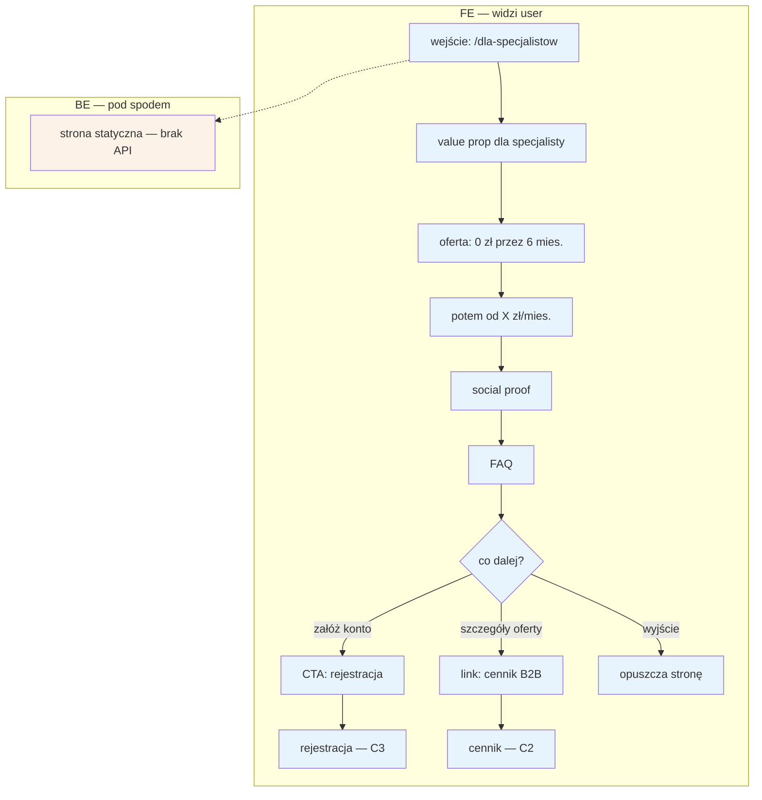

# C1 — Landing /dla-specjalistow

## Notatki
- Elementy FE wg mapy: value prop, oferta „0 zł przez 6 mies., potem od X zł/mies.", social proof, FAQ. Kolejność sekcji na stronie — założenie minimalne (mapa nie rozstrzyga układu).
- BE wg mapy: brak („—"). Subgraph BE zawiera jeden węzeł informacyjny „strona statyczna — brak API", żeby spełnić konwencję FE/BE z CLAUDE.md; hosting treści: P0 hardcode → P1 CMS (F7).
- CTA → [[c3-rejestracja]] wynika ze ścieżki E2E „Specjalista: od landing do 1. rezerwacji" (C1 → C3).
- Link do cennika → [[c2-cennik-b2b]] — założenie minimalne: landing linkuje do cennika B2B (spójna nawigacja B2B).
- Wartość „X zł/mies." nieustalona — model subskrypcji do rozstrzygnięcia w prompcie #2 (C2, E12, F6).
- Powiązania: C2, C3, F7; dalszy ciąg ścieżki: D1 → D2 → D3 → E2/E3.

## Co opisuje ten diagram

Ten diagram pokazuje stronę marketingową /dla-specjalistow — pierwszy kontakt logopedy (specjalisty) z serwisem. Specjalista trafia na nią np. z wyszukiwarki lub reklamy, przegląda ofertę („0 zł przez 6 mies."), opinie innych i FAQ, a następnie decyduje, co dalej: zakłada konto, przechodzi do cennika albo opuszcza stronę. Po stronie systemu nic się nie dzieje — to zwykła strona statyczna bez logiki. Flow kończy się przejściem do rejestracji (C3), do cennika (C2) lub wyjściem ze strony.

## Powiązane diagramy

| ID | Diagram | Jak się łączy |
|---|---|---|
| C2 | [c2-cennik-b2b.md](c2-cennik-b2b.md) | landing linkuje do szczegółów cennika B2B |
| C3 | [c3-rejestracja.md](c3-rejestracja.md) | główne CTA landingu prowadzi do rejestracji specjalisty |
| D1 | [d1-weryfikacja-pwz.md](d1-weryfikacja-pwz.md) | dalszy ciąg ścieżki specjalisty — weryfikacja PWZ po rejestracji |
| D2 | [d2-stan-w-trakcie.md](d2-stan-w-trakcie.md) | dalszy ciąg ścieżki — onboarding w trakcie weryfikacji |
| D3 | [d3-go-live.md](d3-go-live.md) | dalszy ciąg ścieżki — publikacja profilu |
| E2 | [e2-grafik-dostepnosc.md](../e-panel/e2-grafik-dostepnosc.md) | dalszy ciąg ścieżki po go-live — ustawienie grafiku |
| E3 | [e3-uslugi-ceny.md](../e-panel/e3-uslugi-ceny.md) | dalszy ciąg ścieżki po go-live — usługi i ceny |
| E12 | [e12-subskrypcja-billing.md](../e-panel/e12-subskrypcja-billing.md) | oferta z landingu odpowiada modelowi subskrypcji widocznemu w panelu |
| F6 | [f6-billing-admin.md](../f-backoffice/f6-billing-admin.md) | ten sam model subskrypcji rozliczany po stronie admina |
| F7 | [f7-cms-seo.md](../f-backoffice/f7-cms-seo.md) | docelowo (P1) treść landingu zarządzana przez CMS |

## Słownik

| Pojęcie | Wyjaśnienie |
|---|---|
| Landing | Strona docelowa, na którą trafia specjalista z reklamy lub wyszukiwarki, mająca zachęcić go do założenia konta. |
| Value prop | Propozycja wartości — krótkie wyjaśnienie, co specjalista zyskuje dzięki serwisowi. |
| Social proof | Opinie i przykłady innych użytkowników, które budują zaufanie do serwisu. |
| CTA | Przycisk wzywający do działania (call to action), tutaj „załóż konto". |
| B2B | Oferta skierowana do specjalistów/firm (klient biznesowy), a nie do pacjentów. |
| FAQ | Sekcja najczęściej zadawanych pytań wraz z odpowiedziami. |
| Strona statyczna | Strona o stałej treści, która nie pobiera danych z systemu (brak API). |
| CMS | System zarządzania treścią — docelowo pozwoli edytować teksty landingu bez programisty. |
| Subskrypcja | Cykliczna opłata za korzystanie z serwisu („od X zł/mies." po darmowym okresie). |
