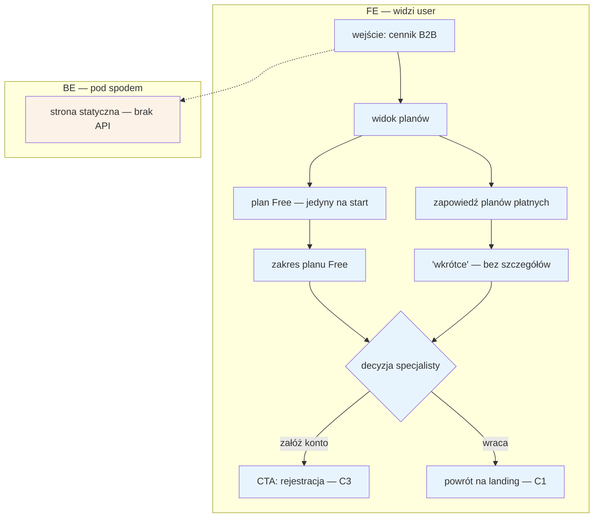

# C2 — Cennik B2B

## Notatki
- Wg mapy: na start dokładnie 1 plan (free) + zapowiedź płatnych; BE brak („—") — węzeł BE tylko informacyjny, dla spełnienia konwencji FE/BE.
- Zakres planu Free, ceny i zawartość planów płatnych — nieustalone; model subskrypcji rozstrzyga prompt #2 (pokrywa C2, E12, F6).
- Spójność z ofertą z C1: „0 zł przez 6 mies., potem od X zł/mies." — licznik „free do DD.MM" widoczny później w E12 (widoczność P0).
- CTA → [[c3-rejestracja]]; powrót → [[c1-landing-dla-specjalistow]].
- Powiązania: C1, C3, E12, F6; dalszy ciąg ścieżki: D1 → D2 → D3 → E2/E3.

## Co opisuje ten diagram

Diagram pokazuje stronę z cennikiem dla specjalistów (oferta B2B). Specjalista trafia tu zwykle z landingu C1, ogląda jedyny dostępny na start plan Free oraz zapowiedź planów płatnych („wkrótce"), po czym albo zakłada konto, albo wraca na landing. To strona czysto informacyjna — system nie wykonuje w tle żadnych operacji. Flow kończy się przejściem do rejestracji (C3) lub powrotem do C1.

## Powiązane diagramy

| ID | Diagram | Jak się łączy |
|---|---|---|
| C1 | [c1-landing-dla-specjalistow.md](c1-landing-dla-specjalistow.md) | wejście na cennik z landingu i możliwy powrót na landing |
| C3 | [c3-rejestracja.md](c3-rejestracja.md) | CTA cennika prowadzi do rejestracji specjalisty |
| D1 | [d1-weryfikacja-pwz.md](d1-weryfikacja-pwz.md) | dalszy ciąg ścieżki specjalisty — weryfikacja PWZ po rejestracji |
| D2 | [d2-stan-w-trakcie.md](d2-stan-w-trakcie.md) | dalszy ciąg ścieżki — onboarding w trakcie weryfikacji |
| D3 | [d3-go-live.md](d3-go-live.md) | dalszy ciąg ścieżki — publikacja profilu |
| E2 | [e2-grafik-dostepnosc.md](../e-panel/e2-grafik-dostepnosc.md) | dalszy ciąg ścieżki po go-live — ustawienie grafiku |
| E3 | [e3-uslugi-ceny.md](../e-panel/e3-uslugi-ceny.md) | dalszy ciąg ścieżki po go-live — usługi i ceny |
| E12 | [e12-subskrypcja-billing.md](../e-panel/e12-subskrypcja-billing.md) | plan z cennika widoczny później w panelu jako subskrypcja (licznik „free do DD.MM") |
| F6 | [f6-billing-admin.md](../f-backoffice/f6-billing-admin.md) | ten sam model subskrypcji rozliczany po stronie admina |

## Słownik

| Pojęcie | Wyjaśnienie |
|---|---|
| B2B | Oferta dla specjalistów/firm (klient biznesowy), w odróżnieniu od części serwisu dla pacjentów. |
| Cennik | Strona prezentująca dostępne plany abonamentowe i ich zakres. |
| Plan Free | Darmowy plan abonamentowy — jedyny dostępny na starcie serwisu. |
| Plany płatne | Przyszłe, płatne warianty abonamentu; na razie tylko zapowiedź „wkrótce", bez szczegółów. |
| Subskrypcja | Cykliczna opłata za korzystanie z serwisu przez specjalistę. |
| CTA | Przycisk wzywający do działania (call to action), tutaj „załóż konto". |
| Strona statyczna | Strona o stałej treści, bez pobierania danych z systemu (brak API). |
| Billing | Rozliczenia i płatności za subskrypcję — widoczne dla specjalisty w E12, a dla admina w F6. |
