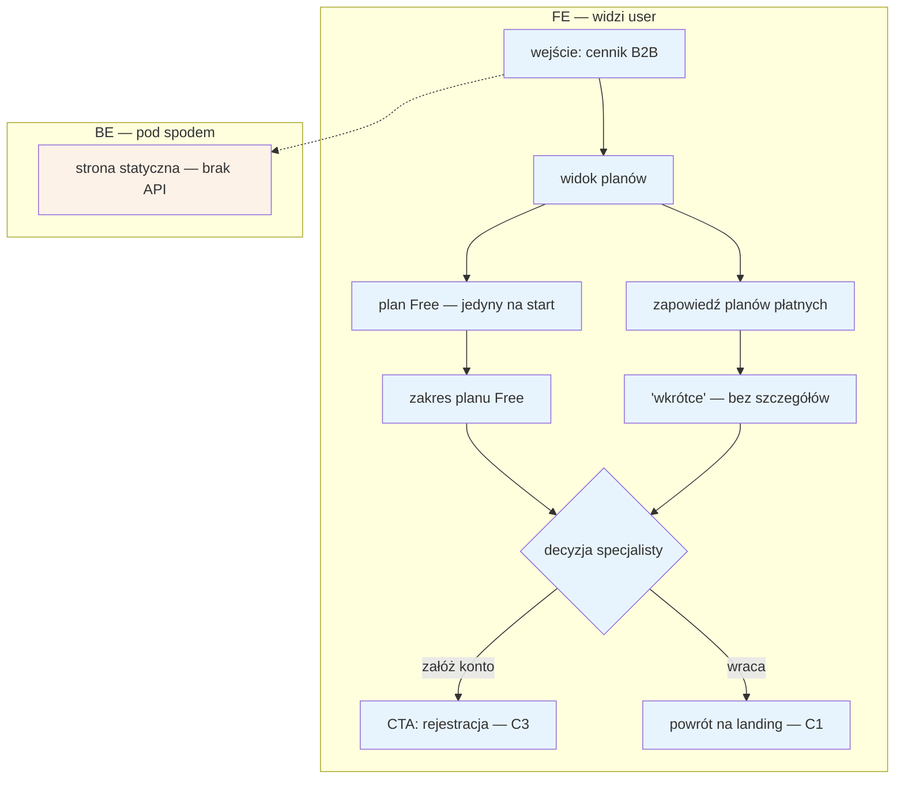

# C2 — Cennik B2B

## Notatki
- Wg mapy: na start dokładnie 1 plan (free) + zapowiedź płatnych; BE brak („—") — węzeł BE tylko informacyjny, dla spełnienia konwencji FE/BE.
- Zakres planu Free, ceny i zawartość planów płatnych — nieustalone; model subskrypcji rozstrzyga prompt #2 (pokrywa C2, E12, F6).
- Spójność z ofertą z C1: „0 zł przez 6 mies., potem od X zł/mies." — licznik „free do DD.MM" widoczny później w E12 (widoczność P0).
- CTA → [[c3-rejestracja]]; powrót → [[c1-landing-dla-specjalistow]].
- Powiązania: C1, C3, E12, F6; dalszy ciąg ścieżki: D1 → D2 → D3 → E2/E3.
