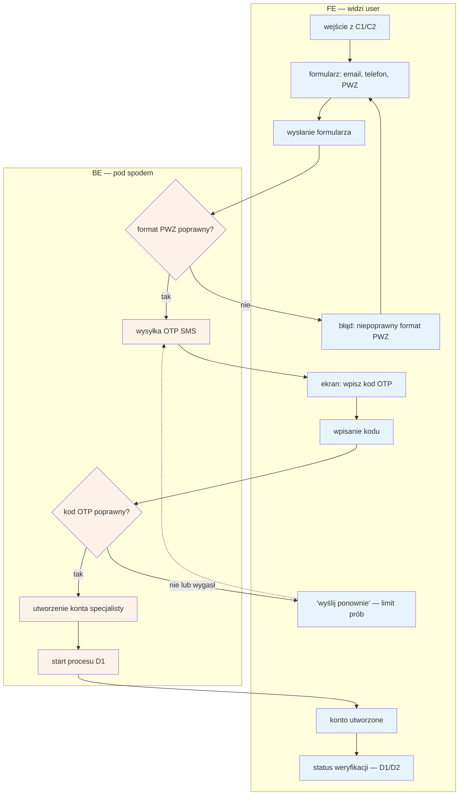

# C3 — Rejestracja specjalisty

## Notatki
- Wg mapy FE: email + telefon (OTP), nr PWZ; BE: utworzenie konta, walidacja **formatu** PWZ, start D1.
- Walidacja formatu PWZ ≠ weryfikacja w rejestrze — merytoryczną weryfikację robi dopiero [[d1-weryfikacja-pwz]] (automat KRL/KIF + fallback F1). Błąd formatu zatrzymuje się na formularzu, nie tworzy stanu w CORE-WERYFIKACJA.
- Kolejność kroków (najpierw walidacja formatu PWZ, potem OTP, potem utworzenie konta) — założenie minimalne; mapa nie rozstrzyga kolejności.
- OTP: limit prób / rate limiting — założenie przez analogię do B1 (mapa dla C3 tego nie precyzuje). Edge case „OTP nie dochodzi" pokryty pętlą retry.
- Po sukcesie konto ląduje w stanie `zarejestrowany` → `weryfikacja_auto` (CORE-WERYFIKACJA); specjalista trafia do panelu w stanie „w trakcie" ([[d2-stan-w-trakcie]]).
- Powiązania: C1, C2, [[d1-weryfikacja-pwz]], [[d2-stan-w-trakcie]], CORE-WERYFIKACJA, B1 (analogia OTP).

## Co opisuje ten diagram

Diagram pokazuje rejestrację specjalisty w serwisie. Specjalista wypełnia formularz (e-mail, telefon, numer PWZ), a system sprawdza poprawność formatu numeru PWZ i potwierdza numer telefonu jednorazowym kodem SMS (OTP). Po poprawnym wpisaniu kodu powstaje konto specjalisty i automatycznie rusza weryfikacja uprawnień w rejestrze (D1), a specjalista trafia do panelu w stanie „w trakcie" (D2). Flow kończy się utworzonym kontem i widocznym statusem weryfikacji.

## Powiązane diagramy

| ID | Diagram | Jak się łączy |
|---|---|---|
| C1 | [c1-landing-dla-specjalistow.md](c1-landing-dla-specjalistow.md) | wejście do formularza rejestracji z landingu |
| C2 | [c2-cennik-b2b.md](c2-cennik-b2b.md) | wejście do formularza rejestracji z cennika B2B |
| D1 | [d1-weryfikacja-pwz.md](d1-weryfikacja-pwz.md) | po utworzeniu konta automatycznie startuje weryfikacja PWZ |
| D2 | [d2-stan-w-trakcie.md](d2-stan-w-trakcie.md) | po rejestracji specjalista ląduje w panelu w stanie „w trakcie" |
| F1 | [f1-kolejka-weryfikacji-pwz.md](../f-backoffice/f1-kolejka-weryfikacji-pwz.md) | merytoryczną weryfikację przy niepewności automatu przejmuje ręczna kolejka admina |
| B1 | [b1-logowanie.md](../b-pacjent-konto/b1-logowanie.md) | limit prób OTP przyjęty przez analogię do logowania pacjenta |
| CORE-WERYFIKACJA | [00-weryfikacja-specjalisty.md](../00-core/00-weryfikacja-specjalisty.md) | nowe konto wchodzi w stany cyklu weryfikacji (`zarejestrowany` → `weryfikacja_auto`) |

## Słownik

| Pojęcie | Wyjaśnienie |
|---|---|
| PWZ | Numer prawa wykonywania zawodu, potwierdzający uprawnienia specjalisty. |
| OTP | Jednorazowy kod wysyłany SMS-em, którym specjalista potwierdza swój numer telefonu. |
| Walidacja formatu PWZ | Sprawdzenie, czy wpisany numer „wygląda poprawnie" (długość, znaki) — bez sprawdzania w rejestrze. |
| Weryfikacja w rejestrze | Właściwe, merytoryczne sprawdzenie numeru PWZ w oficjalnym rejestrze — robi to dopiero flow D1. |
| KRL/KIF | Oficjalne rejestry zawodowe, w których automat sprawdza numer PWZ specjalisty. |
| Limit prób (rate limiting) | Ograniczenie liczby ponownych wysyłek i wpisań kodu OTP, chroniące przed nadużyciami. |
| Stan weryfikacji | Etap, na którym znajduje się konto specjalisty (np. `zarejestrowany`, `weryfikacja_auto`), wg cyklu CORE-WERYFIKACJA. |
| Fallback | Ścieżka awaryjna — gdy automat nie potwierdzi PWZ, sprawę przejmuje człowiek (kolejka F1). |
