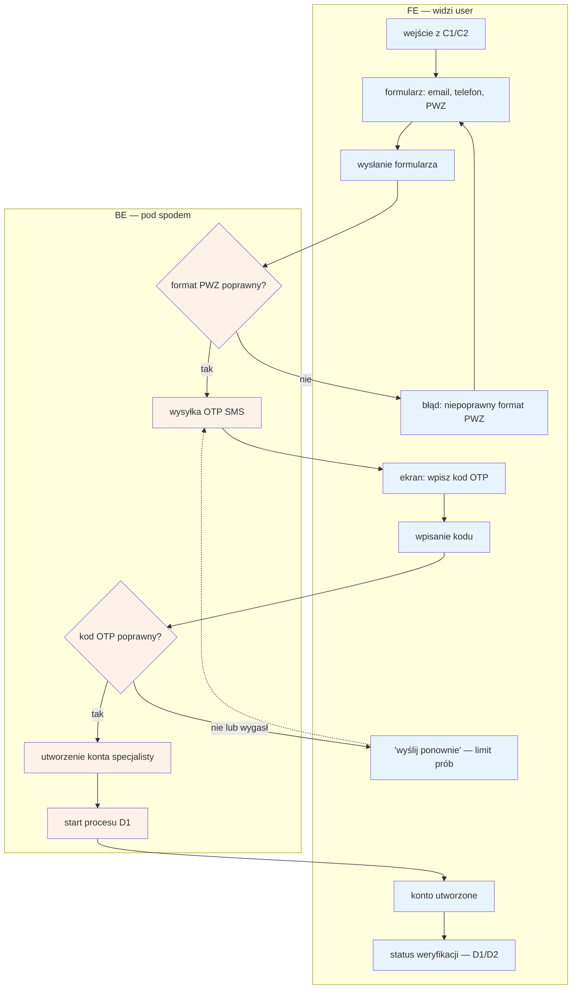

# C3 — Rejestracja specjalisty

## Notatki
- Wg mapy FE: email + telefon (OTP), nr PWZ; BE: utworzenie konta, walidacja **formatu** PWZ, start D1.
- Walidacja formatu PWZ ≠ weryfikacja w rejestrze — merytoryczną weryfikację robi dopiero [[d1-weryfikacja-pwz]] (automat KRL/KIF + fallback F1). Błąd formatu zatrzymuje się na formularzu, nie tworzy stanu w CORE-WERYFIKACJA.
- Kolejność kroków (najpierw walidacja formatu PWZ, potem OTP, potem utworzenie konta) — założenie minimalne; mapa nie rozstrzyga kolejności.
- OTP: limit prób / rate limiting — założenie przez analogię do B1 (mapa dla C3 tego nie precyzuje). Edge case „OTP nie dochodzi" pokryty pętlą retry.
- Po sukcesie konto ląduje w stanie `zarejestrowany` → `weryfikacja_auto` (CORE-WERYFIKACJA); specjalista trafia do panelu w stanie „w trakcie" ([[d2-stan-w-trakcie]]).
- Powiązania: C1, C2, [[d1-weryfikacja-pwz]], [[d2-stan-w-trakcie]], CORE-WERYFIKACJA, B1 (analogia OTP).
