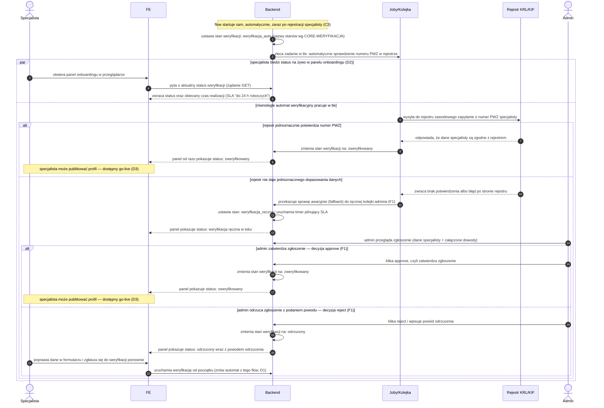

# D1 — Weryfikacja PWZ

## Notatki
- Stany weryfikacji wg CORE-WERYFIKACJA (`weryfikacja_auto` → `zweryfikowany` | `weryfikacja_reczna` → `zweryfikowany` | `odrzucony`); to NIE są stany rezerwacji.
- Wg mapy FE: status na żywo + SLA „do 24 h roboczych"; BE: automat (rejestr KRL/KIF/wet.) + fallback do kolejki ręcznej [[F1]] (zgłoszenia, dane + dowody, approve/reject z powodem, SLA timer).
- Uczestnik `REJ` (Rejestr KRL/KIF) wykracza poza stałą listę aktorów z CLAUDE.md — dodany jako zewnętrzna integracja, bo bez niego automat byłby niewidoczny; „wet." dotyczy forka weterynaryjnego, dla wertykalu logopedycznego przyjęto KRL/KIF.
- „Status na żywo" zamodelowany jako `par`: specjalista widzi zmiany stanu w panelu ([[d2-stan-w-trakcie]]) równolegle z pracą automatu/kolejki; mechanizm odświeżania (polling vs push) — mapa nie rozstrzyga.
- Brak powiadomienia email/SMS o wyniku weryfikacji — mapa go nie przewiduje (mail powitalny dopiero w [[d3-go-live]] przez G1); przyjęto: tylko status w panelu. Otwarta kwestia w rozbieżnościach.
- Ponowne zgłoszenie po odrzuceniu wraca do automatu (nie wprost do F1) — założenie spójne z CORE-WERYFIKACJA; automat przy niepewności robi fallback, sam nie odrzuca.
- Timer SLA startuje przy wejściu do kolejki ręcznej — założenie minimalne (mapa: „SLA timer" w F1).
- Powiązania: [[c3-rejestracja]] (trigger), [[d2-stan-w-trakcie]], [[d3-go-live]], F1, CORE-WERYFIKACJA, prompt #5 (research weryfikacji).

## Co opisuje ten diagram

Diagram pokazuje weryfikację numeru PWZ specjalisty, która startuje automatycznie zaraz po rejestracji (C3). Automat odpytuje oficjalny rejestr (KRL/KIF) — gdy dane się zgadzają, specjalista dostaje status „zweryfikowany" i może opublikować profil (D3). Gdy rejestr nie daje jednoznacznej odpowiedzi, sprawę przejmuje admin w ręcznej kolejce (F1) i zatwierdza albo odrzuca zgłoszenie z podaniem powodu; po odrzuceniu specjalista może poprawić dane i zgłosić się ponownie. Przez cały czas specjalista widzi w panelu (D2) aktualny status weryfikacji wraz z obiecanym czasem realizacji („do 24 h roboczych").

## Aktorzy w tym flow

| Rola | Kto to jest | Co robi w tym flow |
|---|---|---|
| **Specjalista** | logopeda/lekarz — usługodawca, który zakłada profil na platformie | obserwuje w panelu status swojej weryfikacji; po odrzuceniu poprawia dane i zgłasza się ponownie |
| **FE** | interfejs w przeglądarce — tutaj panel onboardingu specjalisty | pokazuje na żywo aktualny status weryfikacji i obiecany czas realizacji (SLA) |
| **System/Backend** | serwerowa część platformy, działająca "pod spodem" | prowadzi stany weryfikacji, zleca automat, uruchamia timer SLA, przekazuje wyniki do panelu |
| **Joby/Kolejka** | automatyczne zadania systemu wykonywane w tle, bez udziału człowieka | odpytuje rejestr zawodowy o numer PWZ; przy niepewnym wyniku przekazuje sprawę do ręcznej kolejki |
| **Rejestr PWZ (KRL/KIF)** | zewnętrzny, oficjalny rejestr zawodowy — instytucja poza platformą | potwierdza (albo nie) numer prawa wykonywania zawodu specjalisty |
| **Admin** | operator platformy — back office | w ręcznej kolejce (F1) przegląda zgłoszenie z dowodami i zatwierdza je albo odrzuca z podaniem powodu |

## Objaśnienie kroków

| Blok/Krok | Co to znaczy w praktyce | Kto tu działa |
|---|---|---|
| Notatka startowa | Nikt nie musi niczego klikać, żeby zacząć weryfikację — uruchamia się sama w chwili, gdy specjalista kończy rejestrację (C3). | System/Backend |
| Kroki 1–2 | System oznacza specjalistę stanem `weryfikacja_auto` (nazwy stanów pochodzą ze wspólnego diagramu CORE-WERYFIKACJA) i zleca **job** — zadanie wykonywane w tle: automatyczne sprawdzenie numeru **PWZ** (prawa wykonywania zawodu) w oficjalnym rejestrze. | System/Backend, Joby/Kolejka |
| Kroki 3–5 | Równolegle (ramka "par" = dwie rzeczy dzieją się w tym samym czasie) specjalista może otworzyć panel onboardingu i na bieżąco widzieć, na jakim etapie jest jego weryfikacja, wraz z obietnicą **SLA** — "do 24 h roboczych". | Specjalista, FE, System/Backend |
| Krok 6 | Automat wysyła zapytanie do zewnętrznego rejestru zawodowego (KRL/KIF) o podany numer PWZ. | Joby/Kolejka, Rejestr PWZ |
| Kroki 7–9 | **Ścieżka szczęśliwa:** rejestr potwierdza, że dane się zgadzają. System zmienia stan na `zweryfikowany`, panel od razu to pokazuje, a specjalista może przejść do publikacji profilu (go-live, D3). Wszystko bez udziału człowieka. | Rejestr PWZ, Joby/Kolejka, System/Backend |
| Kroki 10–13 | **Ścieżka niepewna:** rejestr nie potwierdza danych jednoznacznie (literówka, inna forma nazwiska, awaria rejestru). Automat sam niczego nie odrzuca — robi **fallback**, czyli awaryjnie przekazuje sprawę do ręcznej kolejki admina (F1). System ustawia stan `weryfikacja_reczna`, uruchamia timer pilnujący dotrzymania SLA, a panel uczciwie pokazuje "weryfikacja ręczna w toku". | Rejestr PWZ, Joby/Kolejka, System/Backend |
| Krok 14 | Admin otwiera zgłoszenie w kolejce: widzi dane specjalisty i załączone dowody (np. skan dokumentu) i ocenia je ręcznie. | Admin |
| Kroki 15–17 | **Decyzja pozytywna (approve):** admin zatwierdza zgłoszenie, stan zmienia się na `zweryfikowany`, panel to pokazuje — droga do go-live (D3) otwarta, tak samo jak przy ścieżce automatycznej. | Admin, System/Backend, FE |
| Kroki 18–20 | **Decyzja negatywna (reject):** admin odrzuca zgłoszenie i musi podać powód. Stan zmienia się na `odrzucony`, a specjalista widzi w panelu i status, i powód — wie, co poprawić. | Admin, System/Backend, FE |
| Kroki 21–22 | Odrzucenie nie jest ostateczne: specjalista poprawia dane i zgłasza się ponownie. Weryfikacja startuje od początku — znów od automatu (nie od razu do admina). | Specjalista, FE, System/Backend |

## Powiązane diagramy

| ID | Diagram | Jak się łączy |
|---|---|---|
| C3 | [c3-rejestracja.md](c3-rejestracja.md) | rejestracja specjalisty uruchamia ten flow automatycznie |
| D2 | [d2-stan-w-trakcie.md](d2-stan-w-trakcie.md) | panel onboardingu pokazuje na żywo status weryfikacji z tego flow |
| D3 | [d3-go-live.md](d3-go-live.md) | pozytywny wynik weryfikacji odblokowuje publikację profilu |
| F1 | [f1-kolejka-weryfikacji-pwz.md](../f-backoffice/f1-kolejka-weryfikacji-pwz.md) | fallback — ręczna kolejka admina z decyzją approve/reject i timerem SLA |
| CORE-WERYFIKACJA | [00-weryfikacja-specjalisty.md](../00-core/00-weryfikacja-specjalisty.md) | kanoniczny cykl stanów weryfikacji, po którym porusza się ten flow |

## Słownik

| Pojęcie | Wyjaśnienie |
|---|---|
| PWZ | Numer prawa wykonywania zawodu, potwierdzający uprawnienia specjalisty. |
| KRL/KIF | Oficjalne rejestry zawodowe, w których automat sprawdza numer PWZ. |
| Weryfikacja automatyczna | Sprawdzenie numeru PWZ przez system w rejestrze, bez udziału człowieka. |
| Weryfikacja ręczna | Sprawdzenie zgłoszenia przez admina, gdy automat nie dał jednoznacznego wyniku. |
| Fallback | Awaryjne przekazanie sprawy z automatu do ręcznej kolejki admina (F1). |
| SLA | Obiecany maksymalny czas załatwienia sprawy — tutaj „do 24 h roboczych", pilnowany timerem. |
| Approve / reject | Decyzja admina: zatwierdzenie albo odrzucenie zgłoszenia z podaniem powodu. |
| Status na żywo | Aktualny etap weryfikacji pokazywany na bieżąco w panelu specjalisty. |
| Go-live | Moment publikacji profilu specjalisty, możliwy dopiero po pozytywnej weryfikacji. |
| Fork (wertykał) | Osobna odmiana serwisu dla innej branży (np. weterynaryjnej), korzystająca z innego rejestru. |
| Onboarding | Proces "wdrożenia" nowego specjalisty na platformę: od rejestracji, przez weryfikację, po publikację profilu. |
| Job (zadanie w tle) | Praca wykonywana automatycznie przez system poza widokiem użytkownika — tutaj odpytanie rejestru o numer PWZ. |
| GET | Techniczny typ żądania przeglądarki do backendu służący do pobrania danych — tutaj: aktualnego statusu weryfikacji. |
| CORE-WERYFIKACJA | Wspólny diagram z kanonicznymi nazwami stanów weryfikacji (weryfikacja_auto, weryfikacja_reczna, zweryfikowany, odrzucony), używanymi we wszystkich flow. |
| par (ramka równoległości) | Oznaczenie na diagramie, że dwie ścieżki dzieją się jednocześnie: specjalista patrzy w panel, a automat pracuje w tle. |
