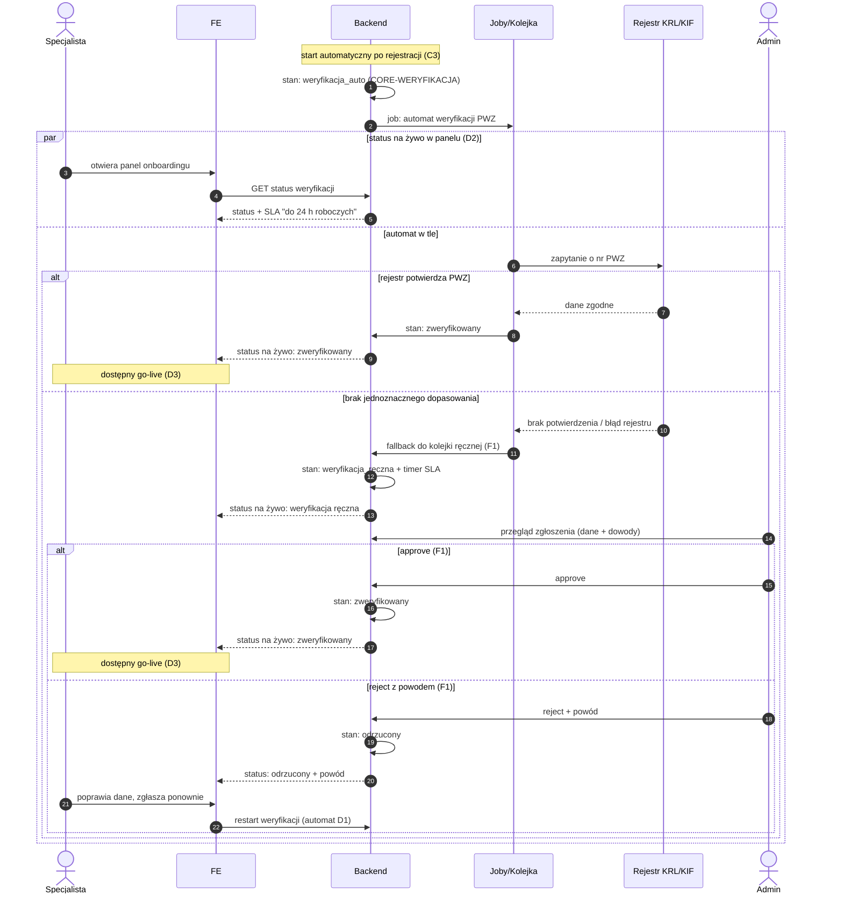

# D1 — Weryfikacja PWZ

## Notatki
- Stany weryfikacji wg CORE-WERYFIKACJA (`weryfikacja_auto` → `zweryfikowany` | `weryfikacja_reczna` → `zweryfikowany` | `odrzucony`); to NIE są stany rezerwacji.
- Wg mapy FE: status na żywo + SLA „do 24 h roboczych"; BE: automat (rejestr KRL/KIF/wet.) + fallback do kolejki ręcznej [[F1]] (zgłoszenia, dane + dowody, approve/reject z powodem, SLA timer).
- Uczestnik `REJ` (Rejestr KRL/KIF) wykracza poza stałą listę aktorów z CLAUDE.md — dodany jako zewnętrzna integracja, bo bez niego automat byłby niewidoczny; „wet." dotyczy forka weterynaryjnego, dla wertykalu logopedycznego przyjęto KRL/KIF.
- „Status na żywo" zamodelowany jako `par`: specjalista widzi zmiany stanu w panelu ([[d2-stan-w-trakcie]]) równolegle z pracą automatu/kolejki; mechanizm odświeżania (polling vs push) — mapa nie rozstrzyga.
- Brak powiadomienia email/SMS o wyniku weryfikacji — mapa go nie przewiduje (mail powitalny dopiero w [[d3-go-live]] przez G1); przyjęto: tylko status w panelu. Otwarta kwestia w rozbieżnościach.
- Ponowne zgłoszenie po odrzuceniu wraca do automatu (nie wprost do F1) — założenie spójne z CORE-WERYFIKACJA; automat przy niepewności robi fallback, sam nie odrzuca.
- Timer SLA startuje przy wejściu do kolejki ręcznej — założenie minimalne (mapa: „SLA timer" w F1).
- Powiązania: [[c3-rejestracja]] (trigger), [[d2-stan-w-trakcie]], [[d3-go-live]], F1, CORE-WERYFIKACJA, prompt #5 (research weryfikacji).
