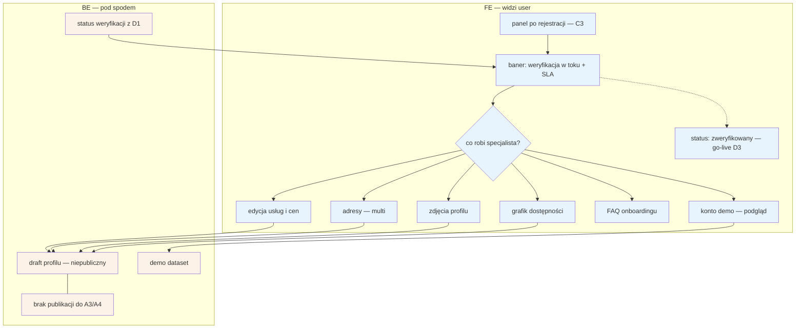

# D2 — Stan „w trakcie" (onboarding podczas weryfikacji)

## Notatki
- Wg mapy FE: pełna edycja profilu (usługi, ceny, **adresy — multi**, zdjęcia, grafik), FAQ, **konto demo**; BE: draft profile (niepubliczny), demo dataset.
- Pełna edycja dostępna **już w trakcie** weryfikacji D1 — nie dopiero po niej; wszystko zapisuje się do draftu, który nie trafia do wyników A3/A4 aż do go-live ([[d3-go-live]]).
- Konto demo: podgląd działania serwisu na demo datasecie — założenie minimalne: tylko do odczytu, dane demo nie mieszają się z draftem profilu (mapa nie rozstrzyga zakresu demo).
- Edycja usług/cen i grafiku w D2 to funkcjonalnie te same edytory co E3 (usługi i ceny) oraz E2 (grafik per adres, długość slotu per usługa) — pełne speki tam; grafik zasili A3/A4 dopiero po publikacji.
- Baner statusu + SLA „do 24 h roboczych" pochodzi z [[d1-weryfikacja-pwz]] (status na żywo); stany wg CORE-WERYFIKACJA.
- Powiązania: [[c3-rejestracja]], [[d1-weryfikacja-pwz]], [[d3-go-live]], E2, E3, A3/A4, CORE-WERYFIKACJA.

## Co opisuje ten diagram

Diagram pokazuje, co specjalista może robić w panelu tuż po rejestracji (C3), gdy jego numer PWZ jest jeszcze weryfikowany (D1). Widzi baner z informacją o trwającej weryfikacji, a mimo to może już w pełni przygotować profil — usługi i ceny, adresy, zdjęcia, grafik — wszystko zapisuje się jako niepubliczny szkic (draft), niewidoczny dla pacjentów. Może też obejrzeć konto demo z przykładowymi danymi. Flow kończy się, gdy weryfikacja się powiedzie i specjalista może przejść do publikacji profilu (D3).

## Powiązane diagramy

| ID | Diagram | Jak się łączy |
|---|---|---|
| C3 | [c3-rejestracja.md](c3-rejestracja.md) | wejście do panelu następuje zaraz po rejestracji |
| D1 | [d1-weryfikacja-pwz.md](d1-weryfikacja-pwz.md) | baner statusu i SLA pochodzą z trwającej weryfikacji PWZ |
| D3 | [d3-go-live.md](d3-go-live.md) | po statusie „zweryfikowany" specjalista przechodzi do go-live |
| E2 | [e2-grafik-dostepnosc.md](../e-panel/e2-grafik-dostepnosc.md) | edycja grafiku w D2 to ten sam edytor co w panelu — pełna spec tam |
| E3 | [e3-uslugi-ceny.md](../e-panel/e3-uslugi-ceny.md) | edycja usług i cen w D2 to ten sam edytor co w panelu — pełna spec tam |
| A3 | [a3-lista-wynikow.md](../a-pacjent-public/a3-lista-wynikow.md) | draft NIE trafia do wyników wyszukiwania aż do publikacji |
| A4 | [a4-profil-specjalisty.md](../a-pacjent-public/a4-profil-specjalisty.md) | draft NIE jest widoczny jako publiczny profil aż do publikacji |
| CORE-WERYFIKACJA | [00-weryfikacja-specjalisty.md](../00-core/00-weryfikacja-specjalisty.md) | stany pokazywane w banerze pochodzą z kanonicznego cyklu weryfikacji |

## Słownik

| Pojęcie | Wyjaśnienie |
|---|---|
| Onboarding | Pierwsze kroki nowego specjalisty w serwisie — przygotowanie profilu przed startem. |
| Weryfikacja | Trwające w tle sprawdzanie numeru PWZ specjalisty (flow D1). |
| Draft profilu | Roboczy, niepubliczny szkic profilu — pacjenci go nie widzą aż do publikacji. |
| Konto demo | Podgląd działania serwisu na przykładowych danych, tylko do odczytu. |
| Demo dataset | Zestaw przykładowych danych, którymi zasilone jest konto demo. |
| Baner statusu | Pasek w panelu informujący o trwającej weryfikacji i obiecanym czasie realizacji. |
| SLA | Obiecany maksymalny czas weryfikacji — tutaj „do 24 h roboczych". |
| Grafik dostępności | Kalendarz godzin, w których specjalista przyjmuje pacjentów. |
| Adresy multi | Możliwość dodania kilku miejsc, w których specjalista przyjmuje. |
| Go-live | Publikacja profilu po pozytywnej weryfikacji (flow D3). |
