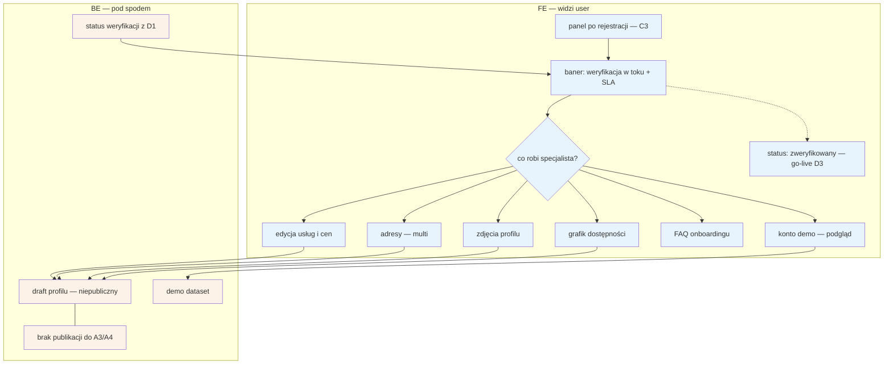

# D2 — Stan „w trakcie" (onboarding podczas weryfikacji)

## Notatki
- Wg mapy FE: pełna edycja profilu (usługi, ceny, **adresy — multi**, zdjęcia, grafik), FAQ, **konto demo**; BE: draft profile (niepubliczny), demo dataset.
- Pełna edycja dostępna **już w trakcie** weryfikacji D1 — nie dopiero po niej; wszystko zapisuje się do draftu, który nie trafia do wyników A3/A4 aż do go-live ([[d3-go-live]]).
- Konto demo: podgląd działania serwisu na demo datasecie — założenie minimalne: tylko do odczytu, dane demo nie mieszają się z draftem profilu (mapa nie rozstrzyga zakresu demo).
- Edycja usług/cen i grafiku w D2 to funkcjonalnie te same edytory co E3 (usługi i ceny) oraz E2 (grafik per adres, długość slotu per usługa) — pełne speki tam; grafik zasili A3/A4 dopiero po publikacji.
- Baner statusu + SLA „do 24 h roboczych" pochodzi z [[d1-weryfikacja-pwz]] (status na żywo); stany wg CORE-WERYFIKACJA.
- Powiązania: [[c3-rejestracja]], [[d1-weryfikacja-pwz]], [[d3-go-live]], E2, E3, A3/A4, CORE-WERYFIKACJA.
