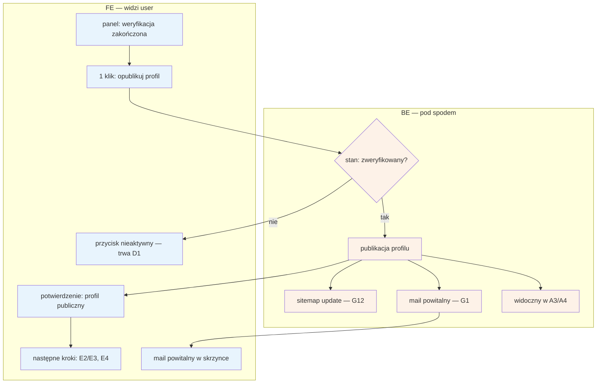

# D3 — Go-live profilu specjalisty

## Notatki
- Wg mapy FE: **1 klik** po weryfikacji → profil publiczny; BE: publikacja, sitemap update, mail powitalny.
- Guard „stan: zweryfikowany?" (CORE-WERYFIKACJA) — go-live możliwy wyłącznie po pozytywnym zakończeniu [[d1-weryfikacja-pwz]]; FE i tak nie pokazuje aktywnego przycisku wcześniej (obrona w głąb — założenie minimalne).
- Po publikacji draft z [[d2-stan-w-trakcie]] staje się profilem publicznym: specjalista widoczny w wynikach A3 (inline sloty) i na profilu A4; sloty pojawią się, o ile grafik (E2) i usługi/ceny (E3) są uzupełnione.
- Sitemap update = job G12 (SEO); mail powitalny przez G1 (notification engine).
- Mapa nie wymaga minimalnej kompletności profilu przed publikacją (np. min. 1 usługa + grafik) — przyjęto brak takiego wymogu; otwarta kwestia zgłoszona w rozbieżnościach.
- Następne kroki ścieżki E2E „od landing do 1. rezerwacji": E2 (grafik) → E3 (usługi i ceny) → widoczny w A3/A4 → E4 (rezerwacje).
- Powiązania: [[d1-weryfikacja-pwz]], [[d2-stan-w-trakcie]], A3, A4, E2, E3, E4, G1, G12, CORE-WERYFIKACJA.

## Co opisuje ten diagram

Diagram pokazuje publikację profilu specjalisty (go-live) — jedno kliknięcie dostępne po pomyślnej weryfikacji PWZ (D1). System najpierw sprawdza, czy specjalista faktycznie ma status „zweryfikowany"; jeśli nie, przycisk pozostaje nieaktywny. Po publikacji szkic profilu z D2 staje się publiczny: specjalista pojawia się w wynikach wyszukiwania (A3) i na stronie profilu (A4), aktualizuje się mapa strony dla wyszukiwarek, a specjalista dostaje mail powitalny. Flow kończy się publicznie widocznym profilem i wskazaniem następnych kroków (grafik, usługi, rezerwacje).

## Powiązane diagramy

| ID | Diagram | Jak się łączy |
|---|---|---|
| D1 | [d1-weryfikacja-pwz.md](d1-weryfikacja-pwz.md) | pozytywny wynik weryfikacji jest warunkiem go-live |
| D2 | [d2-stan-w-trakcie.md](d2-stan-w-trakcie.md) | publikowany jest draft profilu przygotowany podczas weryfikacji |
| A3 | [a3-lista-wynikow.md](../a-pacjent-public/a3-lista-wynikow.md) | po publikacji specjalista pojawia się w wynikach wyszukiwania |
| A4 | [a4-profil-specjalisty.md](../a-pacjent-public/a4-profil-specjalisty.md) | po publikacji profil staje się publiczną stroną specjalisty |
| E2 | [e2-grafik-dostepnosc.md](../e-panel/e2-grafik-dostepnosc.md) | następny krok po go-live — bez grafiku nie pojawią się sloty |
| E3 | [e3-uslugi-ceny.md](../e-panel/e3-uslugi-ceny.md) | następny krok po go-live — bez usług i cen nie pojawią się sloty |
| E4 | [e4-rezerwacje.md](../e-panel/e4-rezerwacje.md) | dalszy ciąg ścieżki E2E — obsługa pierwszych rezerwacji |
| G1 | [00-katalog-eventow.md](../00-core/00-katalog-eventow.md) | mail powitalny wysyła notification engine (G1) |
| G12 | [00-katalog-eventow.md](../00-core/00-katalog-eventow.md) | aktualizację sitemap wykonuje job SEO (G12) |
| CORE-WERYFIKACJA | [00-weryfikacja-specjalisty.md](../00-core/00-weryfikacja-specjalisty.md) | guard „stan: zweryfikowany?" opiera się na kanonicznym cyklu weryfikacji |

## Słownik

| Pojęcie | Wyjaśnienie |
|---|---|
| Go-live | Moment, w którym profil specjalisty staje się publicznie widoczny. |
| Publikacja profilu | Zamiana roboczego szkicu (draftu) na profil widoczny dla pacjentów. |
| Draft profilu | Niepubliczny szkic profilu przygotowany podczas weryfikacji (D2). |
| Guard | Warunek blokujący po stronie systemu — publikacja wykona się tylko dla specjalisty zweryfikowanego. |
| Obrona w głąb | Zasada, że blokada działa i w przycisku (FE), i w systemie (BE), na wypadek obejścia jednej z nich. |
| Sitemap | Mapa strony dla wyszukiwarek (np. Google) — jej aktualizacja pomaga szybciej znaleźć nowy profil. |
| SEO | Działania zwiększające widoczność serwisu w wyszukiwarkach; sitemap aktualizuje job G12. |
| Mail powitalny | Automatyczna wiadomość e-mail wysyłana specjaliście po publikacji profilu. |
| Notification engine | Silnik powiadomień (G1) rozsyłający w serwisie maile i SMS-y. |
| Slot | Konkretny termin wizyty w kalendarzu — pojawi się publicznie, gdy grafik i usługi są uzupełnione. |
