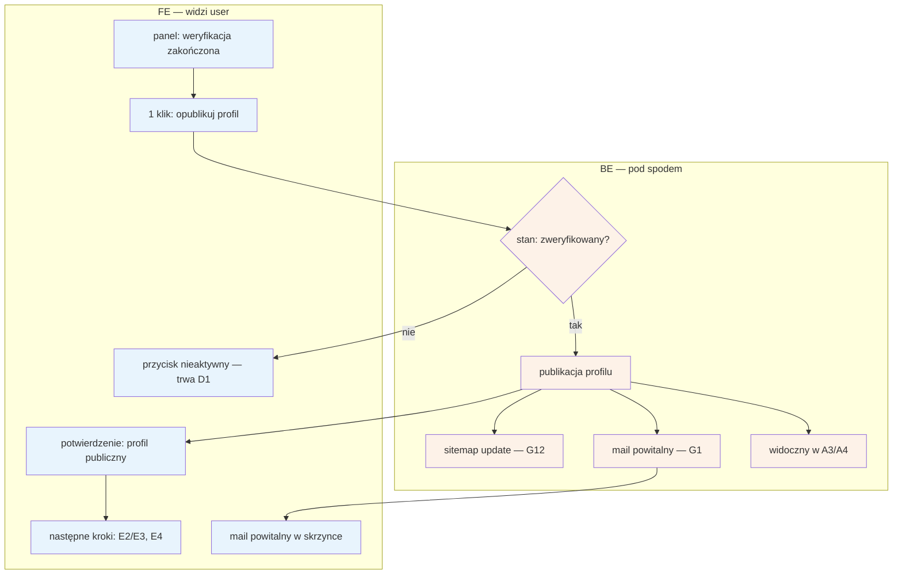

# D3 — Go-live profilu specjalisty

## Notatki
- Wg mapy FE: **1 klik** po weryfikacji → profil publiczny; BE: publikacja, sitemap update, mail powitalny.
- Guard „stan: zweryfikowany?" (CORE-WERYFIKACJA) — go-live możliwy wyłącznie po pozytywnym zakończeniu [[d1-weryfikacja-pwz]]; FE i tak nie pokazuje aktywnego przycisku wcześniej (obrona w głąb — założenie minimalne).
- Po publikacji draft z [[d2-stan-w-trakcie]] staje się profilem publicznym: specjalista widoczny w wynikach A3 (inline sloty) i na profilu A4; sloty pojawią się, o ile grafik (E2) i usługi/ceny (E3) są uzupełnione.
- Sitemap update = job G12 (SEO); mail powitalny przez G1 (notification engine).
- Mapa nie wymaga minimalnej kompletności profilu przed publikacją (np. min. 1 usługa + grafik) — przyjęto brak takiego wymogu; otwarta kwestia zgłoszona w rozbieżnościach.
- Następne kroki ścieżki E2E „od landing do 1. rezerwacji": E2 (grafik) → E3 (usługi i ceny) → widoczny w A3/A4 → E4 (rezerwacje).
- Powiązania: [[d1-weryfikacja-pwz]], [[d2-stan-w-trakcie]], A3, A4, E2, E3, E4, G1, G12, CORE-WERYFIKACJA.
