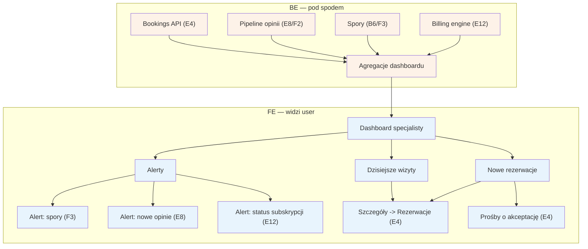

# E1 — Dashboard specjalisty

## Notatki
- Priorytet: P0. Spec: S2 (panel specjalisty).
- Ekran startowy panelu: dzisiejsze wizyty i nowe rezerwacje prowadzą do [[e4-rezerwacje]] (E4); wśród nowych rezerwacji wyróżnione prośby o akceptację (pending_approval — wariant A5).
- Alerty agregują: spory (B6/F3), nowe opinie do odpowiedzi ([[e8-approval-opinie]], E8), status subskrypcji / licznik free ([[e12-subskrypcja-billing]], E12).
- BE = agregacje z istniejących źródeł (bookings, opinie, spory, billing) — bez własnych encji; założenie minimalne.
- Powiązania: E4, E8, E12, B6, F2, F3.
