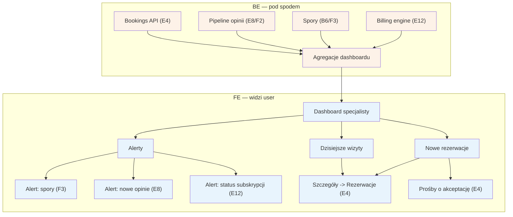

# E1 — Dashboard specjalisty

## Notatki
- Priorytet: P0. Spec: S2 (panel specjalisty).
- Ekran startowy panelu: dzisiejsze wizyty i nowe rezerwacje prowadzą do [[e4-rezerwacje]] (E4); wśród nowych rezerwacji wyróżnione prośby o akceptację (pending_approval — wariant A5).
- Alerty agregują: spory (B6/F3), nowe opinie do odpowiedzi ([[e8-approval-opinie]], E8), status subskrypcji / licznik free ([[e12-subskrypcja-billing]], E12).
- BE = agregacje z istniejących źródeł (bookings, opinie, spory, billing) — bez własnych encji; założenie minimalne.
- Powiązania: E4, E8, E12, B6, F2, F3.

## Co opisuje ten diagram

Ekran startowy panelu specjalisty (np. logopedy) — pierwsza rzecz, jaką widzi po zalogowaniu. System zbiera w jednym miejscu dzisiejsze wizyty, nowe rezerwacje (w tym prośby wymagające ręcznej akceptacji) oraz alerty: o sporach z pacjentami, o nowych opiniach czekających na odpowiedź i o statusie abonamentu. Dashboard sam niczego nie zmienia — to punkt wyjścia, z którego specjalista przechodzi do szczegółowych ekranów, przede wszystkim do listy rezerwacji.

## Powiązane diagramy

| ID | Diagram | Jak się łączy |
|---|---|---|
| E4 | [e4-rezerwacje.md](e4-rezerwacje.md) | dzisiejsze wizyty i nowe rezerwacje (w tym prośby o akceptację) prowadzą do tego ekranu |
| E8 | [e8-approval-opinie.md](e8-approval-opinie.md) | alert o nowych opiniach do odpowiedzi kieruje do pipeline'u opinii |
| E12 | [e12-subskrypcja-billing.md](e12-subskrypcja-billing.md) | alert o statusie subskrypcji i liczniku okresu free |
| B6 | [../b-pacjent-konto/b6-spor-no-show.md](../b-pacjent-konto/b6-spor-no-show.md) | spory zgłaszane przez pacjentów są źródłem alertu o sporach |
| F2 | [../f-backoffice/f2-moderacja-opinii.md](../f-backoffice/f2-moderacja-opinii.md) | moderacja opinii zasila agregacje danych o opiniach |
| F3 | [../f-backoffice/f3-spory.md](../f-backoffice/f3-spory.md) | kolejka sporów po stronie admina — drugie źródło alertu o sporach |

## Słownik

| Pojęcie | Wyjaśnienie |
|---|---|
| dashboard | ekran startowy panelu pokazujący najważniejsze informacje w jednym miejscu |
| agregacja | zebranie danych z kilku źródeł (rezerwacje, opinie, spory, billing) w jedno podsumowanie |
| alert | wyróżnione powiadomienie na dashboardzie o sprawie wymagającej uwagi specjalisty |
| prośba o akceptację | rezerwacja, którą specjalista musi ręcznie zatwierdzić, zanim zostanie potwierdzona (stan pending_approval) |
| subskrypcja | abonament specjalisty za korzystanie z serwisu (na start darmowy okres free) |
| spór | sytuacja, w której pacjent kwestionuje oznaczenie wizyty jako "nie stawił się" |
| opinia | ocena i komentarz pacjenta po odbytej wizycie, na które specjalista może odpowiedzieć |
| billing engine | mechanizm systemu naliczający opłaty abonamentowe i pilnujący statusu subskrypcji |
