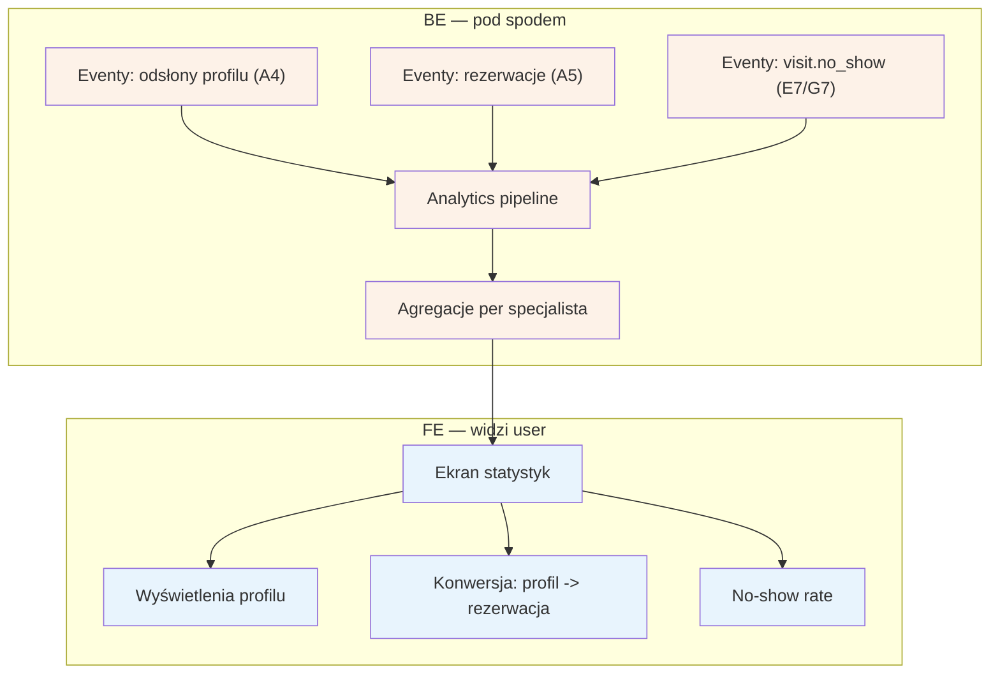

# E10 — Statystyki specjalisty

## Notatki
- Priorytet: P1.
- Trzy metryki z mapy: wyświetlenia profilu (odsłony A4 z analytics A1), konwersja profil -> rezerwacja (A4 -> A5), no-show rate pacjentów specjalisty (eventy visit.no_show z E7 / G7).
- Analytics pipeline: założenie minimalne — agregacje batch z eventów domenowych i odsłon; zakresy dat / porównania okresów mapa nie definiuje.
- No-show rate specjalisty widoczny też jako metryka lejka (S5: konwersja wyszukiwanie -> profil -> checkout — wspólne źródło danych).
- Powiązania: A1, A4, A5, E7, G7.

## Co opisuje ten diagram

Ekran statystyk w panelu specjalisty, dostępny w każdej chwili. System zbiera zdarzenia z serwisu — odsłony profilu, dokonane rezerwacje i niestawienia się pacjentów — przetwarza je w tle i pokazuje specjaliście trzy metryki: ile razy oglądano jego profil, jaka część odwiedzin kończy się rezerwacją (konwersja) oraz jak często jego pacjenci nie przychodzą na wizyty (no-show rate). To ekran wyłącznie do odczytu — niczego się tu nie zmienia.

## Powiązane diagramy

| ID | Diagram | Jak się łączy |
|---|---|---|
| A1 | [../a-pacjent-public/a1-wejscie-seo.md](../a-pacjent-public/a1-wejscie-seo.md) | analytics odsłon startuje od wejść z SEO/direct |
| A4 | [../a-pacjent-public/a4-profil-specjalisty.md](../a-pacjent-public/a4-profil-specjalisty.md) | odsłony profilu są źródłem metryki wyświetleń i początkiem konwersji |
| A5 | [../a-pacjent-public/a5-checkout.md](../a-pacjent-public/a5-checkout.md) | dokonane rezerwacje domykają metrykę konwersji profil → rezerwacja |
| E7 | [e7-no-show.md](e7-no-show.md) | oznaczenia "nie stawił się" generują eventy do no-show rate |
| G7 | [../g-silniki/g7-scoring-engine.md](../g-silniki/g7-scoring-engine.md) | eventy visit.no_show to wspólne źródło danych ze scoringiem |

## Słownik

| Pojęcie | Wyjaśnienie |
|---|---|
| statystyki | zestaw liczb pokazujących specjaliście, jak radzi sobie jego profil i praktyka |
| wyświetlenia profilu | liczba odsłon publicznego profilu specjalisty przez odwiedzających |
| konwersja | odsetek odwiedzin profilu, które zakończyły się rezerwacją wizyty |
| no-show rate | odsetek wizyt, na które pacjenci danego specjalisty się nie stawili |
| event | pojedyncze zdarzenie rejestrowane przez system (odsłona, rezerwacja, no-show) |
| analytics pipeline | mechanizm zbierający zdarzenia i przetwarzający je na czytelne metryki |
| agregacja | zsumowanie wielu pojedynczych zdarzeń w liczby per specjalista |
| batch | przetwarzanie danych partiami co jakiś czas, a nie natychmiast po każdym zdarzeniu |
| lejek | ścieżka użytkownika od wyszukiwania przez profil do rezerwacji, mierzona etapami |
