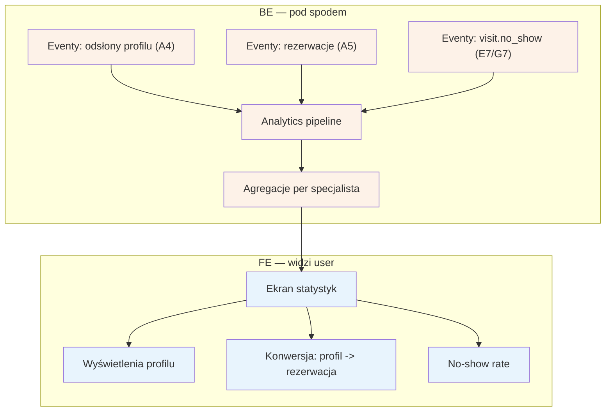

# E10 — Statystyki specjalisty

## Notatki
- Priorytet: P1.
- Trzy metryki z mapy: wyświetlenia profilu (odsłony A4 z analytics A1), konwersja profil -> rezerwacja (A4 -> A5), no-show rate pacjentów specjalisty (eventy visit.no_show z E7 / G7).
- Analytics pipeline: założenie minimalne — agregacje batch z eventów domenowych i odsłon; zakresy dat / porównania okresów mapa nie definiuje.
- No-show rate specjalisty widoczny też jako metryka lejka (S5: konwersja wyszukiwanie -> profil -> checkout — wspólne źródło danych).
- Powiązania: A1, A4, A5, E7, G7.
