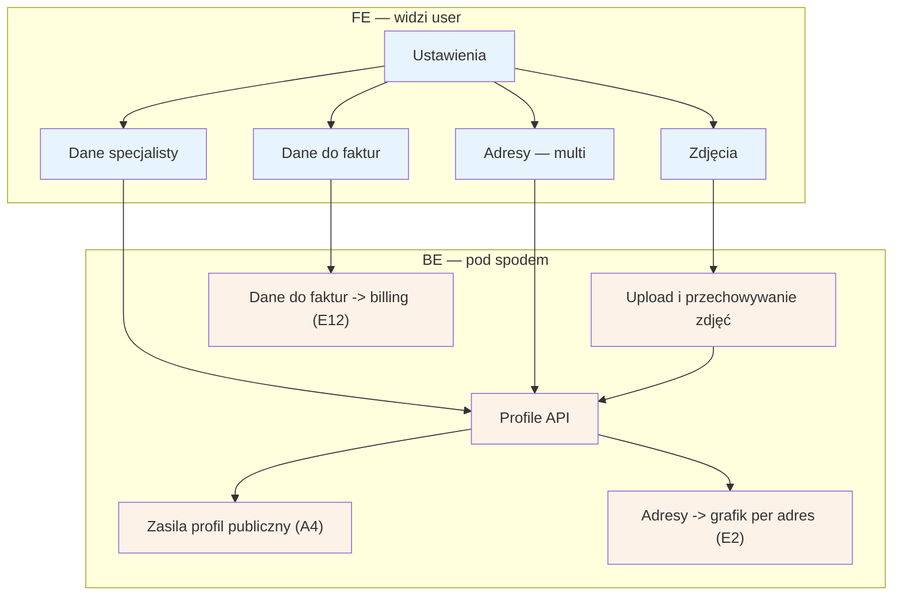

# E11 — Ustawienia specjalisty

## Notatki
- Priorytet: P0.
- Kolumna BE w mapie pusta ("—") — przyjęto założenie minimalne: profile API (te same encje co draft profilu z D2) + upload zdjęć; zgłoszone w rozbieżnościach.
- Adresy multi (jak w D2): każda zmiana adresów wpływa na godziny pracy per adres w [[e2-grafik-dostepnosc]] (E2) i na profil publiczny A4 (mapa, dystans w A2/A3).
- Dane do faktur zasilają billing/faktury VAT w [[e12-subskrypcja-billing]] (E12).
- Czy zmiany danych publicznych (bio, zdjęcia) wymagają ponownej moderacji — mapa nie rozstrzyga; założenie: nie (weryfikacja D1/F1 dotyczy PWZ, nie treści).
- Powiązania: D2, A4, E2, E12.
