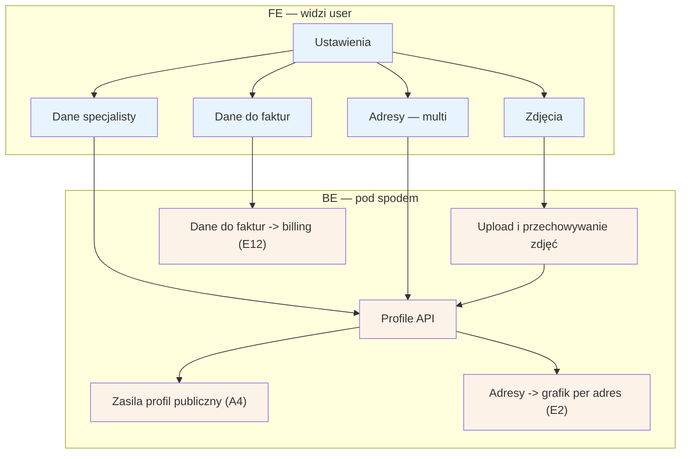

# E11 — Ustawienia specjalisty

## Notatki
- Priorytet: P0.
- Kolumna BE w mapie pusta ("—") — przyjęto założenie minimalne: profile API (te same encje co draft profilu z D2) + upload zdjęć; zgłoszone w rozbieżnościach.
- Adresy multi (jak w D2): każda zmiana adresów wpływa na godziny pracy per adres w [[e2-grafik-dostepnosc]] (E2) i na profil publiczny A4 (mapa, dystans w A2/A3).
- Dane do faktur zasilają billing/faktury VAT w [[e12-subskrypcja-billing]] (E12).
- Czy zmiany danych publicznych (bio, zdjęcia) wymagają ponownej moderacji — mapa nie rozstrzyga; założenie: nie (weryfikacja D1/F1 dotyczy PWZ, nie treści).
- Powiązania: D2, A4, E2, E12.

## Co opisuje ten diagram

Ekran ustawień w panelu specjalisty: edycja danych osobowych i opisu, zarządzanie wieloma adresami gabinetów, wgrywanie zdjęć oraz uzupełnianie danych do faktur. Zmiany zapisuje system i rozprowadza dalej: dane i zdjęcia trafiają na publiczny profil, adresy wpływają na grafik (osobne godziny pracy per adres), a dane do faktur zasilają billing. To flow uruchamiany przez samego specjalistę, kiedy chce coś zaktualizować.

## Powiązane diagramy

| ID | Diagram | Jak się łączy |
|---|---|---|
| D2 | [../cd-specjalista-onboarding/d2-stan-w-trakcie.md](../cd-specjalista-onboarding/d2-stan-w-trakcie.md) | te same encje profilu co draft z onboardingu; adresy multi jak w D2 |
| A4 | [../a-pacjent-public/a4-profil-specjalisty.md](../a-pacjent-public/a4-profil-specjalisty.md) | dane, adresy i zdjęcia zasilają profil publiczny |
| A2 | [../a-pacjent-public/a2-wyszukiwanie.md](../a-pacjent-public/a2-wyszukiwanie.md) | adresy wpływają na wyszukiwanie po dystansie |
| A3 | [../a-pacjent-public/a3-lista-wynikow.md](../a-pacjent-public/a3-lista-wynikow.md) | adresy wpływają na mapę i dystans na liście wyników |
| E2 | [e2-grafik-dostepnosc.md](e2-grafik-dostepnosc.md) | zmiana adresów zmienia godziny pracy per adres w grafiku |
| E12 | [e12-subskrypcja-billing.md](e12-subskrypcja-billing.md) | dane do faktur zasilają billing i faktury VAT |
| D1 | [../cd-specjalista-onboarding/d1-weryfikacja-pwz.md](../cd-specjalista-onboarding/d1-weryfikacja-pwz.md) | założenie: zmiana bio/zdjęć nie wymaga ponownej weryfikacji (D1 dotyczy PWZ) |
| F1 | [../f-backoffice/f1-kolejka-weryfikacji-pwz.md](../f-backoffice/f1-kolejka-weryfikacji-pwz.md) | jak wyżej — kolejka weryfikacji dotyczy PWZ, nie treści profilu |

## Słownik

| Pojęcie | Wyjaśnienie |
|---|---|
| ustawienia | ekran panelu, na którym specjalista edytuje swoje dane, adresy, zdjęcia i dane do faktur |
| adresy multi | możliwość podania kilku miejsc przyjęć (gabinetów), każde z własnymi godzinami pracy |
| upload | wgranie pliku (tu: zdjęcia) do systemu, który go przechowuje |
| profil publiczny | strona specjalisty widoczna dla pacjentów w wyszukiwarce serwisu |
| dane do faktur | dane firmowe specjalisty potrzebne do wystawiania faktur VAT za abonament |
| profile API | usługa systemu przechowująca i udostępniająca dane profilu specjalisty |
| draft profilu | robocza wersja profilu tworzona podczas onboardingu, zanim profil stanie się publiczny |
| PWZ | numer prawa wykonywania zawodu — weryfikowany przy rejestracji, niezależnie od treści profilu |
| moderacja | sprawdzanie treści przez administrację; założenie: zmiany bio/zdjęć jej nie wymagają |
