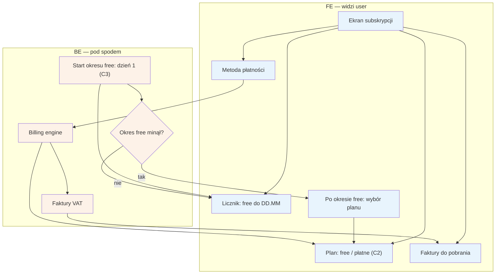

# E12 — Subskrypcja / billing specjalisty

## Notatki
- Priorytet: P1, ale widoczność licznika "free do DD.MM" = P0 (od dnia 1, start liczony od rejestracji C3). Prompt #2 (model subskrypcji).
- Na start 1 plan free + zapowiedź płatnych (C2); billing engine nalicza subskrypcję i wystawia faktury VAT.
- Co dokładnie po końcu okresu free (blokada panelu? ukrycie profilu? grace period?) — mapa NIE rozstrzyga; w diagramie tylko prompt wyboru planu (założenie minimalne); zgłoszone w rozbieżnościach.
- Dane do faktur z [[e11-ustawienia]] (E11); strona administracyjna billingu: F6 (subskrypcje, windykacja).
- Alert o statusie subskrypcji widoczny na dashboardzie [[e1-dashboard]] (E1).
- Płatność za subskrypcję B2B jest niezależna od Flagi 2 (płatności pacjentów w POC).
- Powiązania: C2, C3, E1, E11, F6.
