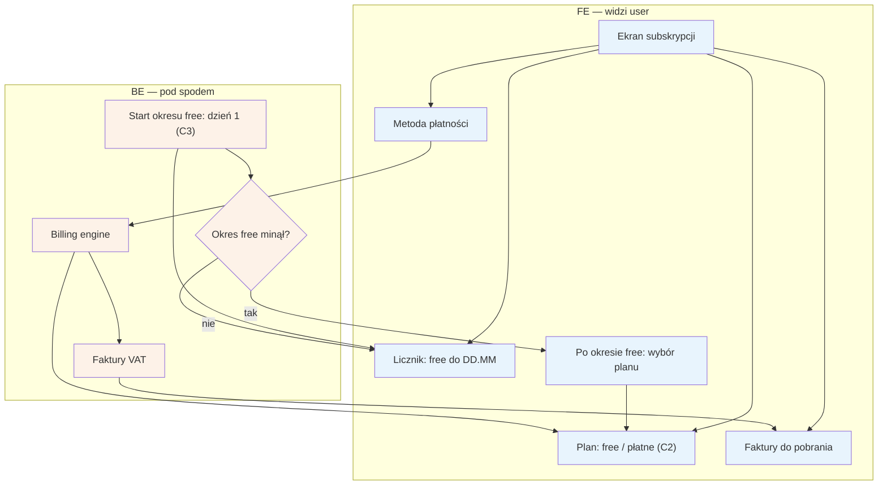

# E12 — Subskrypcja / billing specjalisty

## Notatki
- Priorytet: P1, ale widoczność licznika "free do DD.MM" = P0 (od dnia 1, start liczony od rejestracji C3). Prompt #2 (model subskrypcji).
- Na start 1 plan free + zapowiedź płatnych (C2); billing engine nalicza subskrypcję i wystawia faktury VAT.
- Co dokładnie po końcu okresu free (blokada panelu? ukrycie profilu? grace period?) — mapa NIE rozstrzyga; w diagramie tylko prompt wyboru planu (założenie minimalne); zgłoszone w rozbieżnościach.
- Dane do faktur z [[e11-ustawienia]] (E11); strona administracyjna billingu: F6 (subskrypcje, windykacja).
- Alert o statusie subskrypcji widoczny na dashboardzie [[e1-dashboard]] (E1).
- Płatność za subskrypcję B2B jest niezależna od Flagi 2 (płatności pacjentów w POC).
- Powiązania: C2, C3, E1, E11, F6.

## Co opisuje ten diagram

Ekran subskrypcji w panelu specjalisty: aktualny plan (na start darmowy), licznik "free do DD.MM" odliczany od dnia rejestracji, metoda płatności i faktury do pobrania. W tle billing engine nalicza abonament i wystawia faktury VAT, a gdy okres darmowy się kończy, specjalista widzi zachętę do wyboru płatnego planu. Dotyczy rozliczeń specjalisty z serwisem (B2B) — nie płatności pacjentów za wizyty.

## Powiązane diagramy

| ID | Diagram | Jak się łączy |
|---|---|---|
| C2 | [../cd-specjalista-onboarding/c2-cennik-b2b.md](../cd-specjalista-onboarding/c2-cennik-b2b.md) | plany free/płatne pochodzą z cennika B2B |
| C3 | [../cd-specjalista-onboarding/c3-rejestracja.md](../cd-specjalista-onboarding/c3-rejestracja.md) | okres free startuje w dniu rejestracji specjalisty |
| E1 | [e1-dashboard.md](e1-dashboard.md) | alert o statusie subskrypcji widoczny na dashboardzie |
| E11 | [e11-ustawienia.md](e11-ustawienia.md) | dane do faktur pochodzą z ustawień specjalisty |
| F6 | [../f-backoffice/f6-billing-admin.md](../f-backoffice/f6-billing-admin.md) | administracyjna strona billingu: subskrypcje, windykacja |

## Słownik

| Pojęcie | Wyjaśnienie |
|---|---|
| subskrypcja | abonament specjalisty za korzystanie z serwisu, rozliczany cyklicznie |
| plan free | darmowy plan startowy, obowiązujący od dnia rejestracji przez określony czas |
| licznik free | widoczna od pierwszego dnia informacja "free do DD.MM" — do kiedy trwa okres darmowy |
| billing engine | mechanizm systemu naliczający opłaty abonamentowe i pilnujący terminów |
| faktura VAT | dokument księgowy wystawiany specjaliście za abonament, do pobrania z panelu |
| metoda płatności | zapisany sposób opłacania abonamentu (np. karta) |
| B2B | rozliczenie firma-firma: specjalista płaci serwisowi, niezależnie od płatności pacjentów |
| grace period | ewentualny okres łaski po końcu free, zanim system coś zablokuje — nierozstrzygnięte w mapie |
| windykacja | dochodzenie zaległych płatności — obsługiwane po stronie admina (F6) |
