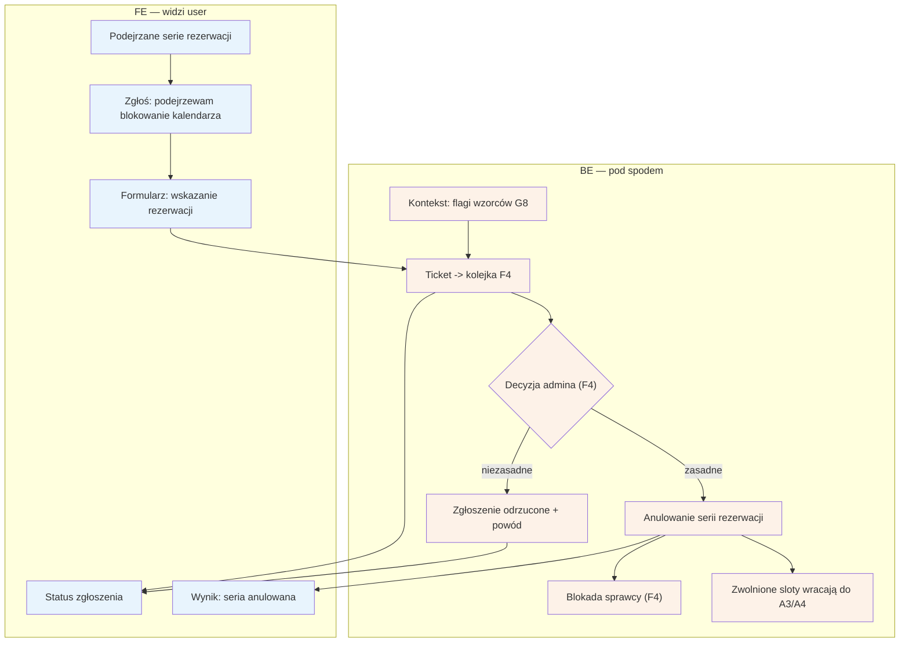

# E13 — Zgłoszenie abuse (blokowanie kalendarza)

## Notatki
- Priorytet: P1. Prompt #4 (scoring + anty-abuse). Ścieżka E2E "sabotaż slotów": seria rezerwacji -> G8 flaga -> F4 -> anulowanie serii -> E13 potwierdza.
- Ticket trafia do kolejki anty-abuse F4 (przegląd IP/device, flagi wzorców z G8 jako kontekst dla admina); decyzja i blokada po stronie F4.
- Stan rezerwacji przy anulowaniu serii przez admina: kanon nie ma anulacji administracyjnej (jest tylko cancelled_by_patient / cancelled_by_specialist) — NIEROZSTRZYGNIĘTE, zgłoszone w rozbieżnościach; w diagramie neutralne "anulowanie serii".
- Zwolnione sloty wracają do dostępności (A3/A4); czy przechodzą przez waitlistę G6 — mapa nie rozstrzyga.
- Powiązania: F4, G8, A3, A4, G6.

## Co opisuje ten diagram

Ścieżka obrony specjalisty przed sabotażem kalendarza: gdy zauważy podejrzaną serię rezerwacji (np. ktoś celowo blokuje mu terminy), zgłasza to formularzem, wskazując konkretne rezerwacje. Zgłoszenie staje się ticketem w kolejce anty-abuse, gdzie administrator — wspierany automatycznymi flagami wzorców — decyduje: jeśli zgłoszenie jest zasadne, anuluje serię, blokuje sprawcę, a zwolnione terminy wracają do sprzedaży; jeśli nie, specjalista dostaje odmowę z uzasadnieniem. Przez cały czas specjalista widzi status swojego zgłoszenia.

## Powiązane diagramy

| ID | Diagram | Jak się łączy |
|---|---|---|
| F4 | [../f-backoffice/f4-anty-abuse.md](../f-backoffice/f4-anty-abuse.md) | ticket trafia do kolejki anty-abuse; decyzja i blokada sprawcy po stronie admina |
| G8 | [../00-core/00-katalog-eventow.md](../00-core/00-katalog-eventow.md) | automatyczne flagi wzorców z fraud detection (G8) to kontekst dla admina |
| A3 | [../a-pacjent-public/a3-lista-wynikow.md](../a-pacjent-public/a3-lista-wynikow.md) | zwolnione sloty wracają do wyników wyszukiwania |
| A4 | [../a-pacjent-public/a4-profil-specjalisty.md](../a-pacjent-public/a4-profil-specjalisty.md) | zwolnione sloty wracają też do kalendarza na profilu |
| G6 | [../g-silniki/g6-waitlist-engine.md](../g-silniki/g6-waitlist-engine.md) | nierozstrzygnięte: czy zwolnione sloty przechodzą przez waitlistę |

## Słownik

| Pojęcie | Wyjaśnienie |
|---|---|
| abuse | nadużycie serwisu — tu: celowe blokowanie kalendarza specjalisty fałszywymi rezerwacjami |
| blokowanie kalendarza | sabotaż polegający na masowym rezerwowaniu terminów bez zamiaru przyjścia |
| seria rezerwacji | grupa powiązanych rezerwacji (np. z jednego źródła), wskazywana w zgłoszeniu |
| ticket | zgłoszenie zarejestrowane w systemie i czekające w kolejce na decyzję admina |
| flaga wzorca | automatyczne oznaczenie podejrzanego zachowania wykryte przez system (G8) |
| anulowanie serii | hurtowe unieważnienie wszystkich rezerwacji uznanych za sabotaż |
| blokada sprawcy | odebranie sprawcy możliwości dalszego rezerwowania w serwisie |
| slot | pojedynczy termin wizyty; po anulowaniu serii wraca do puli wolnych terminów |
| waitlista | lista oczekujących na zwolnione terminy — jej rola przy anulowaniu serii nierozstrzygnięta |
