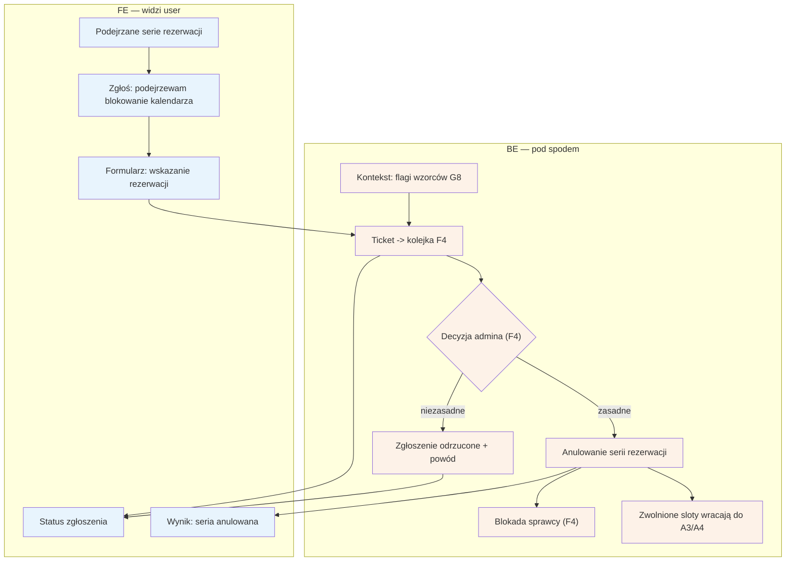

# E13 — Zgłoszenie abuse (blokowanie kalendarza)

## Notatki
- Priorytet: P1. Prompt #4 (scoring + anty-abuse). Ścieżka E2E "sabotaż slotów": seria rezerwacji -> G8 flaga -> F4 -> anulowanie serii -> E13 potwierdza.
- Ticket trafia do kolejki anty-abuse F4 (przegląd IP/device, flagi wzorców z G8 jako kontekst dla admina); decyzja i blokada po stronie F4.
- Stan rezerwacji przy anulowaniu serii przez admina: kanon nie ma anulacji administracyjnej (jest tylko cancelled_by_patient / cancelled_by_specialist) — NIEROZSTRZYGNIĘTE, zgłoszone w rozbieżnościach; w diagramie neutralne "anulowanie serii".
- Zwolnione sloty wracają do dostępności (A3/A4); czy przechodzą przez waitlistę G6 — mapa nie rozstrzyga.
- Powiązania: F4, G8, A3, A4, G6.
