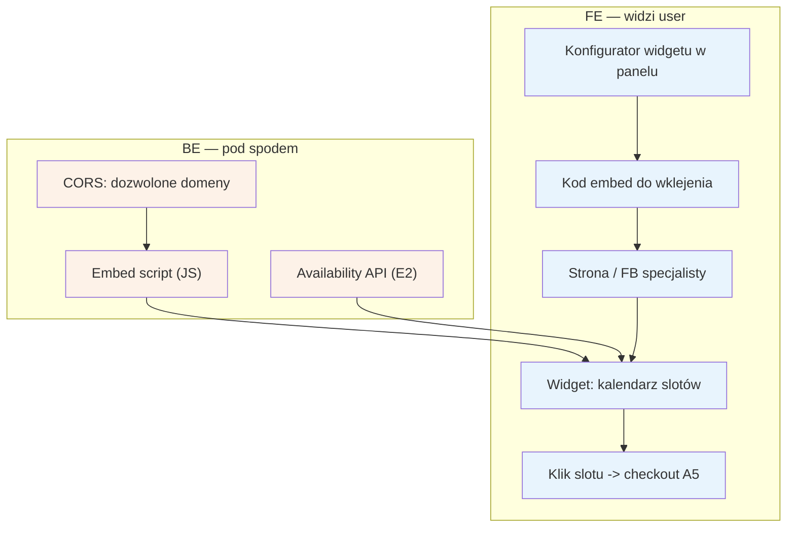

# E14 — Widget rezerwacji (embed)

## Notatki
- Priorytet: P2 (ZL to ma; wspiera komunikat "nie porzucaj obecnych kanałów" — specjalista osadza nasz kalendarz na własnej stronie/FB).
- Widget czyta live sloty z availability API ([[e2-grafik-dostepnosc]], E2); CORS ogranicza osadzanie do domen zadeklarowanych przez specjalistę (założenie minimalne — mapa mówi tylko "embed script, CORS").
- Klik slotu w widgecie -> pełny checkout [[a5-checkout]] (A5) na naszej domenie (lock G5, OTP, zgody) — założenie minimalne: checkout NIE odbywa się w iframe strony trzeciej (RODO/OTP), zgłoszone w rozbieżnościach.
- Konfigurator w panelu: generuje kod embed; personalizacja wyglądu — nierozstrzygnięta, poza mapą.
- Powiązania: A5, E2, G5.
