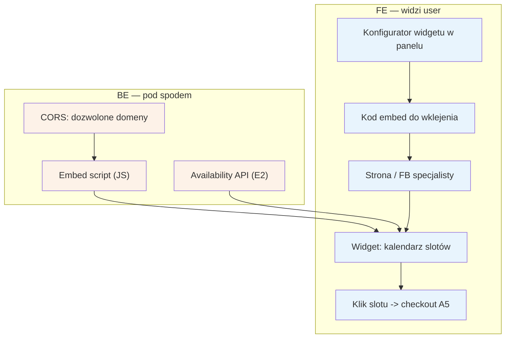

# E14 — Widget rezerwacji (embed)

## Notatki
- Priorytet: P2 (ZL to ma; wspiera komunikat "nie porzucaj obecnych kanałów" — specjalista osadza nasz kalendarz na własnej stronie/FB).
- Widget czyta live sloty z availability API ([[e2-grafik-dostepnosc]], E2); CORS ogranicza osadzanie do domen zadeklarowanych przez specjalistę (założenie minimalne — mapa mówi tylko "embed script, CORS").
- Klik slotu w widgecie -> pełny checkout [[a5-checkout]] (A5) na naszej domenie (lock G5, OTP, zgody) — założenie minimalne: checkout NIE odbywa się w iframe strony trzeciej (RODO/OTP), zgłoszone w rozbieżnościach.
- Konfigurator w panelu: generuje kod embed; personalizacja wyglądu — nierozstrzygnięta, poza mapą.
- Powiązania: A5, E2, G5.

## Co opisuje ten diagram

Pokazuje, jak specjalista osadza kalendarz rezerwacji na własnej stronie internetowej lub profilu na Facebooku. W panelu konfiguruje widget i dostaje kod embed do wklejenia; widget na jego stronie pokazuje na żywo wolne terminy pobierane z serwisu, a osadzanie jest ograniczone do domen, które specjalista zadeklarował. Gdy pacjent kliknie termin w widgecie, przechodzi do pełnego checkoutu na domenie serwisu — tam odbywa się rezerwacja z blokadą slotu i weryfikacją.

## Powiązane diagramy

| ID | Diagram | Jak się łączy |
|---|---|---|
| A5 | [../a-pacjent-public/a5-checkout.md](../a-pacjent-public/a5-checkout.md) | klik slotu w widgecie prowadzi do pełnego checkoutu na domenie serwisu |
| E2 | [e2-grafik-dostepnosc.md](e2-grafik-dostepnosc.md) | widget czyta na żywo wolne sloty z availability API |
| G5 | [../g-silniki/g5-slot-lock.md](../g-silniki/g5-slot-lock.md) | rezerwacja z widgetu korzysta z blokady slotu (lock TTL 10 min) |

## Słownik

| Pojęcie | Wyjaśnienie |
|---|---|
| widget | mały, interaktywny kalendarz rezerwacji wyświetlany na cudzej stronie internetowej |
| embed | osadzenie elementu serwisu (tu: widgetu) na zewnętrznej stronie |
| kod embed | fragment kodu wygenerowany w panelu, który specjalista wkleja na swoją stronę |
| embed script | skrypt (JS) dostarczany przez serwis, który rysuje widget na stronie specjalisty |
| CORS | mechanizm bezpieczeństwa przeglądarki ograniczający, które domeny mogą osadzić widget |
| availability API | usługa systemu zwracająca aktualne wolne sloty specjalisty |
| slot | pojedynczy wolny termin wizyty pokazywany w widgecie |
| lock | tymczasowa blokada wybranego slotu (10 minut) na czas dokończenia rezerwacji |
| checkout | proces rezerwacji wizyty — z widgetu zawsze na domenie serwisu, nie w ramce strony trzeciej |
| OTP | jednorazowy kod potwierdzający tożsamość pacjenta podczas checkoutu |
