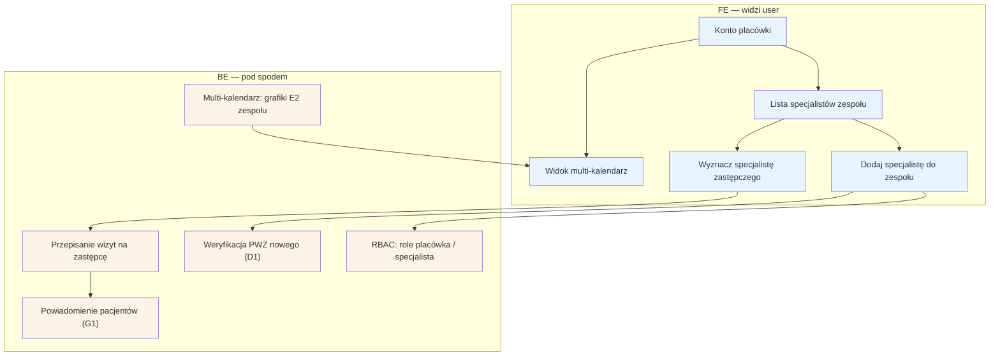

# E15 — Placówka / zespół

## Notatki
- Priorytet: P2.
- Konto placówki zarządza wieloma specjalistami: RBAC (rola placówki vs rola specjalisty — zakres uprawnień nierozstrzygnięty w mapie), multi-kalendarz = widok grafików E2 całego zespołu.
- Każdy dodany specjalista przechodzi własną weryfikację PWZ (D1/F1) — założenie minimalne, mapa nie rozstrzyga.
- "Specjalista zastępczy": założenie minimalne — wizyty nieobecnego przejmuje wskazany członek zespołu, pacjenci powiadamiani (G1) z możliwością odwołania tokenem (B3); pełna mechanika (zgoda pacjenta? różnica cen?) NIEROZSTRZYGNIĘTA, zgłoszone w rozbieżnościach. Alternatywa dla trybu urlop (E6) w placówkach.
- Powiązania: C3, D1, E2, E6, B3, G1, F9 (RBAC adminów — inny byt).
