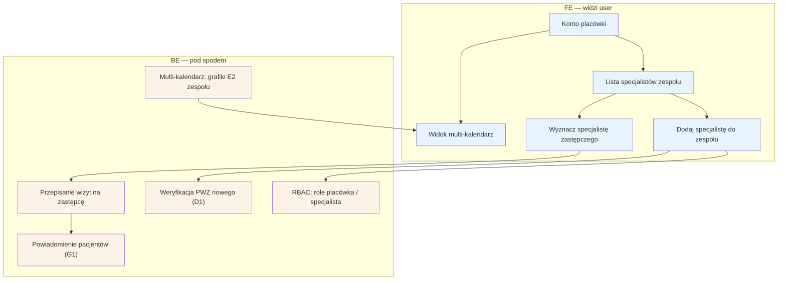

# E15 — Placówka / zespół

## Notatki
- Priorytet: P2.
- Konto placówki zarządza wieloma specjalistami: RBAC (rola placówki vs rola specjalisty — zakres uprawnień nierozstrzygnięty w mapie), multi-kalendarz = widok grafików E2 całego zespołu.
- Każdy dodany specjalista przechodzi własną weryfikację PWZ (D1/F1) — założenie minimalne, mapa nie rozstrzyga.
- "Specjalista zastępczy": założenie minimalne — wizyty nieobecnego przejmuje wskazany członek zespołu, pacjenci powiadamiani (G1) z możliwością odwołania tokenem (B3); pełna mechanika (zgoda pacjenta? różnica cen?) NIEROZSTRZYGNIĘTA, zgłoszone w rozbieżnościach. Alternatywa dla trybu urlop (E6) w placówkach.
- Powiązania: C3, D1, E2, E6, B3, G1, F9 (RBAC adminów — inny byt).

## Co opisuje ten diagram

Panel dla placówki (np. poradni zatrudniającej kilku logopedów), która zarządza zespołem specjalistów z jednego konta. Placówka dodaje nowych specjalistów (każdy przechodzi własną weryfikację PWZ), ogląda grafiki całego zespołu w widoku multi-kalendarza i — gdy któryś specjalista jest nieobecny — wyznacza zastępcę, na którego system przepisuje wizyty. Pacjenci przepisanych wizyt dostają powiadomienie i mogą odwołać wizytę, jeśli zmiana im nie odpowiada.

## Powiązane diagramy

| ID | Diagram | Jak się łączy |
|---|---|---|
| C3 | [../cd-specjalista-onboarding/c3-rejestracja.md](../cd-specjalista-onboarding/c3-rejestracja.md) | dodanie specjalisty do zespołu to wariant rejestracji |
| D1 | [../cd-specjalista-onboarding/d1-weryfikacja-pwz.md](../cd-specjalista-onboarding/d1-weryfikacja-pwz.md) | każdy nowy członek zespołu przechodzi własną weryfikację PWZ |
| F1 | [../f-backoffice/f1-kolejka-weryfikacji-pwz.md](../f-backoffice/f1-kolejka-weryfikacji-pwz.md) | weryfikacja członków zespołu przechodzi przez kolejkę admina |
| E2 | [e2-grafik-dostepnosc.md](e2-grafik-dostepnosc.md) | multi-kalendarz to widok grafików E2 całego zespołu |
| E6 | [e6-tryb-urlop.md](e6-tryb-urlop.md) | zastępca to alternatywa dla trybu urlop (odwołań bulk) w placówkach |
| B3 | [../b-pacjent-konto/b3-odwolanie-tokenem.md](../b-pacjent-konto/b3-odwolanie-tokenem.md) | pacjent przepisanej wizyty może ją odwołać tokenem |
| G1 | [../00-core/00-katalog-eventow.md](../00-core/00-katalog-eventow.md) | powiadomienia pacjentów o zastępstwie wysyła notification engine (G1) |
| F9 | [../f-backoffice/f9-rbac-wertykale.md](../f-backoffice/f9-rbac-wertykale.md) | RBAC adminów to odrębny mechanizm od ról placówka/specjalista |

## Słownik

| Pojęcie | Wyjaśnienie |
|---|---|
| placówka | firma/poradnia zatrudniająca wielu specjalistów, zarządzająca nimi z jednego konta |
| zespół | lista specjalistów przypisanych do konta placówki |
| RBAC | system ról i uprawnień — rozdziela, co może konto placówki, a co pojedynczy specjalista |
| multi-kalendarz | widok grafików wszystkich członków zespołu obok siebie |
| PWZ | numer prawa wykonywania zawodu — każdy dodany specjalista jest weryfikowany osobno |
| specjalista zastępczy | członek zespołu przejmujący wizyty nieobecnego specjalisty |
| przepisanie wizyt | przeniesienie umówionych wizyt na zastępcę zamiast ich odwoływania |
| token odwołania | link w powiadomieniu, którym pacjent może odwołać przepisaną wizytę bez logowania |
