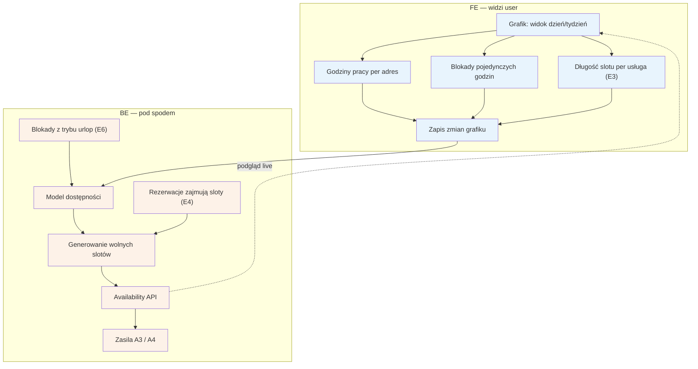

# E2 — Grafik / dostępność

## Notatki
- Priorytet: P0. Spec: S2 (model dostępności = serce systemu).
- Godziny pracy definiowane per adres (adresy multi z D2/[[e11-ustawienia]]); długość slotu per usługa pochodzi z [[e3-uslugi-ceny]] (E3).
- Model dostępności = godziny pracy − blokady (pojedyncze godziny + zakresy z [[e6-tryb-urlop]], E6) − zajęte rezerwacje (E4, w tym wizyty offline); wynik zasila inline sloty w A3 i pełny kalendarz w A4 (availability batch API, live).
- Bufory między wizytami i wizyty cykliczne — w zakresie speca S2, poza mapą E2; nie modelowano.
- Widget E14 i feed .ics E9 czytają ten sam model.
- Powiązania: A3, A4, E3, E4, E6, E9, E14, G10 (przyszły sync 2-way).
