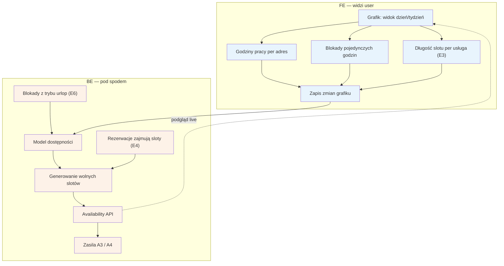

# E2 — Grafik / dostępność

## Notatki
- Priorytet: P0. Spec: S2 (model dostępności = serce systemu).
- Godziny pracy definiowane per adres (adresy multi z D2/[[e11-ustawienia]]); długość slotu per usługa pochodzi z [[e3-uslugi-ceny]] (E3).
- Model dostępności = godziny pracy − blokady (pojedyncze godziny + zakresy z [[e6-tryb-urlop]], E6) − zajęte rezerwacje (E4, w tym wizyty offline); wynik zasila inline sloty w A3 i pełny kalendarz w A4 (availability batch API, live).
- Bufory między wizytami i wizyty cykliczne — w zakresie speca S2, poza mapą E2; nie modelowano.
- Widget E14 i feed .ics E9 czytają ten sam model.
- Powiązania: A3, A4, E3, E4, E6, E9, E14, G10 (przyszły sync 2-way).

## Co opisuje ten diagram

Serce systemu: sposób, w jaki specjalista ustawia swój grafik pracy, i to, jak system wylicza z niego wolne terminy dla pacjentów. Specjalista definiuje godziny pracy dla każdego adresu, blokuje pojedyncze godziny, a długość slotu wynika z czasu trwania usługi. System odejmuje od godzin pracy blokady (w tym urlopy) i zajęte rezerwacje, a wynik — listę wolnych slotów — pokazuje pacjentom w wyszukiwarce i na profilu specjalisty.

## Powiązane diagramy

| ID | Diagram | Jak się łączy |
|---|---|---|
| A3 | [../a-pacjent-public/a3-lista-wynikow.md](../a-pacjent-public/a3-lista-wynikow.md) | wolne sloty zasilają podgląd terminów na liście wyników |
| A4 | [../a-pacjent-public/a4-profil-specjalisty.md](../a-pacjent-public/a4-profil-specjalisty.md) | wolne sloty zasilają pełny kalendarz na profilu specjalisty |
| E3 | [e3-uslugi-ceny.md](e3-uslugi-ceny.md) | czas trwania usługi wyznacza długość slotu w grafiku |
| E4 | [e4-rezerwacje.md](e4-rezerwacje.md) | potwierdzone rezerwacje (także wizyty offline) zajmują sloty |
| E6 | [e6-tryb-urlop.md](e6-tryb-urlop.md) | tryb urlop/choroba dokłada blokady całych zakresów dat |
| E9 | [e9-eksport-ics.md](e9-eksport-ics.md) | feed kalendarza .ics czyta ten sam model dostępności |
| E11 | [e11-ustawienia.md](e11-ustawienia.md) | adresy z ustawień definiują godziny pracy per adres |
| E14 | [e14-widget-rezerwacji.md](e14-widget-rezerwacji.md) | widget na stronie specjalisty czyta wolne sloty z availability API |
| D2 | [../cd-specjalista-onboarding/d2-stan-w-trakcie.md](../cd-specjalista-onboarding/d2-stan-w-trakcie.md) | adresy multi pochodzą już z onboardingu specjalisty |
| G10 | [../00-core/00-katalog-eventow.md](../00-core/00-katalog-eventow.md) | przyszły dwukierunkowy sync z kalendarzem zewnętrznym (silnik G10) |

## Słownik

| Pojęcie | Wyjaśnienie |
|---|---|
| grafik | plan pracy specjalisty w widoku dnia lub tygodnia |
| slot | pojedynczy termin wizyty o określonej długości, który pacjent może zarezerwować |
| model dostępności | reguła systemu: godziny pracy minus blokady minus zajęte rezerwacje = wolne sloty |
| blokada | ręczne wyłączenie godziny lub zakresu dat z możliwości rezerwacji |
| godziny pracy per adres | osobne godziny przyjęć dla każdego miejsca (gabinetu), w którym pracuje specjalista |
| availability API | usługa systemu, która na żądanie zwraca aktualne wolne sloty specjalisty |
| wizyta offline | wizyta dopisana ręcznie przez specjalistę (spoza serwisu), która też zajmuje slot |
| feed .ics | plik kalendarza pobierany cyklicznie przez Google/Apple Calendar z wizytami specjalisty |
| widget | kalendarz rezerwacji osadzany na własnej stronie internetowej specjalisty |
| sync 2-way | przyszła dwukierunkowa synchronizacja grafiku z zewnętrznym kalendarzem |
