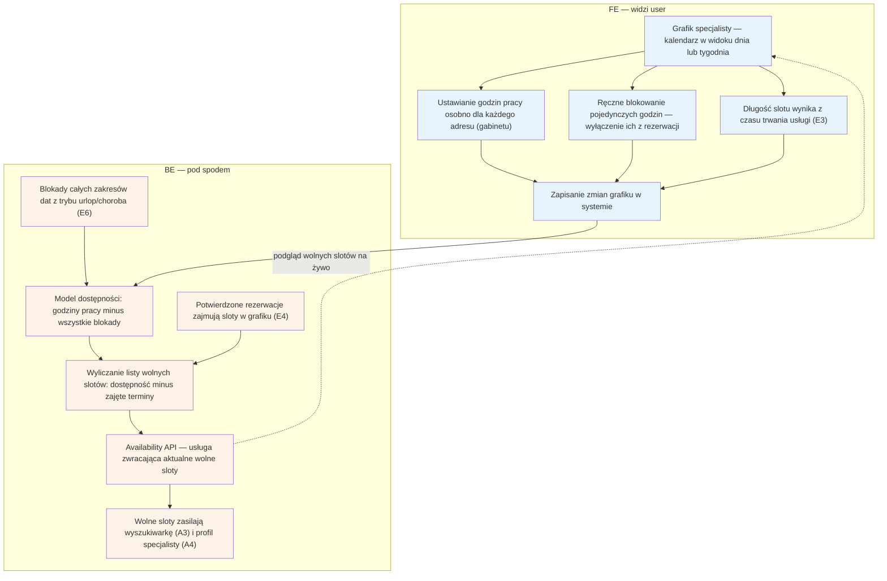

# E2 — Grafik / dostępność

## Notatki
- Priorytet: P0. Spec: S2 (model dostępności = serce systemu).
- Godziny pracy definiowane per adres (adresy multi z D2/[[e11-ustawienia]]); długość slotu per usługa pochodzi z [[e3-uslugi-ceny]] (E3).
- Model dostępności = godziny pracy − blokady (pojedyncze godziny + zakresy z [[e6-tryb-urlop]], E6) − zajęte rezerwacje (E4, w tym wizyty offline); wynik zasila inline sloty w A3 i pełny kalendarz w A4 (availability batch API, live).
- Bufory między wizytami i wizyty cykliczne — w zakresie speca S2, poza mapą E2; nie modelowano.
- Widget E14 i feed .ics E9 czytają ten sam model.
- Powiązania: A3, A4, E3, E4, E6, E9, E14, G10 (przyszły sync 2-way).

## Co opisuje ten diagram

Serce systemu: sposób, w jaki specjalista ustawia swój grafik pracy, i to, jak system wylicza z niego wolne terminy dla pacjentów. Specjalista definiuje godziny pracy dla każdego adresu, blokuje pojedyncze godziny, a długość slotu wynika z czasu trwania usługi. System odejmuje od godzin pracy blokady (w tym urlopy) i zajęte rezerwacje, a wynik — listę wolnych slotów — pokazuje pacjentom w wyszukiwarce i na profilu specjalisty.

## Aktorzy w tym flow

| Rola | Kto to jest | Co robi w tym flow |
|---|---|---|
| **Specjalista** (logopeda / lekarz) | usługodawca przyjmujący wizyty, główny użytkownik panelu | ustawia godziny pracy osobno dla każdego gabinetu, blokuje pojedyncze godziny, zapisuje zmiany grafiku i podgląda na żywo, jak wyglądają jego wolne terminy |
| **FE** (interfejs panelu) | ekrany panelu specjalisty widoczne w przeglądarce | pokazuje kalendarz w widoku dnia/tygodnia, formularze godzin pracy i blokad oraz podgląd wolnych slotów na żywo |
| **System/Backend** | serwery i logika platformy działające „pod spodem", bez udziału człowieka | przechowuje model dostępności, odejmuje od godzin pracy blokady (w tym urlopy z E6) i zajęte rezerwacje (E4), wylicza wolne sloty i udostępnia je przez availability API wyszukiwarce (A3) i profilowi (A4) |

## Objaśnienie bloków

| Blok | Co to znaczy w praktyce | Kto tu działa |
|---|---|---|
| Grafik specjalisty — kalendarz w widoku dnia lub tygodnia | Główny ekran tego flow: kalendarz pracy specjalisty w panelu. Z tego miejsca specjalista wchodzi we wszystkie ustawienia grafiku i widzi efekt swoich zmian. | Specjalista, FE |
| Ustawianie godzin pracy osobno dla każdego adresu (gabinetu) | Specjalista określa, w jakich godzinach przyjmuje pacjentów — i to oddzielnie dla każdego miejsca pracy (np. poniedziałki w gabinecie A, wtorki w gabinecie B). Adresy pochodzą z onboardingu (D2) i ustawień (E11). | Specjalista |
| Ręczne blokowanie pojedynczych godzin — wyłączenie ich z rezerwacji | „Blokada godzin": specjalista wyłącza z rezerwacji konkretne godziny w ramach normalnych godzin pracy (np. prywatna sprawa w środę 12:00–14:00). Pacjenci w tym czasie nie zobaczą wolnych terminów. | Specjalista |
| Długość slotu wynika z czasu trwania usługi (E3) | System nie każe ustawiać długości terminów ręcznie — jeden slot (termin do zarezerwowania) trwa tyle, ile trwa dana usługa zdefiniowana w cenniku (E3), np. konsultacja 30 min = sloty co 30 min. | Specjalista (pośrednio, przez cennik E3) |
| Zapisanie zmian grafiku w systemie | Moment kliknięcia „zapisz" — dopiero wtedy zmiany godzin pracy i blokad trafiają z formularza do systemu i zaczynają obowiązywać. | Specjalista, FE |
| Model dostępności: godziny pracy minus wszystkie blokady | Wewnętrzna „mapa czasu" specjalisty po stronie systemu. Reguła: godziny pracy − blokady pojedynczych godzin − blokady urlopowe = czas, w którym specjalista w ogóle może przyjmować. | System/Backend |
| Potwierdzone rezerwacje zajmują sloty w grafiku (E4) | Każda umówiona wizyta (także dopisana ręcznie wizyta offline) zajmuje swój termin — system musi ją odjąć, żeby nie zaproponować pacjentowi godziny, która jest już zajęta. | System/Backend |
| Blokady całych zakresów dat z trybu urlop/choroba (E6) | Gdy specjalista włączy tryb urlop lub choroba (E6), system blokuje całe dni lub tygodnie naraz — te zakresy również są odejmowane od dostępności. | System/Backend (na podstawie decyzji Specjalisty w E6) |
| Wyliczanie listy wolnych slotów: dostępność minus zajęte terminy | Końcowe działanie: z czasu, w którym specjalista może przyjmować, system wycina zajęte rezerwacje i tnie resztę na sloty o długości usługi. Wynik to konkretna lista wolnych terminów do pokazania pacjentom. | System/Backend |
| Availability API — usługa zwracająca aktualne wolne sloty | „Okienko podawcze" systemu: każdy ekran, który chce pokazać wolne terminy (wyszukiwarka, profil, widget, podgląd w panelu), pyta tę usługę i dostaje zawsze aktualną listę slotów. | System/Backend |
| Wolne sloty zasilają wyszukiwarkę (A3) i profil specjalisty (A4) | Efekt końcowy widoczny dla pacjentów: wolne terminy pojawiają się przy wynikach wyszukiwania (A3) i w pełnym kalendarzu na profilu specjalisty (A4), skąd pacjent może je rezerwować. | System/Backend (odbiorcą jest Pacjent na ekranach A3/A4) |
| Strzałka „podgląd wolnych slotów na żywo" | Grafik w panelu korzysta z tej samej usługi co pacjenci — specjalista widzi na bieżąco dokładnie te wolne terminy, które widzą pacjenci. | FE, System/Backend |

## Powiązane diagramy

| ID | Diagram | Jak się łączy |
|---|---|---|
| A3 | [../a-pacjent-public/a3-lista-wynikow.md](../a-pacjent-public/a3-lista-wynikow.md) | wolne sloty zasilają podgląd terminów na liście wyników |
| A4 | [../a-pacjent-public/a4-profil-specjalisty.md](../a-pacjent-public/a4-profil-specjalisty.md) | wolne sloty zasilają pełny kalendarz na profilu specjalisty |
| E3 | [e3-uslugi-ceny.md](e3-uslugi-ceny.md) | czas trwania usługi wyznacza długość slotu w grafiku |
| E4 | [e4-rezerwacje.md](e4-rezerwacje.md) | potwierdzone rezerwacje (także wizyty offline) zajmują sloty |
| E6 | [e6-tryb-urlop.md](e6-tryb-urlop.md) | tryb urlop/choroba dokłada blokady całych zakresów dat |
| E9 | [e9-eksport-ics.md](e9-eksport-ics.md) | feed kalendarza .ics czyta ten sam model dostępności |
| E11 | [e11-ustawienia.md](e11-ustawienia.md) | adresy z ustawień definiują godziny pracy per adres |
| E14 | [e14-widget-rezerwacji.md](e14-widget-rezerwacji.md) | widget na stronie specjalisty czyta wolne sloty z availability API |
| D2 | [../cd-specjalista-onboarding/d2-stan-w-trakcie.md](../cd-specjalista-onboarding/d2-stan-w-trakcie.md) | adresy multi pochodzą już z onboardingu specjalisty |
| G10 | [../00-core/00-katalog-eventow.md](../00-core/00-katalog-eventow.md) | przyszły dwukierunkowy sync z kalendarzem zewnętrznym (silnik G10) |

## Słownik

| Pojęcie | Wyjaśnienie |
|---|---|
| grafik | plan pracy specjalisty w widoku dnia lub tygodnia |
| slot | pojedynczy termin wizyty o określonej długości, który pacjent może zarezerwować |
| model dostępności | reguła systemu: godziny pracy minus blokady minus zajęte rezerwacje = wolne sloty |
| blokada | ręczne wyłączenie godziny lub zakresu dat z możliwości rezerwacji |
| godziny pracy per adres | osobne godziny przyjęć dla każdego miejsca (gabinetu), w którym pracuje specjalista |
| availability API | usługa systemu, która na żądanie zwraca aktualne wolne sloty specjalisty |
| wizyta offline | wizyta dopisana ręcznie przez specjalistę (spoza serwisu), która też zajmuje slot |
| feed .ics | plik kalendarza pobierany cyklicznie przez Google/Apple Calendar z wizytami specjalisty |
| widget | kalendarz rezerwacji osadzany na własnej stronie internetowej specjalisty |
| sync 2-way | przyszła dwukierunkowa synchronizacja grafiku z zewnętrznym kalendarzem |
| FE („FE — widzi user") | część systemu widoczna dla użytkownika: ekrany i przyciski w przeglądarce |
| BE („BE — pod spodem") | część systemu niewidoczna dla użytkownika: serwery, obliczenia i baza danych |
| blokada godzin | ręczne wyłączenie z rezerwacji konkretnych godzin w ramach normalnych godzin pracy |
| podgląd na żywo (live) | grafik w panelu pokazuje wolne sloty z tej samej usługi co ekrany pacjenta — bez opóźnień |
| onboarding | proces zakładania i uzupełniania konta specjalisty (grupa D), skąd pochodzą m.in. adresy gabinetów |
