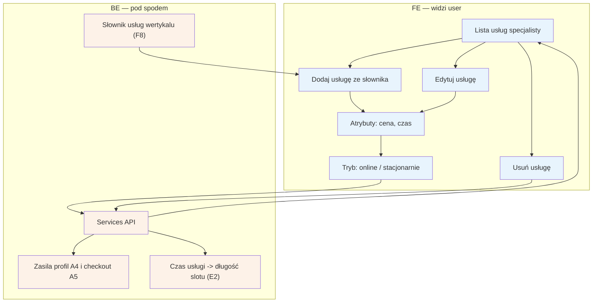

# E3 — Usługi i ceny

## Notatki
- Priorytet: P0. Spec: S2.
- CRUD wyłącznie ze słownika usług wertykalu (konfiguracja forka F8) — specjalista nie tworzy dowolnych nazw usług; ustawia cenę, czas trwania i tryb (online/stacjonarnie).
- Czas trwania usługi determinuje długość slotu w grafiku [[e2-grafik-dostepnosc]] (E2); usługi + ceny widoczne na profilu A4 i w kroku wyboru usługi w checkoucie A5.
- Usunięcie usługi z przyszłymi rezerwacjami — mapa NIE rozstrzyga zachowania (blokada? odwołania E5?); zgłoszone w rozbieżnościach.
- Powiązania: A4, A5, E2, F8.

## Co opisuje ten diagram

Ekran panelu, na którym specjalista zarządza swoją ofertą: dodaje usługi z gotowego słownika (nie wymyśla własnych nazw), ustawia dla nich cenę, czas trwania i tryb (online lub stacjonarnie), edytuje je i usuwa. Zmiany zapisuje system, a ich efekty widać w dwóch miejscach: na publicznym profilu specjalisty (cennik dla pacjentów) oraz w grafiku, gdzie czas trwania usługi wyznacza długość slotu.

## Powiązane diagramy

| ID | Diagram | Jak się łączy |
|---|---|---|
| A4 | [../a-pacjent-public/a4-profil-specjalisty.md](../a-pacjent-public/a4-profil-specjalisty.md) | usługi i ceny są widoczne na publicznym profilu |
| A5 | [../a-pacjent-public/a5-checkout.md](../a-pacjent-public/a5-checkout.md) | wybór usługi to krok checkoutu rezerwacji |
| E2 | [e2-grafik-dostepnosc.md](e2-grafik-dostepnosc.md) | czas trwania usługi determinuje długość slotu w grafiku |
| E5 | [e5-odwolanie-pojedyncze.md](e5-odwolanie-pojedyncze.md) | nierozstrzygnięte: czy usunięcie usługi z przyszłymi rezerwacjami wymusza odwołania |
| F8 | [../f-backoffice/f8-konfiguracja-forka.md](../f-backoffice/f8-konfiguracja-forka.md) | słownik usług wertykalu pochodzi z konfiguracji forka |

## Słownik

| Pojęcie | Wyjaśnienie |
|---|---|
| słownik usług | zamknięta, ustalona przez administrację lista nazw usług, z której specjalista wybiera swoją ofertę |
| wertykal | branża/specjalizacja, dla której działa dana wersja serwisu (tu: logopedzi) |
| fork | osobna instancja serwisu dla innego wertykalu, z własną konfiguracją (m.in. słownikiem usług) |
| CRUD | podstawowe operacje na danych: dodawanie, odczyt, edycja i usuwanie (tu: usług) |
| tryb online / stacjonarnie | określenie, czy usługa odbywa się zdalnie, czy w gabinecie |
| slot | pojedynczy termin wizyty w grafiku; jego długość wynika z czasu trwania usługi |
| checkout | proces rezerwacji wizyty przez pacjenta, w którym wybiera on m.in. usługę |
