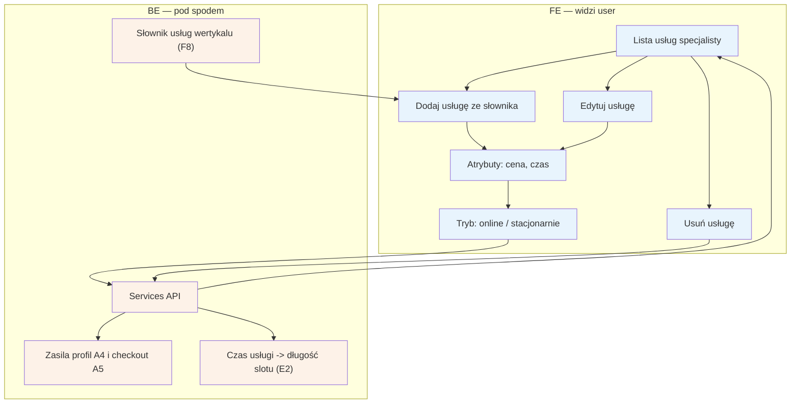

# E3 — Usługi i ceny

## Notatki
- Priorytet: P0. Spec: S2.
- CRUD wyłącznie ze słownika usług wertykalu (konfiguracja forka F8) — specjalista nie tworzy dowolnych nazw usług; ustawia cenę, czas trwania i tryb (online/stacjonarnie).
- Czas trwania usługi determinuje długość slotu w grafiku [[e2-grafik-dostepnosc]] (E2); usługi + ceny widoczne na profilu A4 i w kroku wyboru usługi w checkoucie A5.
- Usunięcie usługi z przyszłymi rezerwacjami — mapa NIE rozstrzyga zachowania (blokada? odwołania E5?); zgłoszone w rozbieżnościach.
- Powiązania: A4, A5, E2, F8.
