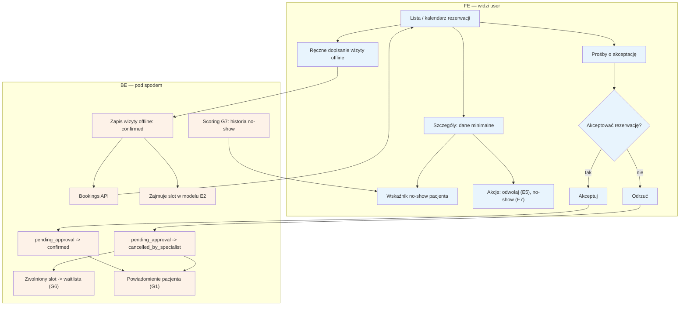

# E4 — Rezerwacje (lista, szczegóły, akceptacja, wizyty offline)

## Notatki
- Priorytet: P0. Spec: S2.
- Szczegóły wizyty = dane minimalne pacjenta (minimalizacja RODO) + wskaźnik no-show pacjenta ze scoringu G7.
- Ręczna akceptacja pojawia się tylko, gdy scoring gate (G7) wymusił wariant [[a5-checkout-wariant-akceptacja]]; akceptacja: pending_approval -> confirmed, odrzucenie: pending_approval -> cancelled_by_specialist (kanon nie ma stanu "rejected") + zwolniony slot -> waitlista (G6); brak reakcji -> timeout (założenie 24 h, patrz wariant A5).
- Ręczne dopisanie wizyty offline: założenie minimalne — od razu stan confirmed, zajmuje slot w modelu E2; dane pacjenta wpisuje specjalista.
- ⚠️ Flaga 4 (OTWARTA): czy wizyta dopisana ręcznie uprawnia do opinii (B5)? Ryzyko lewych opinii; propozycja z mapy: bez prawa do opinii publicznej albo słabszy badge — do rozstrzygnięcia w prompcie #1. Zgłoszone w rozbieżnościach.
- Akcje z poziomu szczegółów: odwołanie/przesunięcie -> [[e5-odwolanie-pojedyncze]] (E5), no-show -> [[e7-no-show]] (E7), approval po wizycie -> [[e8-approval-opinie]] (E8).
- Powiązania: A5 (wariant akceptacji), E2, E5, E7, E8, G1, G6, G7, B8 (odpowiedzi formularza przedwizytowego widoczne tutaj — P2), CORE-STANY, Flaga 4.
