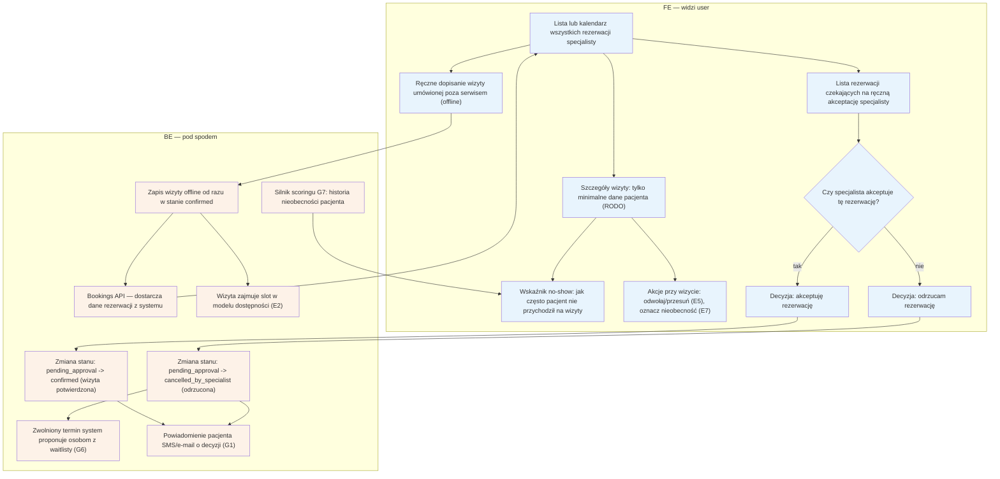

# E4 — Rezerwacje (lista, szczegóły, akceptacja, wizyty offline)

## Notatki
- Priorytet: P0. Spec: S2.
- Szczegóły wizyty = dane minimalne pacjenta (minimalizacja RODO) + wskaźnik no-show pacjenta ze scoringu G7.
- Ręczna akceptacja pojawia się tylko, gdy scoring gate (G7) wymusił wariant [[a5-checkout-wariant-akceptacja]]; akceptacja: pending_approval -> confirmed, odrzucenie: pending_approval -> cancelled_by_specialist (kanon nie ma stanu "rejected") + zwolniony slot -> waitlista (G6); brak reakcji -> timeout (założenie 24 h, patrz wariant A5).
- Ręczne dopisanie wizyty offline: założenie minimalne — od razu stan confirmed, zajmuje slot w modelu E2; dane pacjenta wpisuje specjalista.
- ⚠️ Flaga 4 (OTWARTA): czy wizyta dopisana ręcznie uprawnia do opinii (B5)? Ryzyko lewych opinii; propozycja z mapy: bez prawa do opinii publicznej albo słabszy badge — do rozstrzygnięcia w prompcie #1. Zgłoszone w rozbieżnościach.
- Akcje z poziomu szczegółów: odwołanie/przesunięcie -> [[e5-odwolanie-pojedyncze]] (E5), no-show -> [[e7-no-show]] (E7), approval po wizycie -> [[e8-approval-opinie]] (E8).
- Powiązania: A5 (wariant akceptacji), E2, E5, E7, E8, G1, G6, G7, B8 (odpowiedzi formularza przedwizytowego widoczne tutaj — P2), CORE-STANY, Flaga 4.

## Co opisuje ten diagram

Centralny ekran pracy specjalisty z rezerwacjami: lista lub kalendarz wizyt, szczegóły pojedynczej wizyty (z minimalnymi danymi pacjenta i wskaźnikiem jego historii no-show) oraz akcje — odwołanie, oznaczenie "nie stawił się". Gdy system wymusił ręczną akceptację rezerwacji, specjalista widzi tu prośby o akceptację i decyduje: potwierdzić czy odrzucić (odrzucony slot wraca na waitlistę, pacjent dostaje powiadomienie). Specjalista może też ręcznie dopisać wizytę umówioną poza serwisem (offline), która od razu zajmuje slot w grafiku.

## Aktorzy w tym flow

| Rola | Kto to jest | Co robi w tym flow |
|---|---|---|
| **Specjalista** (logopeda / lekarz) | usługodawca przyjmujący wizyty, główny użytkownik panelu | przegląda listę i szczegóły rezerwacji, akceptuje lub odrzuca rezerwacje czekające na jego decyzję, uruchamia akcje (odwołanie E5, nieobecność E7) i ręcznie dopisuje wizyty umówione poza serwisem |
| **Pacjent** (użytkownik strony; zwykle rodzic dziecka) | osoba, która zarezerwowała wizytę przez serwis | w tym flow nie klika nic sam — jest odbiorcą decyzji: dostaje powiadomienie SMS/e-mail o akceptacji albo odrzuceniu swojej rezerwacji |
| **FE** (interfejs panelu) | ekrany panelu specjalisty widoczne w przeglądarce | pokazuje listę/kalendarz rezerwacji, szczegóły wizyty ze wskaźnikiem no-show, listę próśb o akceptację i formularz dopisania wizyty offline |
| **System/Backend** | serwery i logika platformy działające „pod spodem", bez udziału człowieka | dostarcza dane rezerwacji (Bookings API), wylicza wskaźnik no-show ze scoringu (G7), zmienia stany rezerwacji zgodnie z decyzją specjalisty, oddaje zwolniony termin na waitlistę (G6) i wysyła powiadomienia (G1) |
| **SMS/Email** (bramka powiadomień) | usługa wysyłająca wiadomości SMS i e-mail | doręcza pacjentowi wiadomość o akceptacji lub odrzuceniu rezerwacji |

## Objaśnienie bloków

| Blok | Co to znaczy w praktyce | Kto tu działa |
|---|---|---|
| Lista lub kalendarz wszystkich rezerwacji specjalisty | Punkt startowy: specjalista widzi wszystkie swoje umówione wizyty — jako listę albo widok kalendarza. Dane pochodzą z Bookings API. | Specjalista, FE |
| Szczegóły wizyty: tylko minimalne dane pacjenta (RODO) | Po kliknięciu wizyty specjalista widzi jej szczegóły — ale celowo tylko niezbędne dane pacjenta (np. imię, kontakt), zgodnie z zasadą minimalizacji danych z RODO. | Specjalista, FE |
| Wskaźnik no-show: jak często pacjent nie przychodził na wizyty | Przy pacjencie wyświetla się informacja z jego historii: ile razy wcześniej nie stawił się na umówione wizyty. Pomaga specjaliście ocenić ryzyko, zanim zdecyduje o akceptacji. Liczbę dostarcza silnik scoringu (G7). | FE, System/Backend (scoring G7) |
| Akcje przy wizycie: odwołaj/przesuń (E5), oznacz nieobecność (E7) | Ze szczegółów wizyty specjalista może przejść do innych flowów: odwołać lub przesunąć wizytę (opisane w E5) albo oznaczyć, że pacjent się nie stawił (opisane w E7). Ten diagram tylko pokazuje wejścia do nich. | Specjalista |
| Lista rezerwacji czekających na ręczną akceptację specjalisty | „Ręczna akceptacja": osobna lista rezerwacji w stanie pending_approval — od pacjentów, którym system nie ufa automatycznie (mają w historii nieobecności), więc checkout wymógł zgodę specjalisty (wariant A5). | Specjalista, FE |
| Czy specjalista akceptuje tę rezerwację? (romb decyzji) | Moment decyzji: specjalista patrzy na prośbę (i wskaźnik no-show pacjenta) i wybiera „tak" albo „nie". Uwaga: brak decyzji też ma skutek — po ok. 24 h prośba wygasa (timeout, opisany w Notatkach). | Specjalista |
| Decyzja: akceptuję rezerwację | Specjalista zgadza się przyjąć pacjenta — wizyta dojdzie do skutku. | Specjalista |
| Decyzja: odrzucam rezerwację | Specjalista nie chce przyjąć tej rezerwacji — wizyta nie dojdzie do skutku, a termin się zwalnia. | Specjalista |
| Ręczne dopisanie wizyty umówionej poza serwisem (offline) | Specjalista sam wpisuje do grafiku wizytę, którą umówił np. telefonicznie, poza platformą. Dane pacjenta wpisuje ręcznie. Dzięki temu grafik odzwierciedla całą rzeczywistość, nie tylko rezerwacje z serwisu. | Specjalista |
| Bookings API — dostarcza dane rezerwacji z systemu | Usługa systemu, z której panel pobiera rezerwacje do wyświetlenia i do której zapisuje nowe (w tym wizyty offline). | System/Backend |
| Silnik scoringu G7: historia nieobecności pacjenta | Automat, który prowadzi punktację wiarygodności każdego pacjenta. Na tym ekranie dostarcza jedną rzecz: wskaźnik no-show pokazywany przy szczegółach wizyty. | System/Backend |
| Zmiana stanu: pending_approval -> confirmed (wizyta potwierdzona) | Techniczny skutek kliknięcia „akceptuję": rezerwacja przechodzi ze stanu „czeka na decyzję" do stanu „wizyta umówiona" (nazwy stanów wg kanonu CORE-STANY). | System/Backend |
| Zmiana stanu: pending_approval -> cancelled_by_specialist (odrzucona) | Techniczny skutek kliknięcia „odrzucam": rezerwacja przechodzi do stanu „odwołana przez specjalistę" (kanon nie ma osobnego stanu „odrzucona"). | System/Backend |
| Zwolniony termin system proponuje osobom z waitlisty (G6) | Po odrzuceniu termin nie przepada: silnik waitlisty (G6) automatycznie proponuje go pacjentom zapisanym na listę oczekujących. | System/Backend |
| Zapis wizyty offline od razu w stanie confirmed | Wizyta dopisana ręcznie nie przechodzi przez checkout ani akceptację — od razu jest zapisywana jako potwierdzona (confirmed). | System/Backend |
| Wizyta zajmuje slot w modelu dostępności (E2) | Skutek zapisu: termin tej wizyty znika z puli wolnych slotów, więc żaden pacjent nie zarezerwuje go przez serwis (model dostępności opisany w E2). | System/Backend |
| Powiadomienie pacjenta SMS/e-mail o decyzji (G1) | Niezależnie od decyzji (akceptacja czy odrzucenie) pacjent dostaje wiadomość z wynikiem — wysyła ją silnik powiadomień (G1) przez bramkę SMS/e-mail. | System/Backend, SMS/Email (odbiorcą jest Pacjent) |

## Powiązane diagramy

| ID | Diagram | Jak się łączy |
|---|---|---|
| A5 | [../a-pacjent-public/a5-checkout-wariant-akceptacja.md](../a-pacjent-public/a5-checkout-wariant-akceptacja.md) | prośby o akceptację pochodzą z wariantu checkoutu z akceptacją specjalisty |
| E2 | [e2-grafik-dostepnosc.md](e2-grafik-dostepnosc.md) | wizyty (w tym offline) zajmują sloty w modelu dostępności |
| E5 | [e5-odwolanie-pojedyncze.md](e5-odwolanie-pojedyncze.md) | akcja "odwołaj/przesuń" ze szczegółów wizyty |
| E7 | [e7-no-show.md](e7-no-show.md) | akcja "nie stawił się" ze szczegółów wizyty |
| E8 | [e8-approval-opinie.md](e8-approval-opinie.md) | approval wizyty po terminie ("odbyła się") |
| B5 | [../b-pacjent-konto/b5-wystawienie-opinii.md](../b-pacjent-konto/b5-wystawienie-opinii.md) | Flaga 4: czy wizyta dopisana ręcznie uprawnia pacjenta do opinii |
| B8 | [../b-pacjent-konto/b8-formularz-przedwizytowy.md](../b-pacjent-konto/b8-formularz-przedwizytowy.md) | odpowiedzi formularza przedwizytowego widoczne w szczegółach wizyty (P2) |
| G1 | [../00-core/00-katalog-eventow.md](../00-core/00-katalog-eventow.md) | powiadomienia pacjenta o akceptacji/odrzuceniu wysyła notification engine |
| G6 | [../g-silniki/g6-waitlist-engine.md](../g-silniki/g6-waitlist-engine.md) | slot zwolniony po odrzuceniu trafia do silnika waitlisty |
| G7 | [../g-silniki/g7-scoring-engine.md](../g-silniki/g7-scoring-engine.md) | scoring dostarcza wskaźnik no-show pacjenta i wymusza wariant akceptacji |
| CORE-STANY | [../00-core/00-stany-rezerwacji.md](../00-core/00-stany-rezerwacji.md) | przejścia pending_approval → confirmed / cancelled_by_specialist wg kanonu stanów |

## Słownik

| Pojęcie | Wyjaśnienie |
|---|---|
| rezerwacja | umówiona przez pacjenta wizyta, widoczna na liście lub w kalendarzu specjalisty |
| pending_approval | stan rezerwacji czekającej na ręczną decyzję specjalisty (akceptuj/odrzuć) |
| confirmed | stan rezerwacji potwierdzonej — wizyta dojdzie do skutku, slot jest zajęty |
| akceptacja (approval) | ręczne zatwierdzenie rezerwacji przez specjalistę, wymagane tylko przy pacjentach z gorszą historią |
| wizyta offline | wizyta umówiona poza serwisem i dopisana ręcznie przez specjalistę |
| wskaźnik no-show | informacja przy pacjencie, jak często wcześniej nie stawiał się na wizyty |
| scoring | mechanizm oceniający wiarygodność pacjenta na podstawie jego historii |
| waitlista | lista oczekujących pacjentów, którym system proponuje zwolnione sloty |
| dane minimalne | tylko niezbędne dane pacjenta pokazywane specjaliście (zasada minimalizacji RODO) |
| slot | pojedynczy termin wizyty w grafiku specjalisty |
| cancelled_by_specialist | stan rezerwacji odwołanej (tu: odrzuconej) przez specjalistę — kanon stanów nie ma osobnego stanu „odrzucona" |
| scoring gate | wymóg nałożony w checkoucie na pacjenta z gorszą historią: przedpłata albo ręczna akceptacja specjalisty |
| Bookings API | usługa systemu przechowująca rezerwacje — panel z niej czyta listę wizyt i do niej zapisuje nowe |
| timeout akceptacji | brak decyzji specjalisty przez ok. 24 h — prośba o akceptację wygasa (założenie, patrz wariant A5) |
| FE („FE — widzi user") | część systemu widoczna dla użytkownika: ekrany i przyciski w przeglądarce |
| BE („BE — pod spodem") | część systemu niewidoczna dla użytkownika: serwery, obliczenia i baza danych |
