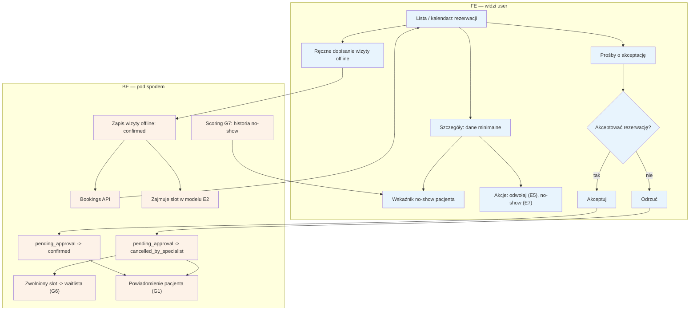

# E4 — Rezerwacje (lista, szczegóły, akceptacja, wizyty offline)

## Notatki
- Priorytet: P0. Spec: S2.
- Szczegóły wizyty = dane minimalne pacjenta (minimalizacja RODO) + wskaźnik no-show pacjenta ze scoringu G7.
- Ręczna akceptacja pojawia się tylko, gdy scoring gate (G7) wymusił wariant [[a5-checkout-wariant-akceptacja]]; akceptacja: pending_approval -> confirmed, odrzucenie: pending_approval -> cancelled_by_specialist (kanon nie ma stanu "rejected") + zwolniony slot -> waitlista (G6); brak reakcji -> timeout (założenie 24 h, patrz wariant A5).
- Ręczne dopisanie wizyty offline: założenie minimalne — od razu stan confirmed, zajmuje slot w modelu E2; dane pacjenta wpisuje specjalista.
- ⚠️ Flaga 4 (OTWARTA): czy wizyta dopisana ręcznie uprawnia do opinii (B5)? Ryzyko lewych opinii; propozycja z mapy: bez prawa do opinii publicznej albo słabszy badge — do rozstrzygnięcia w prompcie #1. Zgłoszone w rozbieżnościach.
- Akcje z poziomu szczegółów: odwołanie/przesunięcie -> [[e5-odwolanie-pojedyncze]] (E5), no-show -> [[e7-no-show]] (E7), approval po wizycie -> [[e8-approval-opinie]] (E8).
- Powiązania: A5 (wariant akceptacji), E2, E5, E7, E8, G1, G6, G7, B8 (odpowiedzi formularza przedwizytowego widoczne tutaj — P2), CORE-STANY, Flaga 4.

## Co opisuje ten diagram

Centralny ekran pracy specjalisty z rezerwacjami: lista lub kalendarz wizyt, szczegóły pojedynczej wizyty (z minimalnymi danymi pacjenta i wskaźnikiem jego historii no-show) oraz akcje — odwołanie, oznaczenie "nie stawił się". Gdy system wymusił ręczną akceptację rezerwacji, specjalista widzi tu prośby o akceptację i decyduje: potwierdzić czy odrzucić (odrzucony slot wraca na waitlistę, pacjent dostaje powiadomienie). Specjalista może też ręcznie dopisać wizytę umówioną poza serwisem (offline), która od razu zajmuje slot w grafiku.

## Powiązane diagramy

| ID | Diagram | Jak się łączy |
|---|---|---|
| A5 | [../a-pacjent-public/a5-checkout-wariant-akceptacja.md](../a-pacjent-public/a5-checkout-wariant-akceptacja.md) | prośby o akceptację pochodzą z wariantu checkoutu z akceptacją specjalisty |
| E2 | [e2-grafik-dostepnosc.md](e2-grafik-dostepnosc.md) | wizyty (w tym offline) zajmują sloty w modelu dostępności |
| E5 | [e5-odwolanie-pojedyncze.md](e5-odwolanie-pojedyncze.md) | akcja "odwołaj/przesuń" ze szczegółów wizyty |
| E7 | [e7-no-show.md](e7-no-show.md) | akcja "nie stawił się" ze szczegółów wizyty |
| E8 | [e8-approval-opinie.md](e8-approval-opinie.md) | approval wizyty po terminie ("odbyła się") |
| B5 | [../b-pacjent-konto/b5-wystawienie-opinii.md](../b-pacjent-konto/b5-wystawienie-opinii.md) | Flaga 4: czy wizyta dopisana ręcznie uprawnia pacjenta do opinii |
| B8 | [../b-pacjent-konto/b8-formularz-przedwizytowy.md](../b-pacjent-konto/b8-formularz-przedwizytowy.md) | odpowiedzi formularza przedwizytowego widoczne w szczegółach wizyty (P2) |
| G1 | [../00-core/00-katalog-eventow.md](../00-core/00-katalog-eventow.md) | powiadomienia pacjenta o akceptacji/odrzuceniu wysyła notification engine |
| G6 | [../g-silniki/g6-waitlist-engine.md](../g-silniki/g6-waitlist-engine.md) | slot zwolniony po odrzuceniu trafia do silnika waitlisty |
| G7 | [../g-silniki/g7-scoring-engine.md](../g-silniki/g7-scoring-engine.md) | scoring dostarcza wskaźnik no-show pacjenta i wymusza wariant akceptacji |
| CORE-STANY | [../00-core/00-stany-rezerwacji.md](../00-core/00-stany-rezerwacji.md) | przejścia pending_approval → confirmed / cancelled_by_specialist wg kanonu stanów |

## Słownik

| Pojęcie | Wyjaśnienie |
|---|---|
| rezerwacja | umówiona przez pacjenta wizyta, widoczna na liście lub w kalendarzu specjalisty |
| pending_approval | stan rezerwacji czekającej na ręczną decyzję specjalisty (akceptuj/odrzuć) |
| confirmed | stan rezerwacji potwierdzonej — wizyta dojdzie do skutku, slot jest zajęty |
| akceptacja (approval) | ręczne zatwierdzenie rezerwacji przez specjalistę, wymagane tylko przy pacjentach z gorszą historią |
| wizyta offline | wizyta umówiona poza serwisem i dopisana ręcznie przez specjalistę |
| wskaźnik no-show | informacja przy pacjencie, jak często wcześniej nie stawiał się na wizyty |
| scoring | mechanizm oceniający wiarygodność pacjenta na podstawie jego historii |
| waitlista | lista oczekujących pacjentów, którym system proponuje zwolnione sloty |
| dane minimalne | tylko niezbędne dane pacjenta pokazywane specjaliście (zasada minimalizacji RODO) |
| slot | pojedynczy termin wizyty w grafiku specjalisty |
