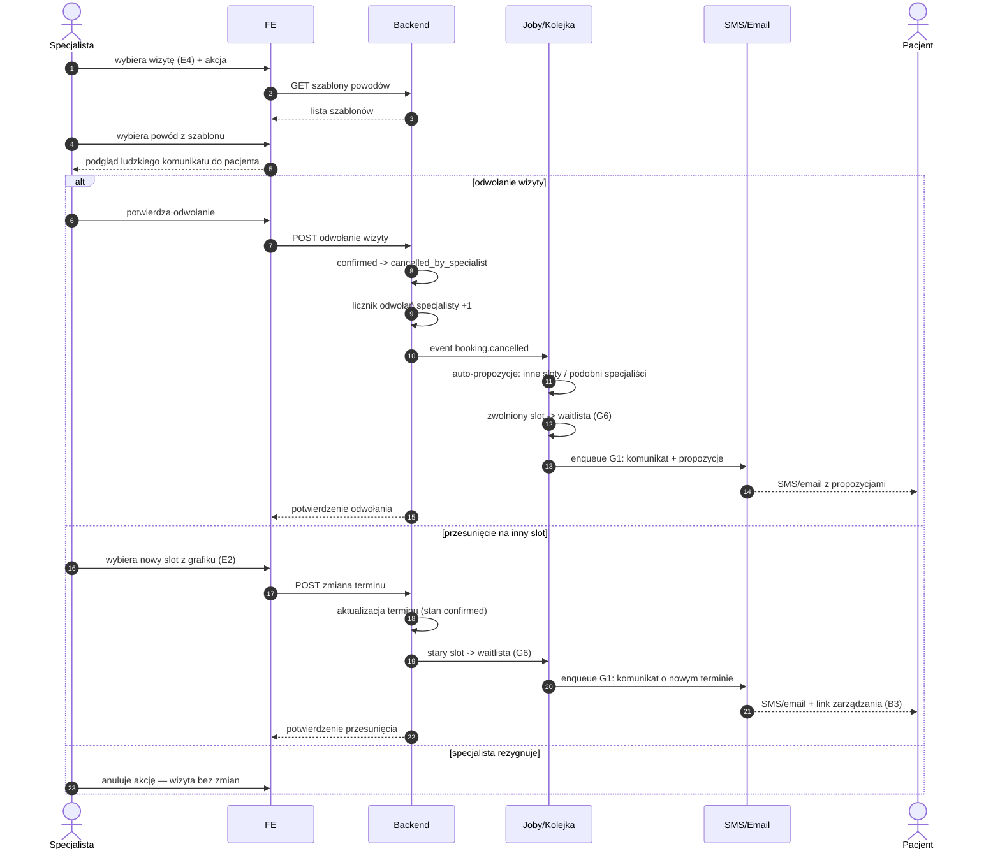

# E5 — Odwołanie/przesunięcie pojedynczej wizyty

## Notatki
- Priorytet: P0. Prompt #6 (polityka odwołań).
- Wejście z panelu rezerwacji [[e4-rezerwacje]] (E4); podgląd "ludzkiego" komunikatu generowany z szablonu powodu przed wysłaniem.
- Auto-propozycje dla pacjenta: inne sloty tego specjalisty (z modelu E2) lub podobni specjaliści (wzorzec A8) — dokładny algorytm nierozstrzygnięty w mapie.
- Zwolniony slot trafia do waitlisty [[b4-waitlista]] (G6) — analogicznie do B3.
- Licznik odwołań specjalisty: mapa definiuje tylko inkrement; skutki progowe (np. flaga do F4, wpływ na ranking A2) — NIEROZSTRZYGNIĘTE, zgłoszone w rozbieżnościach.
- Przesunięcie: założenie minimalne — zmiana terminu bez akceptacji pacjenta, pacjent informowany i może odwołać tokenem (B3); licznik odwołań NIE rośnie przy przesunięciu (założenie).
- Powiadomienia przez G1 (notification engine); pacjent po odwołaniu może skorzystać z propozycji → nowy checkout (A5).
- Powiązania: E4, E2, B3, B4, G1, G6, A8, CORE-STANY.

## Co opisuje ten diagram

Krok po kroku pokazuje, co się dzieje, gdy specjalista odwołuje lub przesuwa jedną wizytę pacjenta. Specjalista wybiera wizytę i powód z gotowego szablonu, widzi podgląd "ludzkiego" komunikatu, a po potwierdzeniu system zmienia stan wizyty, zwalnia slot na waitlistę i wysyła pacjentowi SMS/email — przy odwołaniu z propozycjami innych terminów lub podobnych specjalistów, przy przesunięciu z nowym terminem i linkiem do samodzielnego zarządzania wizytą. Specjalista może też zrezygnować z akcji i wtedy nic się nie zmienia.

## Powiązane diagramy

| ID | Diagram | Jak się łączy |
|---|---|---|
| E4 | [e4-rezerwacje.md](e4-rezerwacje.md) | wejście do flow — specjalista wybiera wizytę z listy rezerwacji |
| E2 | [e2-grafik-dostepnosc.md](e2-grafik-dostepnosc.md) | nowy slot przy przesunięciu i auto-propozycje pochodzą z grafiku |
| B3 | [../b-pacjent-konto/b3-odwolanie-tokenem.md](../b-pacjent-konto/b3-odwolanie-tokenem.md) | pacjent po przesunięciu może odwołać wizytę linkiem z tokenem |
| B4 | [../b-pacjent-konto/b4-waitlista.md](../b-pacjent-konto/b4-waitlista.md) | zwolniony slot jest proponowany oczekującym z waitlisty |
| A5 | [../a-pacjent-public/a5-checkout.md](../a-pacjent-public/a5-checkout.md) | pacjent korzystający z propozycji przechodzi nowy checkout |
| A8 | [../a-pacjent-public/a8-brak-slotow.md](../a-pacjent-public/a8-brak-slotow.md) | wzorzec propozycji "podobni specjaliści" pochodzi z tego flow |
| G1 | [../00-core/00-katalog-eventow.md](../00-core/00-katalog-eventow.md) | powiadomienia SMS/email wysyła notification engine (G1) |
| G6 | [../g-silniki/g6-waitlist-engine.md](../g-silniki/g6-waitlist-engine.md) | silnik waitlisty przejmuje zwolniony slot |
| CORE-STANY | [../00-core/00-stany-rezerwacji.md](../00-core/00-stany-rezerwacji.md) | przejście confirmed → cancelled_by_specialist wg kanonu stanów |

## Słownik

| Pojęcie | Wyjaśnienie |
|---|---|
| odwołanie | anulowanie wizyty przez specjalistę — wizyta nie odbędzie się |
| przesunięcie | zmiana terminu wizyty na inny slot bez jej anulowania (stan pozostaje confirmed) |
| szablon powodu | gotowa lista przyczyn odwołania, z której generowany jest zrozumiały komunikat dla pacjenta |
| auto-propozycje | automatycznie dobrane alternatywy dla pacjenta: inne terminy tego specjalisty lub podobni specjaliści |
| licznik odwołań | licznik zliczający, ile wizyt specjalista odwołał (rośnie przy odwołaniu, nie przy przesunięciu) |
| waitlista | lista pacjentów czekających na zwolniony termin |
| slot | pojedynczy termin wizyty w grafiku specjalisty |
| event booking.cancelled | wewnętrzny sygnał systemu "wizyta odwołana", uruchamiający powiadomienia i waitlistę |
| token zarządzania | link w SMS/emailu pozwalający pacjentowi zmienić lub odwołać wizytę bez logowania |
