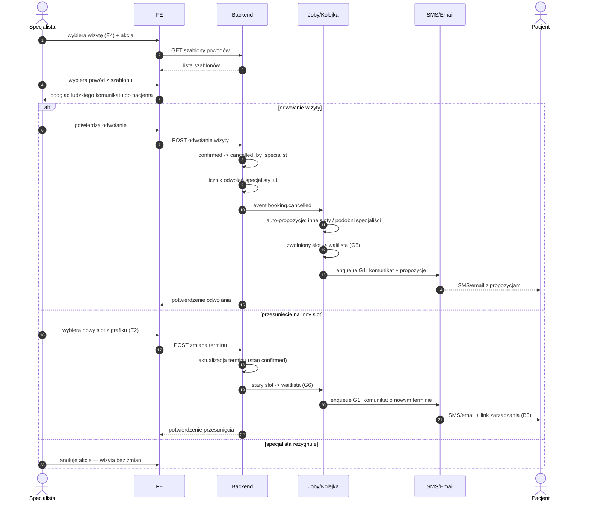

# E5 — Odwołanie/przesunięcie pojedynczej wizyty

## Notatki
- Priorytet: P0. Prompt #6 (polityka odwołań).
- Wejście z panelu rezerwacji [[e4-rezerwacje]] (E4); podgląd "ludzkiego" komunikatu generowany z szablonu powodu przed wysłaniem.
- Auto-propozycje dla pacjenta: inne sloty tego specjalisty (z modelu E2) lub podobni specjaliści (wzorzec A8) — dokładny algorytm nierozstrzygnięty w mapie.
- Zwolniony slot trafia do waitlisty [[b4-waitlista]] (G6) — analogicznie do B3.
- Licznik odwołań specjalisty: mapa definiuje tylko inkrement; skutki progowe (np. flaga do F4, wpływ na ranking A2) — NIEROZSTRZYGNIĘTE, zgłoszone w rozbieżnościach.
- Przesunięcie: założenie minimalne — zmiana terminu bez akceptacji pacjenta, pacjent informowany i może odwołać tokenem (B3); licznik odwołań NIE rośnie przy przesunięciu (założenie).
- Powiadomienia przez G1 (notification engine); pacjent po odwołaniu może skorzystać z propozycji → nowy checkout (A5).
- Powiązania: E4, E2, B3, B4, G1, G6, A8, CORE-STANY.
