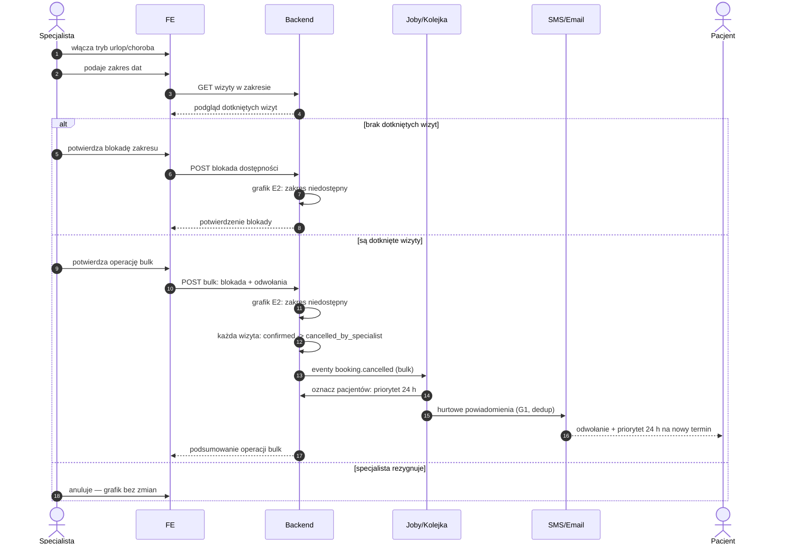

# E6 — Tryb urlop/choroba (operacja bulk)

## Notatki
- Priorytet: P1. Prompt #6 (polityka odwołań).
- Zakres dat blokuje dostępność w modelu [[e2-grafik-dostepnosc]] (E2) — zwolnione sloty NIE idą do waitlisty (G6), bo są zablokowane urlopem.
- Hurtowe powiadomienia przez G1 (kolejka, dedup, szablony PL).
- Priorytet 24 h dla poszkodowanych pacjentów: założenie minimalne — pierwszeństwo rezerwacji nowego terminu przez 24 h od powiadomienia; dokładna mechanika (early access do slotów? pozycja w waitliście G6?) NIEROZSTRZYGNIĘTA, zgłoszone w rozbieżnościach.
- Czy odwołania bulk z urlopu wliczają się do licznika odwołań specjalisty (E5)? Mapa nie rozstrzyga — zgłoszone w rozbieżnościach.
- Powiązania: E2, E5, G1, G6, CORE-STANY.

## Co opisuje ten diagram

Pokazuje, co się dzieje, gdy specjalista bierze urlop lub choruje i musi zablokować cały zakres dat naraz (operacja hurtowa, tzw. bulk). Specjalista podaje zakres, system pokazuje podgląd wizyt, które ucierpią, i po potwierdzeniu blokuje grafik oraz odwołuje wszystkie te wizyty za jednym razem. Poszkodowani pacjenci dostają hurtowe powiadomienia SMS/email wraz z 24-godzinnym priorytetem na rezerwację nowego terminu; jeśli w zakresie nie ma żadnych wizyt, blokada zakłada się bez odwołań.

## Powiązane diagramy

| ID | Diagram | Jak się łączy |
|---|---|---|
| E2 | [e2-grafik-dostepnosc.md](e2-grafik-dostepnosc.md) | zakres dat staje się niedostępny w modelu grafiku |
| E5 | [e5-odwolanie-pojedyncze.md](e5-odwolanie-pojedyncze.md) | nierozstrzygnięte: czy odwołania bulk wliczają się do licznika odwołań specjalisty |
| G1 | [../00-core/00-katalog-eventow.md](../00-core/00-katalog-eventow.md) | hurtowe powiadomienia pacjentów wysyła notification engine (G1) |
| G6 | [../g-silniki/g6-waitlist-engine.md](../g-silniki/g6-waitlist-engine.md) | sloty z urlopu NIE trafiają do waitlisty (są zablokowane, nie wolne) |
| CORE-STANY | [../00-core/00-stany-rezerwacji.md](../00-core/00-stany-rezerwacji.md) | każda dotknięta wizyta: confirmed → cancelled_by_specialist wg kanonu |

## Słownik

| Pojęcie | Wyjaśnienie |
|---|---|
| bulk | operacja hurtowa — jedna decyzja specjalisty działa naraz na wiele wizyt |
| tryb urlop/choroba | funkcja panelu blokująca cały zakres dat w grafiku jednym ruchem |
| blokada dostępności | oznaczenie zakresu dat jako niedostępnego — pacjenci nie mogą rezerwować terminów |
| podgląd dotkniętych wizyt | lista wizyt, które zostaną odwołane, pokazywana specjaliście przed potwierdzeniem |
| dedup | zabezpieczenie, by pacjent nie dostał wielu identycznych powiadomień przy operacji hurtowej |
| priorytet 24 h | pierwszeństwo poszkodowanego pacjenta w rezerwacji nowego terminu przez dobę od powiadomienia |
| licznik odwołań | licznik odwołanych wizyt specjalisty (dla urlopu bulk — kwestia nierozstrzygnięta) |
| cancelled_by_specialist | stan wizyty odwołanej z winy/decyzji specjalisty |
| waitlista | lista pacjentów czekających na wolne terminy — tu pomijana, bo sloty są zablokowane |
