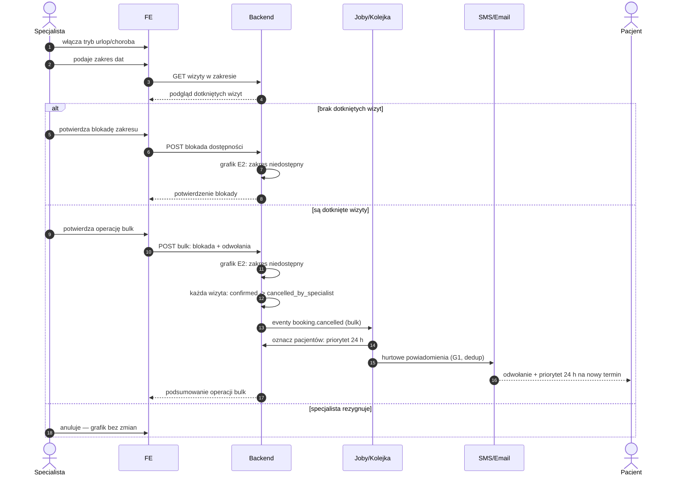

# E6 — Tryb urlop/choroba (operacja bulk)

## Notatki
- Priorytet: P1. Prompt #6 (polityka odwołań).
- Zakres dat blokuje dostępność w modelu [[e2-grafik-dostepnosc]] (E2) — zwolnione sloty NIE idą do waitlisty (G6), bo są zablokowane urlopem.
- Hurtowe powiadomienia przez G1 (kolejka, dedup, szablony PL).
- Priorytet 24 h dla poszkodowanych pacjentów: założenie minimalne — pierwszeństwo rezerwacji nowego terminu przez 24 h od powiadomienia; dokładna mechanika (early access do slotów? pozycja w waitliście G6?) NIEROZSTRZYGNIĘTA, zgłoszone w rozbieżnościach.
- Czy odwołania bulk z urlopu wliczają się do licznika odwołań specjalisty (E5)? Mapa nie rozstrzyga — zgłoszone w rozbieżnościach.
- Powiązania: E2, E5, G1, G6, CORE-STANY.
