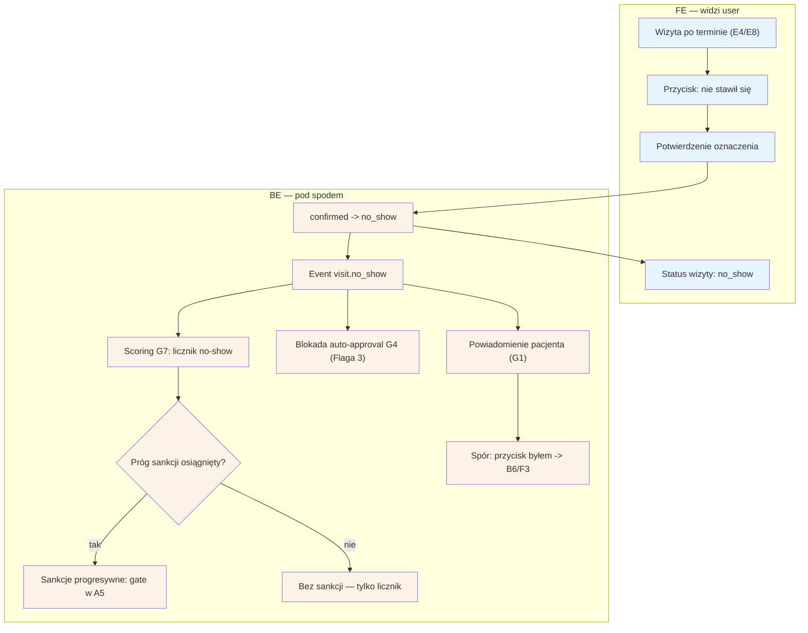

# E7 — No-show (oznaczenie "nie stawił się")

## Notatki
- Priorytet: P0. Prompt #4 (scoring + anty-abuse).
- Przycisk dostępny przy wizycie po terminie — z listy [[e4-rezerwacje]] (E4) lub listy do potwierdzenia [[e8-approval-opinie]] (E8).
- Event visit.no_show -> scoring G7; sankcje progresywne wg ścieżki E2E: 1. no-show = licznik, 2. no-show = gate przedpłaty (lub akceptacji — Flaga 2) w checkoucie A5. Progi konfigurowane per fork (F8).
- Stan no_show blokuje auto-approval T+48 h (G4) — ⚠️ Flaga 3.
- Pacjent w komunikacie o sankcji dostaje przycisk "byłem/byłam" -> spór [[b6-spor-no-show]] (B6) -> kolejka F3; na czas sporu stan disputed (również blokuje G4).
- Wizyta no_show bez review ask (G3) — opinia nie przysługuje (wizyta się nie odbyła).
- Powiązania: E4, E8, B6, F3, F8, G1, G4, G7, A5, CORE-STANY, Flaga 2, Flaga 3.
