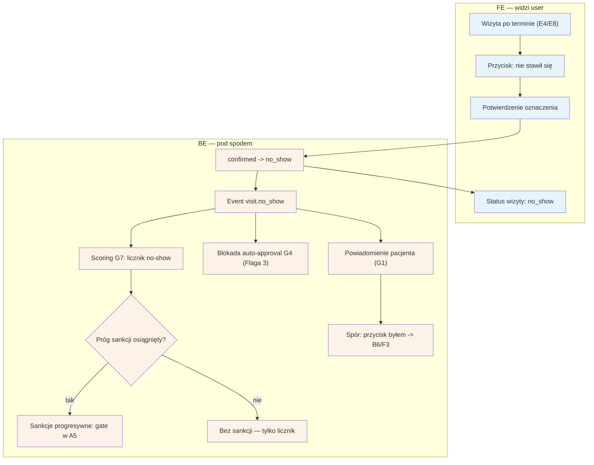

# E7 — No-show (oznaczenie "nie stawił się")

## Notatki
- Priorytet: P0. Prompt #4 (scoring + anty-abuse).
- Przycisk dostępny przy wizycie po terminie — z listy [[e4-rezerwacje]] (E4) lub listy do potwierdzenia [[e8-approval-opinie]] (E8).
- Event visit.no_show -> scoring G7; sankcje progresywne wg ścieżki E2E: 1. no-show = licznik, 2. no-show = gate przedpłaty (lub akceptacji — Flaga 2) w checkoucie A5. Progi konfigurowane per fork (F8).
- Stan no_show blokuje auto-approval T+48 h (G4) — ⚠️ Flaga 3.
- Pacjent w komunikacie o sankcji dostaje przycisk "byłem/byłam" -> spór [[b6-spor-no-show]] (B6) -> kolejka F3; na czas sporu stan disputed (również blokuje G4).
- Wizyta no_show bez review ask (G3) — opinia nie przysługuje (wizyta się nie odbyła).
- Powiązania: E4, E8, B6, F3, F8, G1, G4, G7, A5, CORE-STANY, Flaga 2, Flaga 3.

## Co opisuje ten diagram

Pokazuje, co się dzieje, gdy pacjent nie przyszedł na wizytę i specjalista oznacza ją przyciskiem "nie stawił się". System zmienia stan wizyty na no_show, dolicza zdarzenie do licznika pacjenta w scoringu i — jeśli pacjent przekroczył próg — włącza sankcje (np. wymóg przedpłaty przy kolejnych rezerwacjach). Pacjent dostaje powiadomienie z przyciskiem "byłem/byłam", którym może otworzyć spór rozstrzygany przez administratora; wizyta w stanie no_show lub spornym nie może zostać automatycznie potwierdzona jako odbyta.

## Powiązane diagramy

| ID | Diagram | Jak się łączy |
|---|---|---|
| E4 | [e4-rezerwacje.md](e4-rezerwacje.md) | przycisk "nie stawił się" dostępny przy wizycie po terminie na liście rezerwacji |
| E8 | [e8-approval-opinie.md](e8-approval-opinie.md) | to samo oznaczenie dostępne z listy wizyt do potwierdzenia |
| A5 | [../a-pacjent-public/a5-checkout.md](../a-pacjent-public/a5-checkout.md) | sankcja = gate (przedpłata lub akceptacja) w checkoucie pacjenta |
| B6 | [../b-pacjent-konto/b6-spor-no-show.md](../b-pacjent-konto/b6-spor-no-show.md) | przycisk "byłem/byłam" w powiadomieniu otwiera spór pacjenta |
| F3 | [../f-backoffice/f3-spory.md](../f-backoffice/f3-spory.md) | spór trafia do kolejki rozstrzyganej przez admina |
| F8 | [../f-backoffice/f8-konfiguracja-forka.md](../f-backoffice/f8-konfiguracja-forka.md) | progi sankcji konfigurowane per fork |
| G1 | [../00-core/00-katalog-eventow.md](../00-core/00-katalog-eventow.md) | powiadomienie pacjenta o oznaczeniu wysyła notification engine (G1) |
| G3 | [../00-core/00-katalog-eventow.md](../00-core/00-katalog-eventow.md) | brak prośby o opinię (G3) — wizyta się nie odbyła |
| G4 | [../g-silniki/g4-auto-approval.md](../g-silniki/g4-auto-approval.md) | stan no_show blokuje auto-approval T+48 h (Flaga 3) |
| G7 | [../g-silniki/g7-scoring-engine.md](../g-silniki/g7-scoring-engine.md) | event visit.no_show zasila licznik i progi w scoringu |
| CORE-STANY | [../00-core/00-stany-rezerwacji.md](../00-core/00-stany-rezerwacji.md) | przejścia confirmed → no_show oraz disputed wg kanonu stanów |

## Słownik

| Pojęcie | Wyjaśnienie |
|---|---|
| no-show | sytuacja, w której pacjent nie stawił się na umówioną wizytę bez odwołania |
| event visit.no_show | wewnętrzny sygnał systemu o niestawieniu się, uruchamiający scoring i powiadomienia |
| scoring | mechanizm zliczający historię pacjenta (m.in. no-show) i oceniający jego wiarygodność |
| próg sankcji | liczba no-show, po której system zaczyna stosować obostrzenia wobec pacjenta |
| sankcje progresywne | obostrzenia rosnące z każdym kolejnym no-show: najpierw tylko licznik, potem gate w checkoucie |
| gate | dodatkowy warunek przy rezerwacji dla pacjenta z historią no-show: przedpłata lub akceptacja specjalisty |
| auto-approval | automatyczne potwierdzenie po 48 h, że wizyta się odbyła — zablokowane przy no_show i sporze |
| spór | zakwestionowanie oznaczenia przez pacjenta ("byłem/byłam"), rozstrzygane przez admina |
| disputed | stan wizyty na czas trwania sporu |
| fork | osobna instancja serwisu dla innej branży, z własnymi progami sankcji |
