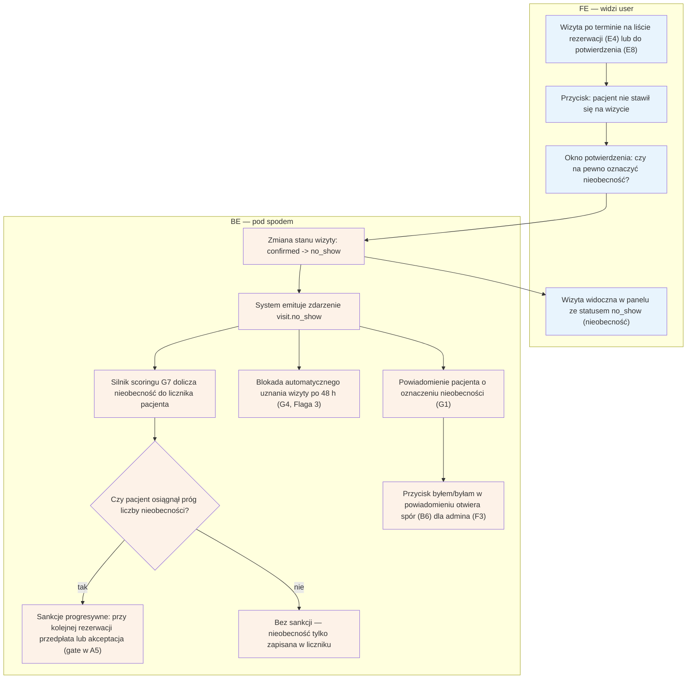

# E7 — No-show (oznaczenie "nie stawił się")

## Notatki
- Priorytet: P0. Prompt #4 (scoring + anty-abuse).
- Przycisk dostępny przy wizycie po terminie — z listy [[e4-rezerwacje]] (E4) lub listy do potwierdzenia [[e8-approval-opinie]] (E8).
- Event visit.no_show -> scoring G7; sankcje progresywne wg ścieżki E2E: 1. no-show = licznik, 2. no-show = gate przedpłaty (lub akceptacji — Flaga 2) w checkoucie A5. Progi konfigurowane per fork (F8).
- Stan no_show blokuje auto-approval T+48 h (G4) — ⚠️ Flaga 3.
- Pacjent w komunikacie o sankcji dostaje przycisk "byłem/byłam" -> spór [[b6-spor-no-show]] (B6) -> kolejka F3; na czas sporu stan disputed (również blokuje G4).
- Wizyta no_show bez review ask (G3) — opinia nie przysługuje (wizyta się nie odbyła).
- Powiązania: E4, E8, B6, F3, F8, G1, G4, G7, A5, CORE-STANY, Flaga 2, Flaga 3.

## Co opisuje ten diagram

Pokazuje, co się dzieje, gdy pacjent nie przyszedł na wizytę i specjalista oznacza ją przyciskiem "nie stawił się". System zmienia stan wizyty na no_show, dolicza zdarzenie do licznika pacjenta w scoringu i — jeśli pacjent przekroczył próg — włącza sankcje (np. wymóg przedpłaty przy kolejnych rezerwacjach). Pacjent dostaje powiadomienie z przyciskiem "byłem/byłam", którym może otworzyć spór rozstrzygany przez administratora; wizyta w stanie no_show lub spornym nie może zostać automatycznie potwierdzona jako odbyta.

## Aktorzy w tym flow

| Rola | Kto to jest | Co robi w tym flow |
|---|---|---|
| **Specjalista** (logopeda / lekarz) | usługodawca przyjmujący wizyty, główny użytkownik panelu | oznacza w panelu, że pacjent nie stawił się na wizycie, i potwierdza to oznaczenie |
| **Pacjent** (użytkownik strony; zwykle rodzic dziecka) | osoba, która miała przyjść na wizytę | dostaje powiadomienie o oznaczeniu nieobecności; jeśli się nie zgadza, przyciskiem „byłem/byłam" otwiera spór (B6) |
| **FE** (interfejs panelu) | ekrany panelu specjalisty widoczne w przeglądarce | pokazuje wizytę po terminie, przycisk oznaczenia nieobecności, okno potwierdzenia i nowy status wizyty |
| **System/Backend** | serwery i logika platformy działające „pod spodem", bez udziału człowieka | zmienia stan wizyty na no_show, emituje zdarzenie visit.no_show, dolicza nieobecność w scoringu (G7), sprawdza próg sankcji, blokuje auto-approval (G4) i zleca powiadomienie pacjenta (G1) |
| **SMS/Email** (bramka powiadomień) | usługa wysyłająca wiadomości SMS i e-mail | doręcza pacjentowi powiadomienie o oznaczeniu nieobecności wraz z przyciskiem „byłem/byłam" |
| **Admin** (operator platformy) | zespół prowadzący serwis — back office | rozstrzyga spór otwarty przez pacjenta (kolejka sporów F3) — poza zakresem tego diagramu |

## Objaśnienie bloków

| Blok | Co to znaczy w praktyce | Kto tu działa |
|---|---|---|
| Wizyta po terminie na liście rezerwacji (E4) lub do potwierdzenia (E8) | Punkt startowy: minęła godzina wizyty, a wizyta wciąż jest w stanie „umówiona" (confirmed). Specjalista widzi ją na liście rezerwacji (E4) albo na liście wizyt do potwierdzenia (E8) — z obu miejsc dostępny jest ten sam przycisk. | Specjalista, FE |
| Przycisk: pacjent nie stawił się na wizycie | Specjalista klika przycisk zgłoszenia nieobecności — twierdzi, że pacjent nie przyszedł na umówioną wizytę i jej nie odwołał (tzw. no-show). | Specjalista |
| Okno potwierdzenia: czy na pewno oznaczyć nieobecność? | Zabezpieczenie przed pomyłką: system prosi o potwierdzenie decyzji, bo oznaczenie ma realne konsekwencje dla pacjenta (punkty karne w scoringu). | Specjalista, FE |
| Wizyta widoczna w panelu ze statusem no_show (nieobecność) | Efekt widoczny dla specjalisty: wizyta na liście zmienia status na no_show — nieobecność jest zapisana. | FE |
| Zmiana stanu wizyty: confirmed -> no_show | Techniczny skutek potwierdzenia: rezerwacja przechodzi ze stanu „wizyta umówiona" do stanu „pacjent nie pojawił się" (nazwy stanów wg kanonu CORE-STANY). | System/Backend |
| System emituje zdarzenie visit.no_show | Wewnętrzny sygnał rozsyłany po systemie: „na tej wizycie był no-show". Ten jeden sygnał uruchamia równolegle scoring, blokadę auto-approvalu i powiadomienie pacjenta. | System/Backend |
| Silnik scoringu G7 dolicza nieobecność do licznika pacjenta | Automat prowadzący punktację wiarygodności pacjenta zapisuje kolejną nieobecność w jego historii. To z tego licznika bierze się „wskaźnik no-show" widoczny w E4. | System/Backend (scoring G7) |
| Czy pacjent osiągnął próg liczby nieobecności? (romb decyzji) | Automatyczna decyzja systemu (nie człowieka): czy liczba nieobecności pacjenta przekroczyła ustalony próg? Progi są konfigurowalne per fork (F8). | System/Backend |
| Sankcje progresywne: przy kolejnej rezerwacji przedpłata lub akceptacja (gate w A5) | „Sankcje scoringu" rosnące z każdym no-show: pierwsza nieobecność = tylko zapis w liczniku, druga = przy następnej rezerwacji pacjent musi zapłacić z góry albo czekać na zgodę specjalisty (dodatkowy warunek w checkoucie A5, tzw. gate; wybór wariantu — Flaga 2). | System/Backend |
| Bez sankcji — nieobecność tylko zapisana w liczniku | Pacjent poniżej progu: nic się dla niego nie zmienia przy kolejnych rezerwacjach, ale nieobecność zostaje w historii. | System/Backend |
| Blokada automatycznego uznania wizyty po 48 h (G4, Flaga 3) | Normalnie system po 48 godzinach sam uznaje wizytę za odbytą (auto-approval, G4). Wizyta oznaczona jako no_show (albo sporna) jest z tego automatu wyłączona — inaczej system „potwierdziłby" wizytę, która się nie odbyła. | System/Backend |
| Powiadomienie pacjenta o oznaczeniu nieobecności (G1) | Pacjent dostaje SMS/e-mail z informacją, że specjalista oznaczył jego nieobecność — wysyła go silnik powiadomień (G1). | System/Backend, SMS/Email (odbiorcą jest Pacjent) |
| Przycisk byłem/byłam w powiadomieniu otwiera spór (B6) dla admina (F3) | Furtka dla pacjenta, który uważa oznaczenie za błędne: klika „byłem/byłam" w powiadomieniu, co otwiera spór (flow B6). Spór trafia do kolejki admina (F3), a wizyta na czas sporu ma stan disputed — który też blokuje auto-approval. | Pacjent, Admin (rozstrzygnięcie w F3) |

## Powiązane diagramy

| ID | Diagram | Jak się łączy |
|---|---|---|
| E4 | [e4-rezerwacje.md](e4-rezerwacje.md) | przycisk "nie stawił się" dostępny przy wizycie po terminie na liście rezerwacji |
| E8 | [e8-approval-opinie.md](e8-approval-opinie.md) | to samo oznaczenie dostępne z listy wizyt do potwierdzenia |
| A5 | [../a-pacjent-public/a5-checkout.md](../a-pacjent-public/a5-checkout.md) | sankcja = gate (przedpłata lub akceptacja) w checkoucie pacjenta |
| B6 | [../b-pacjent-konto/b6-spor-no-show.md](../b-pacjent-konto/b6-spor-no-show.md) | przycisk "byłem/byłam" w powiadomieniu otwiera spór pacjenta |
| F3 | [../f-backoffice/f3-spory.md](../f-backoffice/f3-spory.md) | spór trafia do kolejki rozstrzyganej przez admina |
| F8 | [../f-backoffice/f8-konfiguracja-forka.md](../f-backoffice/f8-konfiguracja-forka.md) | progi sankcji konfigurowane per fork |
| G1 | [../00-core/00-katalog-eventow.md](../00-core/00-katalog-eventow.md) | powiadomienie pacjenta o oznaczeniu wysyła notification engine (G1) |
| G3 | [../00-core/00-katalog-eventow.md](../00-core/00-katalog-eventow.md) | brak prośby o opinię (G3) — wizyta się nie odbyła |
| G4 | [../g-silniki/g4-auto-approval.md](../g-silniki/g4-auto-approval.md) | stan no_show blokuje auto-approval T+48 h (Flaga 3) |
| G7 | [../g-silniki/g7-scoring-engine.md](../g-silniki/g7-scoring-engine.md) | event visit.no_show zasila licznik i progi w scoringu |
| CORE-STANY | [../00-core/00-stany-rezerwacji.md](../00-core/00-stany-rezerwacji.md) | przejścia confirmed → no_show oraz disputed wg kanonu stanów |

## Słownik

| Pojęcie | Wyjaśnienie |
|---|---|
| no-show | sytuacja, w której pacjent nie stawił się na umówioną wizytę bez odwołania |
| event visit.no_show | wewnętrzny sygnał systemu o niestawieniu się, uruchamiający scoring i powiadomienia |
| scoring | mechanizm zliczający historię pacjenta (m.in. no-show) i oceniający jego wiarygodność |
| próg sankcji | liczba no-show, po której system zaczyna stosować obostrzenia wobec pacjenta |
| sankcje progresywne | obostrzenia rosnące z każdym kolejnym no-show: najpierw tylko licznik, potem gate w checkoucie |
| gate | dodatkowy warunek przy rezerwacji dla pacjenta z historią no-show: przedpłata lub akceptacja specjalisty |
| auto-approval | automatyczne potwierdzenie po 48 h, że wizyta się odbyła — zablokowane przy no_show i sporze |
| spór | zakwestionowanie oznaczenia przez pacjenta ("byłem/byłam"), rozstrzygane przez admina |
| disputed | stan wizyty na czas trwania sporu |
| fork | osobna instancja serwisu dla innej branży, z własnymi progami sankcji |
| licznik no-show | prowadzona przez scoring liczba nieobecności pacjenta; źródło wskaźnika no-show w E4 |
| checkout (A5) | proces rezerwacji wizyty przez pacjenta — tam właśnie działa gate nałożony przez sankcje |
| Flaga 2 | otwarta decyzja projektowa: czy sankcją jest przedpłata online, czy akceptacja specjalisty (oba warianty udokumentowane) |
| Flaga 3 | otwarta decyzja projektowa: auto-approval po 48 h musi być zablokowany przy no_show i sporze |
| FE („FE — widzi user") | część systemu widoczna dla użytkownika: ekrany i przyciski w przeglądarce |
| BE („BE — pod spodem") | część systemu niewidoczna dla użytkownika: serwery, obliczenia i baza danych |
