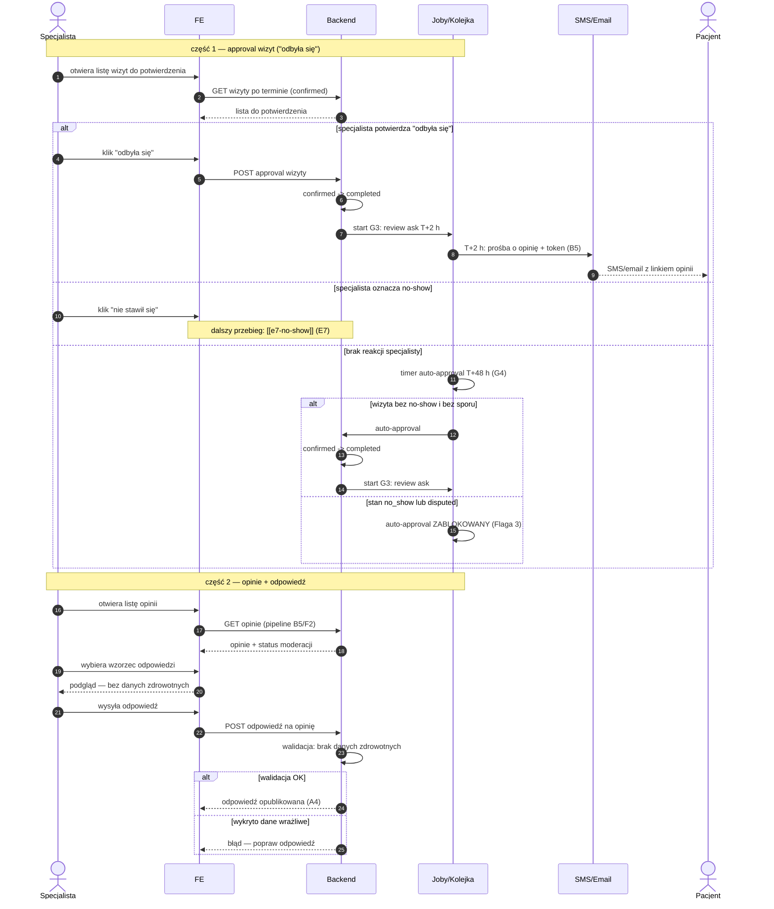

# E8 — Approval wizyt + opinie

## Notatki
- Priorytet: P0. Prompt #1 (pipeline opinii).
- Approval "odbyła się" domyka wizytę (completed) i startuje G3 (review ask T+2 h) → [[b5-wystawienie-opinii]] (B5) → moderacja F2 → publikacja na A4.
- Timer auto-approval T+48 h (G4) — ⚠️ Flaga 3: zablokowany, gdy wizyta ma stan no_show lub disputed (inaczej system "potwierdza" wizytę, która się nie odbyła: fałszywy badge + zepsuty scoring).
- Oznaczenie no-show z tej samej listy → [[e7-no-show]] (E7), stan confirmed -> no_show.
- Wzorce odpowiedzi bez danych zdrowotnych: gotowe szablony; walidacja odpowiedzi po stronie BE — założenie minimalne: automatyczny filtr (jak auto-filtr B5); czy odpowiedź specjalisty przechodzi też przez moderację F2 — mapa NIE rozstrzyga, zgłoszone w rozbieżnościach.
- Powiązania: E7, G3, G4, B5, F2, A4, CORE-STANY, Flaga 3.
