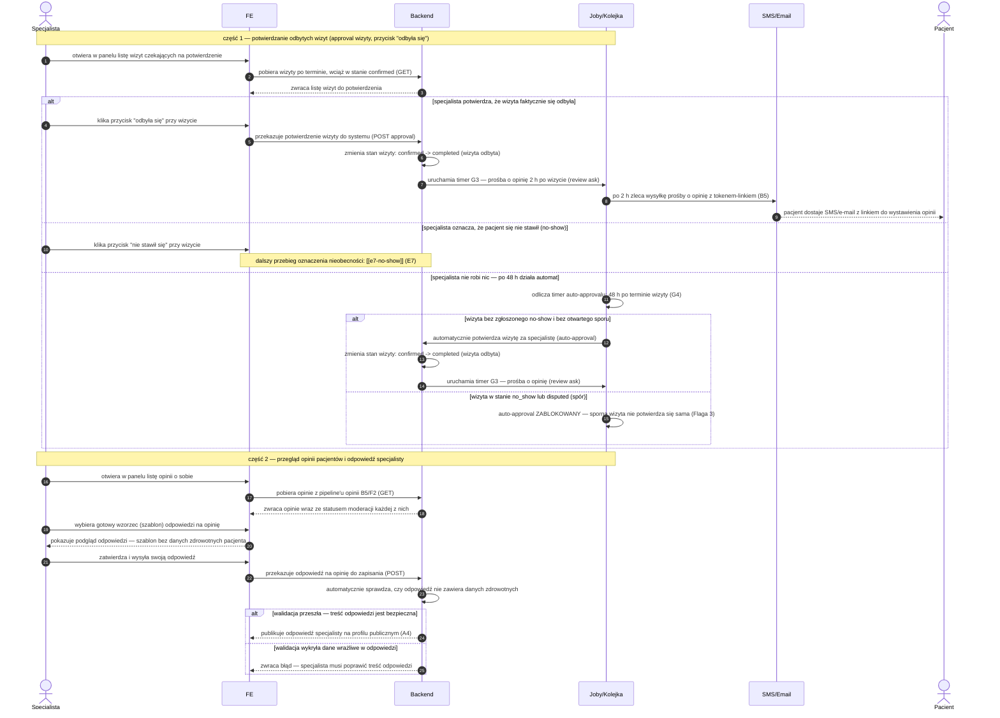

# E8 — Approval wizyt + opinie

## Notatki
- Priorytet: P0. Prompt #1 (pipeline opinii).
- Approval "odbyła się" domyka wizytę (completed) i startuje G3 (review ask T+2 h) → [[b5-wystawienie-opinii]] (B5) → moderacja F2 → publikacja na A4.
- Timer auto-approval T+48 h (G4) — ⚠️ Flaga 3: zablokowany, gdy wizyta ma stan no_show lub disputed (inaczej system "potwierdza" wizytę, która się nie odbyła: fałszywy badge + zepsuty scoring).
- Oznaczenie no-show z tej samej listy → [[e7-no-show]] (E7), stan confirmed -> no_show.
- Wzorce odpowiedzi bez danych zdrowotnych: gotowe szablony; walidacja odpowiedzi po stronie BE — założenie minimalne: automatyczny filtr (jak auto-filtr B5); czy odpowiedź specjalisty przechodzi też przez moderację F2 — mapa NIE rozstrzyga, zgłoszone w rozbieżnościach.
- Powiązania: E7, G3, G4, B5, F2, A4, CORE-STANY, Flaga 3.

## Co opisuje ten diagram

Dwuczęściowy flow w panelu specjalisty. Część 1: po terminie wizyty specjalista potwierdza, że wizyta się odbyła ("odbyła się" — wtedy po 2 godzinach pacjent dostaje prośbę o opinię), oznacza no-show albo nie robi nic — wtedy po 48 godzinach system potwierdza wizytę automatycznie, chyba że jest ona oznaczona jako no-show lub sporna. Część 2: specjalista przegląda opinie pacjentów i odpowiada na nie z gotowych wzorców, a system pilnuje, by odpowiedź nie zawierała danych zdrowotnych, zanim opublikuje ją na profilu.

## Aktorzy w tym flow

| Rola | Kto to jest | Co robi w tym flow |
|---|---|---|
| **Specjalista** (logopeda / lekarz) | usługodawca przyjmujący wizyty, główny użytkownik panelu | potwierdza odbyte wizyty ("odbyła się"), ewentualnie oznacza nieobecność pacjenta, a w części 2 przegląda opinie i odpowiada na nie z gotowych wzorców |
| **Pacjent** (użytkownik strony; zwykle rodzic dziecka) | osoba, która była (lub miała być) na wizycie | w tym flow nic nie klika w panelu — jest odbiorcą: 2 h po potwierdzeniu wizyty dostaje SMS/e-mail z linkiem do wystawienia opinii (B5) |
| **FE** (interfejs panelu) | ekrany panelu specjalisty widoczne w przeglądarce | pokazuje listę wizyt do potwierdzenia, listę opinii ze statusem moderacji i podgląd odpowiedzi przed wysłaniem |
| **System/Backend** | serwery i logika platformy działające „pod spodem", bez udziału człowieka | zmienia stany wizyt (confirmed -> completed), uruchamia timery, waliduje odpowiedzi specjalisty pod kątem danych zdrowotnych i publikuje je na profilu (A4) |
| **Joby/Kolejka** | automaty czasowe systemu — zadania wykonywane z opóźnieniem, bez udziału człowieka | odlicza 2 h do prośby o opinię (G3) i 48 h do auto-approvalu (G4); pilnuje blokady auto-approvalu przy no-show i sporze (Flaga 3) |
| **SMS/Email** (bramka powiadomień) | usługa wysyłająca wiadomości SMS i e-mail | doręcza pacjentowi prośbę o opinię z tokenem-linkiem |

## Objaśnienie kroków

| Krok | Co to znaczy w praktyce | Kto tu działa |
|---|---|---|
| 1–3 | Specjalista otwiera w panelu listę wizyt, których termin już minął, a które wciąż mają stan confirmed („umówiona") — system czeka na informację, czy się odbyły. Panel pobiera tę listę z systemu i wyświetla. | Specjalista, FE, System/Backend |
| 4–6 (ścieżka „odbyła się") | „Approval wizyty" — specjalista klika „odbyła się", panel przekazuje to do systemu, a system zmienia stan wizyty na completed („wizyta odbyta"). To potwierdzenie odblokowuje pacjentowi prawo do opinii. | Specjalista, FE, System/Backend |
| 7–9 (prośba o opinię) | Start „pipeline'u opinii": system nastawia timer i po 2 godzinach od potwierdzenia wysyła pacjentowi SMS/e-mail z prośbą o opinię (G3, tzw. review ask). W wiadomości jest token — jednorazowy link, którym pacjent wystawi opinię bez logowania (B5). | System/Backend, Joby/Kolejka, SMS/Email (odbiorcą jest Pacjent) |
| 10 (ścieżka no-show) | Zamiast potwierdzać, specjalista może z tej samej listy oznaczyć, że pacjent się nie stawił — kliknięcie przenosi do osobnego flow nieobecności (E7); tam wizyta przejdzie w stan no_show. | Specjalista, FE |
| 11 (ścieżka „nic nie robię") | Jeśli specjalista nie zareaguje, w tle odlicza się timer: 48 godzin po terminie wizyty uruchamia się automat auto-approvalu (G4) — system nie chce, by wizyty wisiały bez rozstrzygnięcia w nieskończoność. | Joby/Kolejka |
| 12–14 (auto-approval T+48 h) | Gdy przy wizycie nie ma zgłoszonego no-show ani otwartego sporu, automat sam potwierdza wizytę: stan zmienia się na completed dokładnie tak, jakby kliknął specjalista, i tak samo startuje prośba o opinię. | Joby/Kolejka, System/Backend |
| 15 (blokada auto-approvalu) | Wyjątek (Flaga 3): wizyta w stanie no_show (pacjent nie przyszedł) albo disputed (trwa spór) NIE może być automatycznie potwierdzona — inaczej system uznałby za odbytą wizytę, która się nie odbyła, psując opinie i scoring. | Joby/Kolejka |
| 16–18 (lista opinii) | Część 2: specjalista otwiera listę opinii o sobie. Panel pobiera je z pipeline'u opinii (pacjent wystawia w B5, moderacja sprawdza w F2) i pokazuje przy każdej status moderacji (np. czeka na sprawdzenie / opublikowana). | Specjalista, FE, System/Backend |
| 19–20 (wzorzec odpowiedzi) | Specjalista nie pisze odpowiedzi od zera — wybiera gotowy wzorzec (szablon), ułożony tak, by nie zdradzać żadnych informacji o zdrowiu pacjenta. Panel pokazuje podgląd przed wysłaniem. | Specjalista, FE |
| 21–23 (wysyłka i walidacja) | Specjalista zatwierdza odpowiedź, panel przekazuje ją do systemu, a system automatycznie sprawdza treść: czy nie ma w niej danych zdrowotnych pacjenta (takich informacji nie wolno publikować). | Specjalista, FE, System/Backend |
| 24 (walidacja OK) | Treść jest bezpieczna — system publikuje odpowiedź specjalisty pod opinią na jego publicznym profilu (A4), gdzie zobaczą ją wszyscy odwiedzający. | System/Backend |
| 25 (wykryte dane wrażliwe) | Walidacja znalazła w odpowiedzi dane zdrowotne — system zwraca błąd, odpowiedź nie zostaje opublikowana, a specjalista musi ją poprawić. | System/Backend, Specjalista |

## Powiązane diagramy

| ID | Diagram | Jak się łączy |
|---|---|---|
| E7 | [e7-no-show.md](e7-no-show.md) | oznaczenie "nie stawił się" z tej samej listy przechodzi w flow no-show |
| B5 | [../b-pacjent-konto/b5-wystawienie-opinii.md](../b-pacjent-konto/b5-wystawienie-opinii.md) | pacjent wystawia opinię z linku otrzymanego po review ask |
| F2 | [../f-backoffice/f2-moderacja-opinii.md](../f-backoffice/f2-moderacja-opinii.md) | opinie przechodzą moderację, zanim trafią do specjalisty i na profil |
| A4 | [../a-pacjent-public/a4-profil-specjalisty.md](../a-pacjent-public/a4-profil-specjalisty.md) | opublikowana odpowiedź specjalisty jest widoczna na profilu publicznym |
| G3 | [../00-core/00-katalog-eventow.md](../00-core/00-katalog-eventow.md) | review ask T+2 h — automatyczna prośba o opinię po potwierdzeniu wizyty |
| G4 | [../g-silniki/g4-auto-approval.md](../g-silniki/g4-auto-approval.md) | timer auto-approval T+48 h przy braku reakcji specjalisty (Flaga 3) |
| CORE-STANY | [../00-core/00-stany-rezerwacji.md](../00-core/00-stany-rezerwacji.md) | przejście confirmed → completed wg kanonu stanów |

## Słownik

| Pojęcie | Wyjaśnienie |
|---|---|
| approval | potwierdzenie przez specjalistę, że wizyta faktycznie się odbyła |
| auto-approval | automatyczne potwierdzenie wizyty po 48 h, gdy specjalista nie zareagował |
| review ask | automatyczna prośba o opinię wysyłana pacjentowi 2 h po potwierdzeniu wizyty |
| opinia | ocena i komentarz pacjenta po odbytej wizycie |
| moderacja | sprawdzenie opinii przez system/admina przed jej publikacją |
| wzorzec odpowiedzi | gotowy szablon odpowiedzi na opinię, bezpieczny pod kątem danych wrażliwych |
| dane zdrowotne | informacje o zdrowiu pacjenta, których nie wolno ujawniać w publicznej odpowiedzi |
| completed | stan wizyty potwierdzonej jako odbyta |
| no_show / disputed | stany (niestawienie się / spór), które blokują automatyczne potwierdzenie wizyty |
| token | link jednorazowy w SMS/emailu, którym pacjent wystawia opinię bez logowania |
| confirmed | stan wizyty umówionej, która czeka na rozstrzygnięcie: odbyła się, no-show albo auto-approval |
| pipeline opinii | pełna droga opinii przez system: prośba o opinię (G3) → wystawienie przez pacjenta (B5) → moderacja (F2) → publikacja na profilu (A4) |
| T+2 h / T+48 h | zapis „ile czasu po terminie wizyty": prośba o opinię wychodzi 2 h po potwierdzeniu, auto-approval działa 48 h po wizycie |
| Flaga 3 | otwarta decyzja projektowa: auto-approval musi być zablokowany przy no_show i sporze |
| walidacja | automatyczne sprawdzenie treści odpowiedzi przez system przed publikacją |
| GET / POST | techniczne typy zapytań panelu do systemu: GET pobiera dane, POST zapisuje zmianę |
| status moderacji | etap, na którym jest opinia w pipeline: np. czeka na sprawdzenie, zaakceptowana, opublikowana |
