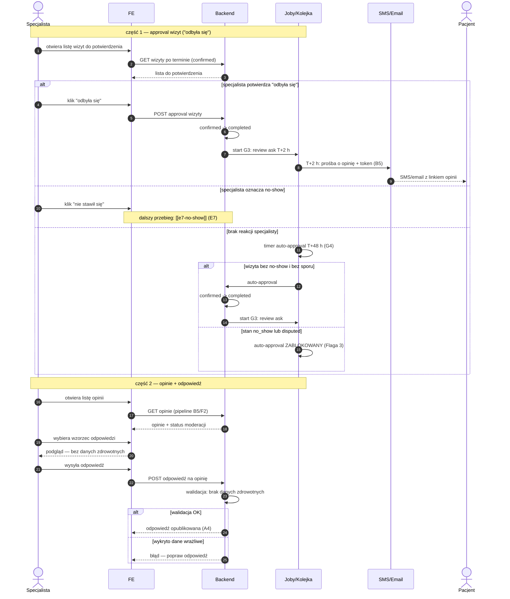

# E8 — Approval wizyt + opinie

## Notatki
- Priorytet: P0. Prompt #1 (pipeline opinii).
- Approval "odbyła się" domyka wizytę (completed) i startuje G3 (review ask T+2 h) → [[b5-wystawienie-opinii]] (B5) → moderacja F2 → publikacja na A4.
- Timer auto-approval T+48 h (G4) — ⚠️ Flaga 3: zablokowany, gdy wizyta ma stan no_show lub disputed (inaczej system "potwierdza" wizytę, która się nie odbyła: fałszywy badge + zepsuty scoring).
- Oznaczenie no-show z tej samej listy → [[e7-no-show]] (E7), stan confirmed -> no_show.
- Wzorce odpowiedzi bez danych zdrowotnych: gotowe szablony; walidacja odpowiedzi po stronie BE — założenie minimalne: automatyczny filtr (jak auto-filtr B5); czy odpowiedź specjalisty przechodzi też przez moderację F2 — mapa NIE rozstrzyga, zgłoszone w rozbieżnościach.
- Powiązania: E7, G3, G4, B5, F2, A4, CORE-STANY, Flaga 3.

## Co opisuje ten diagram

Dwuczęściowy flow w panelu specjalisty. Część 1: po terminie wizyty specjalista potwierdza, że wizyta się odbyła ("odbyła się" — wtedy po 2 godzinach pacjent dostaje prośbę o opinię), oznacza no-show albo nie robi nic — wtedy po 48 godzinach system potwierdza wizytę automatycznie, chyba że jest ona oznaczona jako no-show lub sporna. Część 2: specjalista przegląda opinie pacjentów i odpowiada na nie z gotowych wzorców, a system pilnuje, by odpowiedź nie zawierała danych zdrowotnych, zanim opublikuje ją na profilu.

## Powiązane diagramy

| ID | Diagram | Jak się łączy |
|---|---|---|
| E7 | [e7-no-show.md](e7-no-show.md) | oznaczenie "nie stawił się" z tej samej listy przechodzi w flow no-show |
| B5 | [../b-pacjent-konto/b5-wystawienie-opinii.md](../b-pacjent-konto/b5-wystawienie-opinii.md) | pacjent wystawia opinię z linku otrzymanego po review ask |
| F2 | [../f-backoffice/f2-moderacja-opinii.md](../f-backoffice/f2-moderacja-opinii.md) | opinie przechodzą moderację, zanim trafią do specjalisty i na profil |
| A4 | [../a-pacjent-public/a4-profil-specjalisty.md](../a-pacjent-public/a4-profil-specjalisty.md) | opublikowana odpowiedź specjalisty jest widoczna na profilu publicznym |
| G3 | [../00-core/00-katalog-eventow.md](../00-core/00-katalog-eventow.md) | review ask T+2 h — automatyczna prośba o opinię po potwierdzeniu wizyty |
| G4 | [../g-silniki/g4-auto-approval.md](../g-silniki/g4-auto-approval.md) | timer auto-approval T+48 h przy braku reakcji specjalisty (Flaga 3) |
| CORE-STANY | [../00-core/00-stany-rezerwacji.md](../00-core/00-stany-rezerwacji.md) | przejście confirmed → completed wg kanonu stanów |

## Słownik

| Pojęcie | Wyjaśnienie |
|---|---|
| approval | potwierdzenie przez specjalistę, że wizyta faktycznie się odbyła |
| auto-approval | automatyczne potwierdzenie wizyty po 48 h, gdy specjalista nie zareagował |
| review ask | automatyczna prośba o opinię wysyłana pacjentowi 2 h po potwierdzeniu wizyty |
| opinia | ocena i komentarz pacjenta po odbytej wizycie |
| moderacja | sprawdzenie opinii przez system/admina przed jej publikacją |
| wzorzec odpowiedzi | gotowy szablon odpowiedzi na opinię, bezpieczny pod kątem danych wrażliwych |
| dane zdrowotne | informacje o zdrowiu pacjenta, których nie wolno ujawniać w publicznej odpowiedzi |
| completed | stan wizyty potwierdzonej jako odbyta |
| no_show / disputed | stany (niestawienie się / spór), które blokują automatyczne potwierdzenie wizyty |
| token | link jednorazowy w SMS/emailu, którym pacjent wystawia opinię bez logowania |
