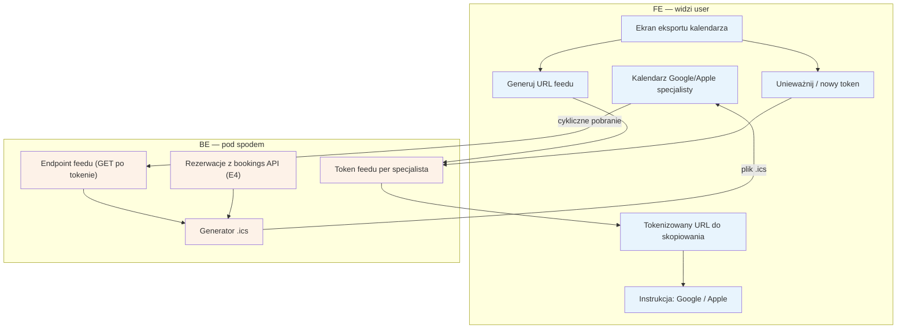

# E9 — Eksport .ics (feed kalendarza)

## Notatki
- Priorytet: P0. Prompt #3 (kalendarz i integracje).
- Jednokierunkowy feed read-only: kalendarz Google/Apple subskrybuje tokenizowany URL i cyklicznie pobiera .ics z wizytami specjalisty (bookings E4); sync dwukierunkowy to osobny silnik G10 (P1/P2).
- Token w URL = jedyna autoryzacja feedu (bez logowania kalendarza) — założenie minimalne: możliwość unieważnienia i wygenerowania nowego tokenu (wyciek URL-a); mapa tego nie rozstrzyga, zgłoszone w rozbieżnościach.
- Węzeł "Kalendarz Google/Apple" umieszczony w FE jako element widoczny dla specjalisty (zewnętrzna aplikacja).
- Zakres danych w .ics: minimalizacja (termin, usługa, inicjały pacjenta?) — nierozstrzygnięte, do speca #3.
- Powiązania: E2, E4, G10.
