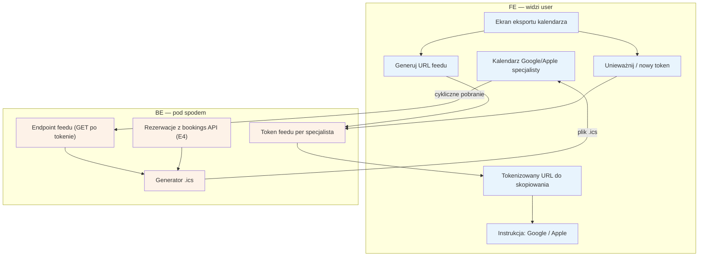

# E9 — Eksport .ics (feed kalendarza)

## Notatki
- Priorytet: P0. Prompt #3 (kalendarz i integracje).
- Jednokierunkowy feed read-only: kalendarz Google/Apple subskrybuje tokenizowany URL i cyklicznie pobiera .ics z wizytami specjalisty (bookings E4); sync dwukierunkowy to osobny silnik G10 (P1/P2).
- Token w URL = jedyna autoryzacja feedu (bez logowania kalendarza) — założenie minimalne: możliwość unieważnienia i wygenerowania nowego tokenu (wyciek URL-a); mapa tego nie rozstrzyga, zgłoszone w rozbieżnościach.
- Węzeł "Kalendarz Google/Apple" umieszczony w FE jako element widoczny dla specjalisty (zewnętrzna aplikacja).
- Zakres danych w .ics: minimalizacja (termin, usługa, inicjały pacjenta?) — nierozstrzygnięte, do speca #3.
- Powiązania: E2, E4, G10.

## Co opisuje ten diagram

Pokazuje, jak specjalista podłącza swoje wizyty z serwisu do prywatnego kalendarza Google lub Apple. W panelu generuje specjalny, tokenizowany adres URL i wkleja go do swojego kalendarza według instrukcji; od tej pory kalendarz sam cyklicznie pobiera plik .ics z aktualnymi wizytami. Przepływ działa tylko w jedną stronę (odczyt) — a gdyby adres wyciekł, specjalista może unieważnić token i wygenerować nowy.

## Powiązane diagramy

| ID | Diagram | Jak się łączy |
|---|---|---|
| E2 | [e2-grafik-dostepnosc.md](e2-grafik-dostepnosc.md) | feed czyta ten sam model dostępności/grafiku co reszta systemu |
| E4 | [e4-rezerwacje.md](e4-rezerwacje.md) | wizyty do pliku .ics pochodzą z bookings API |
| G10 | [../00-core/00-katalog-eventow.md](../00-core/00-katalog-eventow.md) | sync dwukierunkowy z kalendarzem to osobny, przyszły silnik G10 |

## Słownik

| Pojęcie | Wyjaśnienie |
|---|---|
| .ics | standardowy format pliku kalendarza, rozumiany przez Google Calendar i Apple Calendar |
| feed kalendarza | adres, spod którego zewnętrzny kalendarz cyklicznie pobiera aktualną listę wizyt |
| tokenizowany URL | adres feedu zawierający tajny, losowy klucz — tylko kto zna adres, ten widzi wizyty |
| token | tajny klucz w adresie feedu, pełniący rolę jedynego "hasła" dostępu |
| unieważnienie tokenu | wyłączenie starego adresu feedu (np. po wycieku) i wygenerowanie nowego |
| read-only | dostęp tylko do odczytu — kalendarz zewnętrzny nie może niczego zmienić w serwisie |
| sync dwukierunkowy | przyszła pełna synchronizacja w obie strony (zmiany w Google widoczne w serwisie) — silnik G10 |
| minimalizacja danych | zasada, by plik .ics zawierał tylko niezbędne informacje o wizycie i pacjencie |
