# E2E-1 — Pacjent nowy (happy path)

```mermaid
flowchart LR
    A1["A1 wejście SEO"] --> A2["A2 wyszukiwanie"]
    A2 --> A3["A3 lista wyników"]
    A3 --> A4["A4 profil specjalisty"]
    A4 --> A5["A5 checkout rezerwacji"]
    B7["B7 dla kogo: dziecko"] -. "krok wewnątrz A5" .-> A5
    A5 -.->|"wariant przedpłaty (Flaga 2)"| A6["A6 płatność online"]
    A6 -.-> A7["A7 potwierdzenie"]
    A5 -->|"płatność na miejscu"| A7
    A7 --> G2["G2 przypomnienie T-24h"]
    G2 --> W(("wizyta"))
    W --> E8["E8 approval wizyty"]
    E8 --> G3["G3 review ask T+2h"]
    G3 --> B5["B5 wystawienie opinii"]
    B5 --> F2["F2 moderacja opinii"]
    F2 --> PUB["publikacja opinii"]
    style A6 stroke-dasharray: 5 5
```

## Notatki
- Wyjątek od konwencji: bez subgraph FE/BE — węzły to całe flowy (kompozycja ścieżki), nie kroki FE/BE.
- `[A6]` w mapie = krok opcjonalny → przerywany obrys węzła i przerywane krawędzie; ścieżka bez A6 = płatność na miejscu (lub wariant akceptacji specjalisty).
- ⚠️ Flaga 2 OTWARTA (decyzja 2026-07-15: dokumentujemy oba warianty): przedpłata online przez A6/G9 albo rezerwacja za akceptacją specjalisty — patrz [[a5-checkout-wariant-przedplata]] i [[a5-checkout-wariant-akceptacja]].
- Węzły "wizyta" i "publikacja opinii" to zdarzenia/etapy z sekwencji mapy (sekcja 8), nie ID flowów.
- B7 nie jest osobnym krokiem ścieżki — to krok "dla kogo: ja/dziecko/inna osoba" wewnątrz checkoutu A5 (u logopedów domyślnie dziecko).
- Kanoniczne stany rezerwacji po drodze: draft → locked → pending_payment/pending_approval → confirmed → completed (szczegóły w [[a5-checkout]] i 00-stany-rezerwacji).
- Diagramy składowe: [[a1-wejscie-seo]], [[a2-wyszukiwanie]], [[a3-lista-wynikow]], [[a4-profil-specjalisty]], [[a5-checkout]], [[b7-pacjent-podopieczny]], [[a7-potwierdzenie]], [[e8-approval-opinie]], [[b5-wystawienie-opinii]], [[f2-moderacja-opinii]]
- Brak plików diagramów dla: A6 (płatność online), G2 (reminder T−24 h), G3 (review ask T+2 h) — odwołanie tylko po ID.
