# E2E-1 — Pacjent nowy (happy path)

```mermaid
flowchart LR
    A1["A1 wejście SEO"] --> A2["A2 wyszukiwanie"]
    A2 --> A3["A3 lista wyników"]
    A3 --> A4["A4 profil specjalisty"]
    A4 --> A5["A5 checkout rezerwacji"]
    B7["B7 dla kogo: dziecko"] -. "krok wewnątrz A5" .-> A5
    A5 -.->|"wariant przedpłaty (Flaga 2)"| A6["A6 płatność online"]
    A6 -.-> A7["A7 potwierdzenie"]
    A5 -->|"płatność na miejscu"| A7
    A7 --> G2["G2 przypomnienie T-24h"]
    G2 --> W(("wizyta"))
    W --> E8["E8 approval wizyty"]
    E8 --> G3["G3 review ask T+2h"]
    G3 --> B5["B5 wystawienie opinii"]
    B5 --> F2["F2 moderacja opinii"]
    F2 --> PUB["publikacja opinii"]
    style A6 stroke-dasharray: 5 5
```

## Notatki
- Wyjątek od konwencji: bez subgraph FE/BE — węzły to całe flowy (kompozycja ścieżki), nie kroki FE/BE.
- `[A6]` w mapie = krok opcjonalny → przerywany obrys węzła i przerywane krawędzie; ścieżka bez A6 = płatność na miejscu (lub wariant akceptacji specjalisty).
- ⚠️ Flaga 2 OTWARTA (decyzja 2026-07-15: dokumentujemy oba warianty): przedpłata online przez A6/G9 albo rezerwacja za akceptacją specjalisty — patrz [[a5-checkout-wariant-przedplata]] i [[a5-checkout-wariant-akceptacja]].
- Węzły "wizyta" i "publikacja opinii" to zdarzenia/etapy z sekwencji mapy (sekcja 8), nie ID flowów.
- B7 nie jest osobnym krokiem ścieżki — to krok "dla kogo: ja/dziecko/inna osoba" wewnątrz checkoutu A5 (u logopedów domyślnie dziecko).
- Kanoniczne stany rezerwacji po drodze: draft → locked → pending_payment/pending_approval → confirmed → completed (szczegóły w [[a5-checkout]] i 00-stany-rezerwacji).
- Diagramy składowe: [[a1-wejscie-seo]], [[a2-wyszukiwanie]], [[a3-lista-wynikow]], [[a4-profil-specjalisty]], [[a5-checkout]], [[b7-pacjent-podopieczny]], [[a7-potwierdzenie]], [[e8-approval-opinie]], [[b5-wystawienie-opinii]], [[f2-moderacja-opinii]]
- Brak plików diagramów dla: A6 (płatność online), G2 (reminder T−24 h), G3 (review ask T+2 h) — odwołanie tylko po ID.

## Co opisuje ten diagram

Najważniejsza ścieżka w serwisie: nowy pacjent trafia z wyszukiwarki Google, znajduje logopedę, rezerwuje wizytę (opcjonalnie płacąc online), przychodzi na wizytę, a po niej wystawia opinię, która po moderacji trafia na profil specjalisty. Uczestniczą pacjent, specjalista (zatwierdza odbytą wizytę), admin (moderuje opinię) i system (przypomnienie przed wizytą, prośba o opinię po niej). Flow zaczyna się od wejścia z wyszukiwarki, a kończy publikacją opinii. Każdy węzeł to osobny, szczegółowy diagram.

## Powiązane diagramy

| ID | Diagram | Jak się łączy |
|---|---|---|
| A1 | [a1-wejscie-seo.md](../a-pacjent-public/a1-wejscie-seo.md) | start ścieżki — pacjent trafia do serwisu z wyszukiwarki |
| A2 | [a2-wyszukiwanie.md](../a-pacjent-public/a2-wyszukiwanie.md) | pacjent wyszukuje specjalistę po mieście/usłudze |
| A3 | [a3-lista-wynikow.md](../a-pacjent-public/a3-lista-wynikow.md) | wybór specjalisty z listy wyników |
| A4 | [a4-profil-specjalisty.md](../a-pacjent-public/a4-profil-specjalisty.md) | przegląd profilu i wolnych terminów przed rezerwacją |
| A5 | [a5-checkout.md](../a-pacjent-public/a5-checkout.md) | checkout rezerwacji — serce ścieżki |
| A6 | [a5-checkout-wariant-przedplata.md](../a-pacjent-public/a5-checkout-wariant-przedplata.md) | opcjonalna płatność online w wariancie przedpłaty (Flaga 2) |
| A5 (wariant akceptacji) | [a5-checkout-wariant-akceptacja.md](../a-pacjent-public/a5-checkout-wariant-akceptacja.md) | alternatywa dla przedpłaty — rezerwacja za akceptacją specjalisty |
| A7 | [a7-potwierdzenie.md](../a-pacjent-public/a7-potwierdzenie.md) | potwierdzenie rezerwacji z tokenami samoobsługi |
| B7 | [b7-pacjent-podopieczny.md](../b-pacjent-konto/b7-pacjent-podopieczny.md) | krok "dla kogo: ja/dziecko/inna osoba" wewnątrz checkoutu A5 |
| G2 | [00-katalog-eventow.md](../00-core/00-katalog-eventow.md) | automatyczne przypomnienie T−24 h przed wizytą |
| E8 | [e8-approval-opinie.md](../e-panel/e8-approval-opinie.md) | specjalista zatwierdza odbytą wizytę — warunek prośby o opinię |
| G3 | [00-katalog-eventow.md](../00-core/00-katalog-eventow.md) | prośba o opinię wysyłana T+2 h po zatwierdzonej wizycie |
| G9 | [00-katalog-eventow.md](../00-core/00-katalog-eventow.md) | webhooki płatności potwierdzają rezerwację w wariancie przedpłaty |
| B5 | [b5-wystawienie-opinii.md](../b-pacjent-konto/b5-wystawienie-opinii.md) | pacjent wystawia opinię tokenem z prośby |
| F2 | [f2-moderacja-opinii.md](../f-backoffice/f2-moderacja-opinii.md) | moderacja opinii przed publikacją na profilu |
| CORE-STANY | [00-stany-rezerwacji.md](../00-core/00-stany-rezerwacji.md) | stany rezerwacji przechodzone po drodze (draft → … → completed) |

## Słownik

| Pojęcie | Wyjaśnienie |
|---|---|
| SEO | Widoczność w bezpłatnych wynikach Google — główne źródło nowych pacjentów. |
| Checkout | Kilkukrokowy proces rezerwacji terminu (wybór slotu, dane, zgody, ewentualna płatność). |
| Przedpłata | Opcjonalna płatność online z góry za wizytę (wariant Flagi 2). |
| Płatność na miejscu | Ścieżka bez płatności online — pacjent płaci dopiero w gabinecie. |
| Flaga 2 | Otwarta decyzja projektowa: przedpłata online albo rezerwacja za akceptacją specjalisty — dokumentowane są oba warianty. |
| Reminder T−24 h | Automatyczne przypomnienie SMS/email wysyłane dobę przed wizytą. |
| Approval wizyty | Potwierdzenie przez specjalistę, że wizyta się odbyła — dopiero to odblokowuje opinię. |
| Review ask T+2 h | Automatyczna prośba o opinię wysyłana 2 godziny po zatwierdzeniu wizyty. |
| Moderacja | Sprawdzenie treści opinii przez admina przed jej publikacją. |
| Podopieczny | Osoba, dla której robiona jest rezerwacja (u logopedów zwykle dziecko), inna niż osoba rezerwująca. |
| Stany kanoniczne | Kolejne etapy życia rezerwacji (draft → locked → confirmed → completed) wspólne dla całego systemu. |
