# E2E-1 — Pacjent nowy (happy path)

```mermaid
flowchart LR
    A1["A1: pacjent trafia do serwisu z bezpłatnych wyników Google (SEO)"] --> A2["A2: pacjent wyszukuje logopedę po mieście i usłudze"]
    A2 --> A3["A3: pacjent przegląda listę wyników i wybiera specjalistę"]
    A3 --> A4["A4: pacjent ogląda profil specjalisty i wolne terminy"]
    A4 --> A5["A5: pacjent wypełnia checkout i blokuje termin"]
    B7["B7: pacjent wskazuje, dla kogo jest wizyta (zwykle dziecko)"] -. "krok wewnątrz checkoutu A5" .-> A5
    A5 -.->|"wariant przedpłaty online (Flaga 2)"| A6["A6: pacjent płaci online z góry za wizytę"]
    A6 -.-> A7["A7: pacjent dostaje potwierdzenie rezerwacji"]
    A5 -->|"pacjent zapłaci na miejscu w gabinecie"| A7
    A7 --> G2["G2: system wysyła przypomnienie 24 h przed wizytą"]
    G2 --> W(("wizyta odbywa się w gabinecie"))
    W --> E8["E8: specjalista potwierdza, że wizyta się odbyła"]
    E8 --> G3["G3: system wysyła prośbę o opinię 2 h po wizycie"]
    G3 --> B5["B5: pacjent wystawia opinię jednorazowym tokenem"]
    B5 --> F2["F2: admin moderuje opinię przed publikacją"]
    F2 --> PUB["opinia pojawia się na publicznym profilu specjalisty"]
    style A6 stroke-dasharray: 5 5
```

## Notatki
- Wyjątek od konwencji: bez subgraph FE/BE — węzły to całe flowy (kompozycja ścieżki), nie kroki FE/BE.
- `[A6]` w mapie = krok opcjonalny → przerywany obrys węzła i przerywane krawędzie; ścieżka bez A6 = płatność na miejscu (lub wariant akceptacji specjalisty).
- ⚠️ Flaga 2 OTWARTA (decyzja 2026-07-15: dokumentujemy oba warianty): przedpłata online przez A6/G9 albo rezerwacja za akceptacją specjalisty — patrz [[a5-checkout-wariant-przedplata]] i [[a5-checkout-wariant-akceptacja]].
- Węzły "wizyta" i "publikacja opinii" to zdarzenia/etapy z sekwencji mapy (sekcja 8), nie ID flowów.
- B7 nie jest osobnym krokiem ścieżki — to krok "dla kogo: ja/dziecko/inna osoba" wewnątrz checkoutu A5 (u logopedów domyślnie dziecko).
- Kanoniczne stany rezerwacji po drodze: draft → locked → pending_payment/pending_approval → confirmed → completed (szczegóły w [[a5-checkout]] i 00-stany-rezerwacji).
- Diagramy składowe: [[a1-wejscie-seo]], [[a2-wyszukiwanie]], [[a3-lista-wynikow]], [[a4-profil-specjalisty]], [[a5-checkout]], [[b7-pacjent-podopieczny]], [[a7-potwierdzenie]], [[e8-approval-opinie]], [[b5-wystawienie-opinii]], [[f2-moderacja-opinii]]
- Brak plików diagramów dla: A6 (płatność online), G2 (reminder T−24 h), G3 (review ask T+2 h) — odwołanie tylko po ID.

## Co opisuje ten diagram

Najważniejsza ścieżka w serwisie: nowy pacjent trafia z wyszukiwarki Google, znajduje logopedę, rezerwuje wizytę (opcjonalnie płacąc online), przychodzi na wizytę, a po niej wystawia opinię, która po moderacji trafia na profil specjalisty. Uczestniczą pacjent, specjalista (zatwierdza odbytą wizytę), admin (moderuje opinię) i system (przypomnienie przed wizytą, prośba o opinię po niej). Flow zaczyna się od wejścia z wyszukiwarki, a kończy publikacją opinii. Każdy węzeł to osobny, szczegółowy diagram.

## Aktorzy w tym flow

| Rola | Kto to jest | Co robi w tym flow |
|---|---|---|
| **Pacjent** (użytkownik strony) | osoba korzystająca ze strony; u logopedów najczęściej rodzic rezerwujący wizytę dla dziecka | przechodzi całą ścieżkę: trafia z Google, szuka logopedy, wybiera specjalistę i termin, rezerwuje (opcjonalnie płaci online), przychodzi na wizytę i wystawia opinię |
| **Specjalista** (logopeda / lekarz) | usługodawca przyjmujący wizyty, właściciel kalendarza i profilu | przyjmuje pacjenta na wizycie i potwierdza w swoim panelu, że wizyta się odbyła (E8) — bez tego system nie poprosi pacjenta o opinię |
| **Admin** (operator platformy) | zespół prowadzący serwis — back office | moderuje opinię pacjenta przed publikacją (F2): zatwierdza ją na profil albo odrzuca z powodem |
| **System / Backend** | automaty platformy działające bez udziału człowieka | blokuje wybrany termin na czas checkoutu, prowadzi rezerwację przez stany kanoniczne, generuje token do opinii i publikuje zatwierdzoną opinię na profilu |
| **Joby / Kolejka** | zadania uruchamiane automatycznie o zaplanowanym czasie | odmierzają czas i uruchamiają: przypomnienie 24 h przed wizytą (G2) oraz prośbę o opinię 2 h po zatwierdzonej wizycie (G3) |
| **SMS/Email** | kanał powiadomień platformy | dostarcza pacjentowi potwierdzenie rezerwacji (A7), przypomnienie przed wizytą (G2) i prośbę o opinię z tokenem (G3) |

## Objaśnienie bloków

| Blok | Co to znaczy w praktyce | Kto tu działa |
|---|---|---|
| A1: wejście z Google (SEO) | Początek ścieżki: pacjent szuka w Google np. „logopeda Kraków" i klika bezpłatny wynik prowadzący do serwisu. SEO (widoczność w wynikach wyszukiwania) to główne źródło nowych pacjentów. | Pacjent |
| A2: wyszukiwanie | Pacjent korzysta z wyszukiwarki serwisu — wybiera miasto i rodzaj usługi, żeby zawęzić listę specjalistów. | Pacjent |
| A3: lista wyników | Pacjent przegląda listę pasujących specjalistów (z ocenami, cenami, dostępnością) i wybiera jednego z nich. | Pacjent |
| A4: profil specjalisty | Pacjent ogląda profil wybranego logopedy: opis, opinie innych pacjentów, cennik i kalendarz wolnych terminów. Kliknięcie terminu rozpoczyna rezerwację. | Pacjent |
| A5: checkout i blokada terminu | Checkout to kilkukrokowy formularz rezerwacji: wybór usługi, dane kontaktowe, zgody. W trakcie system blokuje wybrany termin na 10 minut wyłącznie dla tego pacjenta, żeby nikt inny go nie zajął. | Pacjent, System |
| B7: dla kogo jest wizyta | Krok wewnątrz checkoutu (nie osobny etap ścieżki): pacjent wskazuje, czy wizyta jest dla niego, dla dziecka czy dla innej osoby. U logopedów rezerwującym jest zwykle rodzic, a podopiecznym dziecko. | Pacjent |
| A6: płatność online z góry (wariant) | Krok opcjonalny — stąd przerywany obrys i przerywane strzałki. W wariancie przedpłaty (Flaga 2 — decyzja projektowa wciąż otwarta) pacjent płaci za wizytę online od razu; rezerwacja potwierdza się po zaksięgowaniu wpłaty. | Pacjent, Procesor płatności |
| pacjent zapłaci na miejscu (strzałka A5 → A7) | Ścieżka bez płatności online: rezerwacja potwierdza się od razu, a pacjent płaci dopiero w gabinecie. | Pacjent |
| A7: potwierdzenie rezerwacji | Pacjent dostaje potwierdzenie (na ekranie oraz e-mailem/SMS-em) z linkami do samodzielnego zarządzania rezerwacją, np. odwołania. Wizyta jest umówiona. | Pacjent, System, SMS/Email |
| G2: przypomnienie 24 h przed wizytą | Automat: dobę przed terminem system sam wysyła pacjentowi przypomnienie SMS/e-mail, żeby zmniejszyć liczbę nieobecności. | System (job), SMS/Email |
| wizyta odbywa się w gabinecie | Zdarzenie poza aplikacją (dlatego inny kształt węzła — to etap, nie osobny flow): pacjent przychodzi do gabinetu na umówioną wizytę. | Pacjent, Specjalista |
| E8: specjalista potwierdza wizytę | Po wizycie specjalista oznacza w swoim panelu, że wizyta faktycznie się odbyła (tzw. approval wizyty). To bramka jakości: dopiero potwierdzona wizyta uruchamia prośbę o opinię. | Specjalista |
| G3: prośba o opinię 2 h po wizycie | Automat: 2 godziny po zatwierdzeniu wizyty system wysyła pacjentowi wiadomość z jednorazowym linkiem (tokenem) do wystawienia opinii. | System (job), SMS/Email |
| B5: pacjent wystawia opinię | Pacjent klika link z wiadomości i ocenia wizytę. Token gwarantuje, że opinie wystawiają wyłącznie osoby po faktycznie odbytej wizycie. | Pacjent |
| F2: moderacja opinii | Zanim opinia trafi na profil, admin sprawdza ją w kolejce moderacji (podejrzane treści automat oznacza flagą i wypycha na wierzch) i zatwierdza albo odrzuca z powodem. Szczegóły w diagramie F2. | Admin, System |
| opinia pojawia się na profilu | Finał ścieżki: zatwierdzona opinia jest widoczna publicznie na profilu specjalisty i pomaga kolejnym pacjentom w wyborze. | System |

## Powiązane diagramy

| ID | Diagram | Jak się łączy |
|---|---|---|
| A1 | [a1-wejscie-seo.md](../a-pacjent-public/a1-wejscie-seo.md) | start ścieżki — pacjent trafia do serwisu z wyszukiwarki |
| A2 | [a2-wyszukiwanie.md](../a-pacjent-public/a2-wyszukiwanie.md) | pacjent wyszukuje specjalistę po mieście/usłudze |
| A3 | [a3-lista-wynikow.md](../a-pacjent-public/a3-lista-wynikow.md) | wybór specjalisty z listy wyników |
| A4 | [a4-profil-specjalisty.md](../a-pacjent-public/a4-profil-specjalisty.md) | przegląd profilu i wolnych terminów przed rezerwacją |
| A5 | [a5-checkout.md](../a-pacjent-public/a5-checkout.md) | checkout rezerwacji — serce ścieżki |
| A6 | [a5-checkout-wariant-przedplata.md](../a-pacjent-public/a5-checkout-wariant-przedplata.md) | opcjonalna płatność online w wariancie przedpłaty (Flaga 2) |
| A5 (wariant akceptacji) | [a5-checkout-wariant-akceptacja.md](../a-pacjent-public/a5-checkout-wariant-akceptacja.md) | alternatywa dla przedpłaty — rezerwacja za akceptacją specjalisty |
| A7 | [a7-potwierdzenie.md](../a-pacjent-public/a7-potwierdzenie.md) | potwierdzenie rezerwacji z tokenami samoobsługi |
| B7 | [b7-pacjent-podopieczny.md](../b-pacjent-konto/b7-pacjent-podopieczny.md) | krok "dla kogo: ja/dziecko/inna osoba" wewnątrz checkoutu A5 |
| G2 | [00-katalog-eventow.md](../00-core/00-katalog-eventow.md) | automatyczne przypomnienie T−24 h przed wizytą |
| E8 | [e8-approval-opinie.md](../e-panel/e8-approval-opinie.md) | specjalista zatwierdza odbytą wizytę — warunek prośby o opinię |
| G3 | [00-katalog-eventow.md](../00-core/00-katalog-eventow.md) | prośba o opinię wysyłana T+2 h po zatwierdzonej wizycie |
| G9 | [00-katalog-eventow.md](../00-core/00-katalog-eventow.md) | webhooki płatności potwierdzają rezerwację w wariancie przedpłaty |
| B5 | [b5-wystawienie-opinii.md](../b-pacjent-konto/b5-wystawienie-opinii.md) | pacjent wystawia opinię tokenem z prośby |
| F2 | [f2-moderacja-opinii.md](../f-backoffice/f2-moderacja-opinii.md) | moderacja opinii przed publikacją na profilu |
| CORE-STANY | [00-stany-rezerwacji.md](../00-core/00-stany-rezerwacji.md) | stany rezerwacji przechodzone po drodze (draft → … → completed) |

## Słownik

| Pojęcie | Wyjaśnienie |
|---|---|
| SEO | Widoczność w bezpłatnych wynikach Google — główne źródło nowych pacjentów. |
| Checkout | Kilkukrokowy proces rezerwacji terminu (wybór slotu, dane, zgody, ewentualna płatność). |
| Przedpłata | Opcjonalna płatność online z góry za wizytę (wariant Flagi 2). |
| Płatność na miejscu | Ścieżka bez płatności online — pacjent płaci dopiero w gabinecie. |
| Flaga 2 | Otwarta decyzja projektowa: przedpłata online albo rezerwacja za akceptacją specjalisty — dokumentowane są oba warianty. |
| Reminder T−24 h | Automatyczne przypomnienie SMS/email wysyłane dobę przed wizytą. |
| Approval wizyty | Potwierdzenie przez specjalistę, że wizyta się odbyła — dopiero to odblokowuje opinię. |
| Review ask T+2 h | Automatyczna prośba o opinię wysyłana 2 godziny po zatwierdzeniu wizyty. |
| Moderacja | Sprawdzenie treści opinii przez admina przed jej publikacją. |
| Podopieczny | Osoba, dla której robiona jest rezerwacja (u logopedów zwykle dziecko), inna niż osoba rezerwująca. |
| Stany kanoniczne | Kolejne etapy życia rezerwacji (draft → locked → confirmed → completed) wspólne dla całego systemu. |
| Happy path | Najbardziej pożądany przebieg ścieżki bez komplikacji: wizyta dochodzi do skutku, nikt nie odwołuje, opinia zostaje opublikowana. |
| Token | Jednorazowy link/klucz wysyłany pacjentowi po wizycie — tylko z nim można wystawić opinię, co gwarantuje, że opinie piszą osoby po odbytej wizycie. |
| Procesor płatności | Zewnętrzna firma obsługująca płatność online w wariancie przedpłaty — potwierdza zaksięgowanie wpłaty. |
| Auto-flaga | Oznaczenie nadawane opinii przez automatyczny filtr treści w moderacji (F2) — podejrzane opinie trafiają na początek kolejki admina. |
| Publikacja opinii | Finał ścieżki: zatwierdzona przez admina opinia staje się publicznie widoczna na profilu specjalisty. |
