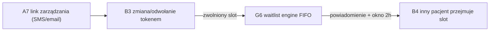

# E2E-2 — Pacjent zmienia termin

## Notatki
- Wyjątek od konwencji: bez subgraph FE/BE — węzły to całe flowy (kompozycja ścieżki), nie kroki FE/BE.
- Punkt startu: pacjent klika link z tokenem samoobsługi wysłany w A7 (SMS/email), bez logowania.
- B3: walidacja tokenu (TTL, zweryfikowany kanał), polityka X h; odwołanie po terminie → event booking.cancelled_late → G7 (poza tą ścieżką, patrz [[b3-odwolanie-tokenem]]).
- G6: FIFO, okno 2 h na potwierdzenie/auto-book; brak potwierdzenia → kaskada do następnego z listy (patrz [[g6-waitlist-engine]]).
- Koniec ścieżki wg mapy: slot przejmuje INNY pacjent z waitlisty (B4) — dwóch różnych pacjentów w jednej ścieżce.
- Diagramy składowe: [[a7-potwierdzenie]], [[b3-odwolanie-tokenem]], [[g6-waitlist-engine]], [[b4-waitlista]]
