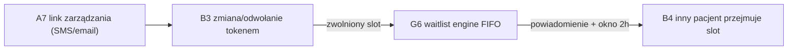

# E2E-2 — Pacjent zmienia termin

## Notatki
- Wyjątek od konwencji: bez subgraph FE/BE — węzły to całe flowy (kompozycja ścieżki), nie kroki FE/BE.
- Punkt startu: pacjent klika link z tokenem samoobsługi wysłany w A7 (SMS/email), bez logowania.
- B3: walidacja tokenu (TTL, zweryfikowany kanał), polityka X h; odwołanie po terminie → event booking.cancelled_late → G7 (poza tą ścieżką, patrz [[b3-odwolanie-tokenem]]).
- G6: FIFO, okno 2 h na potwierdzenie/auto-book; brak potwierdzenia → kaskada do następnego z listy (patrz [[g6-waitlist-engine]]).
- Koniec ścieżki wg mapy: slot przejmuje INNY pacjent z waitlisty (B4) — dwóch różnych pacjentów w jednej ścieżce.
- Diagramy składowe: [[a7-potwierdzenie]], [[b3-odwolanie-tokenem]], [[g6-waitlist-engine]], [[b4-waitlista]]

## Co opisuje ten diagram

Ścieżka zmiany terminu wizyty: pacjent klika link z SMS-a lub emaila (bez logowania), odwołuje albo przesuwa wizytę, a system natychmiast proponuje zwolniony termin osobom z listy oczekujących — po kolei, aż ktoś go przejmie. W ścieżce występuje dwóch różnych pacjentów (jeden zwalnia slot, drugi go przejmuje) oraz system, który obsługuje waitlistę automatycznie. Flow zaczyna się od kliknięcia linku z potwierdzenia rezerwacji, a kończy przejęciem terminu przez innego pacjenta.

## Powiązane diagramy

| ID | Diagram | Jak się łączy |
|---|---|---|
| A7 | [a7-potwierdzenie.md](../a-pacjent-public/a7-potwierdzenie.md) | źródło linku z tokenem samoobsługi (SMS/email po rezerwacji) |
| B3 | [b3-odwolanie-tokenem.md](../b-pacjent-konto/b3-odwolanie-tokenem.md) | zmiana lub odwołanie wizyty tokenem, bez logowania |
| G6 | [g6-waitlist-engine.md](../g-silniki/g6-waitlist-engine.md) | zwolniony slot trafia do kaskady waitlisty (FIFO, okno 2 h) |
| B4 | [b4-waitlista.md](../b-pacjent-konto/b4-waitlista.md) | inny pacjent z waitlisty potwierdza i przejmuje slot |
| G7 | [g7-scoring-engine.md](../g-silniki/g7-scoring-engine.md) | odwołanie po terminie (booking.cancelled_late) zasila scoring sankcji |

## Słownik

| Pojęcie | Wyjaśnienie |
|---|---|
| Token samoobsługi | Unikalny link z potwierdzenia (SMS/email), który pozwala zarządzać wizytą bez logowania. |
| TTL | Ograniczony czas ważności tokenu lub propozycji — po jego upływie link/oferta wygasa. |
| Slot | Konkretny termin wizyty w kalendarzu specjalisty. |
| Waitlista | Lista pacjentów czekających na zwolnienie się terminu u danego specjalisty. |
| FIFO | Kolejność obsługi listy: kto pierwszy się zapisał, ten pierwszy dostaje propozycję terminu. |
| Okno 2 h | Czas, jaki pacjent z waitlisty ma na potwierdzenie propozycji, zanim slot trafi do następnej osoby. |
| Kaskada | Automatyczne przechodzenie propozycji slotu do kolejnych osób z listy, gdy poprzednia nie odpowie. |
| Polityka X h | Reguła określająca, do ilu godzin przed wizytą można ją odwołać bez konsekwencji. |
| booking.cancelled_late | Zdarzenie oznaczające odwołanie po dozwolonym terminie — obniża scoring pacjenta. |
| Auto-book | Automatyczna rezerwacja zwolnionego slotu dla pacjenta z waitlisty po jego potwierdzeniu. |
